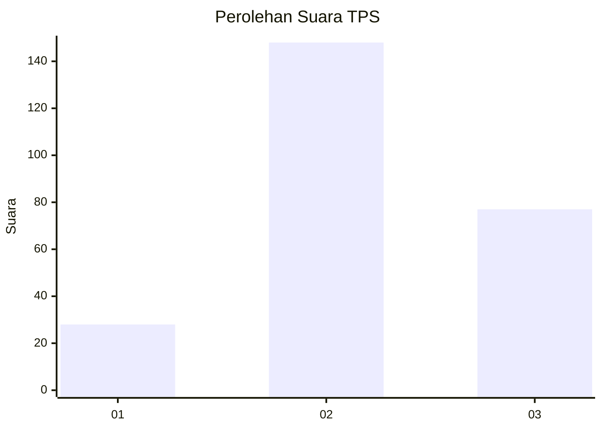
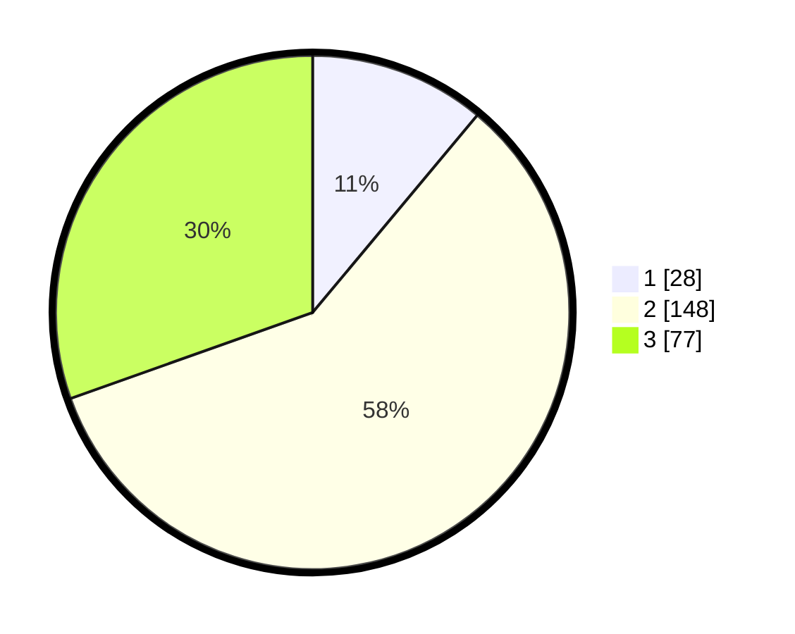

# Hasil

## Grafik

## Tabel

| No. | Nama Paslon    | Suara | Suara (raw) | Persentase |
|:--- |:-------------- | -----:| -----------:| ----------:|
| 1   | ANIES MUHAIMIN | 28    | [28][p-1]   | 11,07      |
| 2   | PRABOWO GIBRAN | 148   | [148][p-2]  | 58,50      |
| 3   | GANJAR MAHFUD  | 77    | [77][p-3]   | 30,43      |

[p-1]: https://github.com/gigit-pemilu/pemilu-2024-33-jawa-tengah/blob/main/pilpres/hitung-suara/sub/33-jawa-tengah/sub/20-jepara/sub/11-tahunan/sub/2012-tahunan/sub/033-tps/sub/paslon-1.txt
[p-2]: https://github.com/gigit-pemilu/pemilu-2024-33-jawa-tengah/blob/main/pilpres/hitung-suara/sub/33-jawa-tengah/sub/20-jepara/sub/11-tahunan/sub/2012-tahunan/sub/033-tps/sub/paslon-2.txt
[p-3]: https://github.com/gigit-pemilu/pemilu-2024-33-jawa-tengah/blob/main/pilpres/hitung-suara/sub/33-jawa-tengah/sub/20-jepara/sub/11-tahunan/sub/2012-tahunan/sub/033-tps/sub/paslon-3.txt

## Foto C Plano

https://sirekap-obj-formc.kpu.go.id/db07/pemilu/ppwp/33/20/11/20/12/3320112012033-20240214-195023--5f88f56e-72c9-4149-9606-b694499c8896.jpg

https://sirekap-obj-formc.kpu.go.id/db07/pemilu/ppwp/33/20/11/20/12/3320112012033-20240214-194825--6a894d5c-9a6d-4c5a-ba1f-0d27b72bf133.jpg

https://sirekap-obj-formc.kpu.go.id/db07/pemilu/ppwp/33/20/11/20/12/3320112012033-20240214-195128--d143bb72-c940-475b-ab0c-9d78bb275bd8.jpg

## Metadata

| Key        | Value               |
| ---------- | ------------------- |
| Time Stamp | 2024-02-15 00:41:44 |

