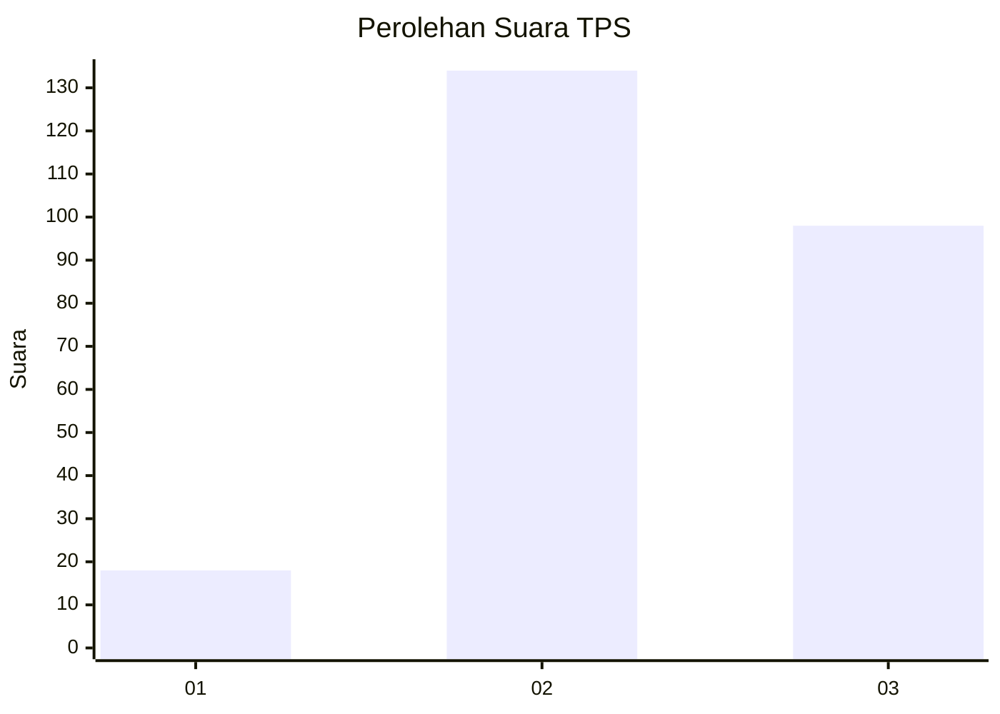
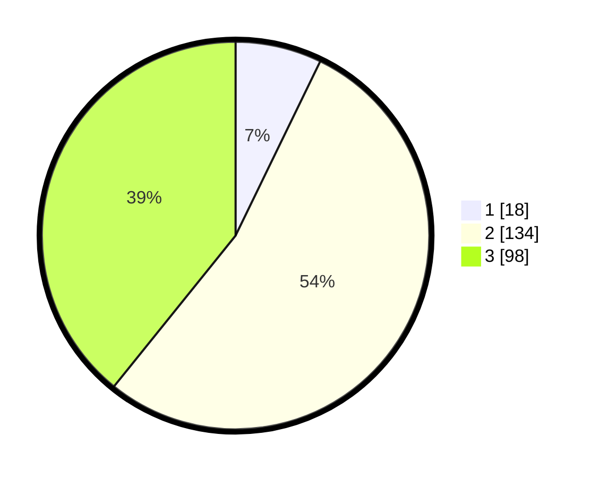

# Hasil

## Grafik

## Tabel

| No. | Nama Paslon    | Suara | Suara (raw) | Persentase |
|:--- |:-------------- | -----:| -----------:| ----------:|
| 1   | ANIES MUHAIMIN | 18    | [18][p-1]   | 7,20       |
| 2   | PRABOWO GIBRAN | 134   | [134][p-2]  | 53,60      |
| 3   | GANJAR MAHFUD  | 98    | [98][p-3]   | 39,20      |

[p-1]: https://github.com/gigit-pemilu/pemilu-2024-33-jawa-tengah/blob/main/pilpres/hitung-suara/sub/33-jawa-tengah/sub/20-jepara/sub/11-tahunan/sub/2015-krapyak/sub/025-tps/sub/paslon-1.txt
[p-2]: https://github.com/gigit-pemilu/pemilu-2024-33-jawa-tengah/blob/main/pilpres/hitung-suara/sub/33-jawa-tengah/sub/20-jepara/sub/11-tahunan/sub/2015-krapyak/sub/025-tps/sub/paslon-2.txt
[p-3]: https://github.com/gigit-pemilu/pemilu-2024-33-jawa-tengah/blob/main/pilpres/hitung-suara/sub/33-jawa-tengah/sub/20-jepara/sub/11-tahunan/sub/2015-krapyak/sub/025-tps/sub/paslon-3.txt

## Foto C Plano

https://sirekap-obj-formc.kpu.go.id/ad97/pemilu/ppwp/33/20/11/20/15/3320112015025-20240215-062641--b75777bb-5a3b-4576-b7d6-7e6b4a47b31d.jpg

https://sirekap-obj-formc.kpu.go.id/ad97/pemilu/ppwp/33/20/11/20/15/3320112015025-20240215-062919--ec919c51-c087-47a3-bdaf-6de45818584e.jpg

https://sirekap-obj-formc.kpu.go.id/ad97/pemilu/ppwp/33/20/11/20/15/3320112015025-20240215-063045--9bdbc647-e5f9-4c18-82df-ae8aa939639a.jpg

## Metadata

| Key        | Value               |
| ---------- | ------------------- |
| Time Stamp | 2024-02-15 22:30:27 |

