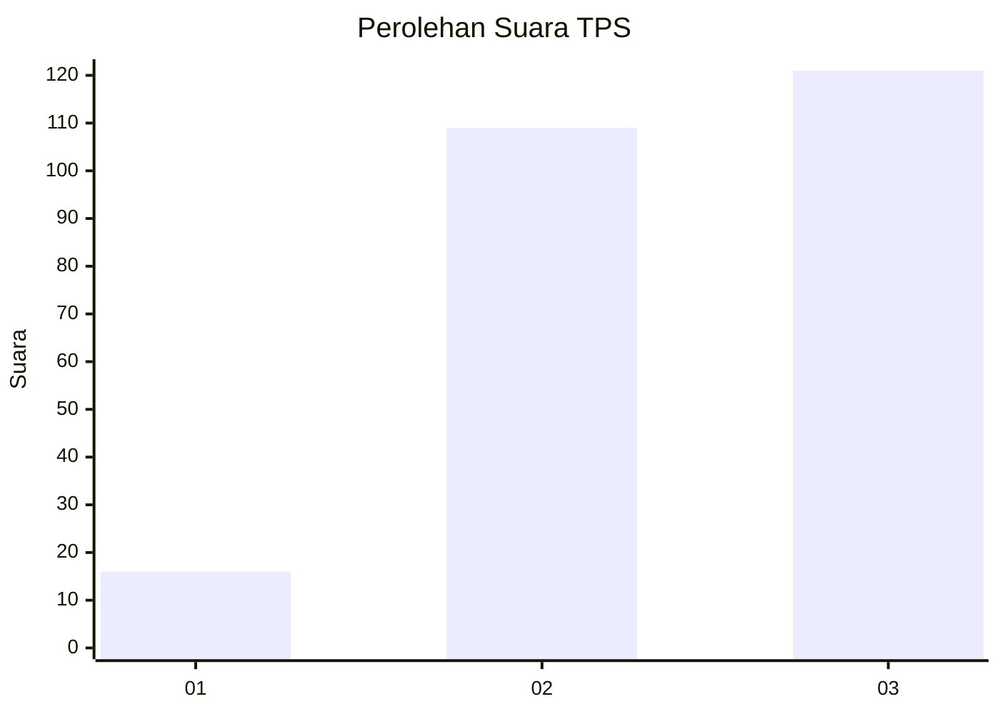
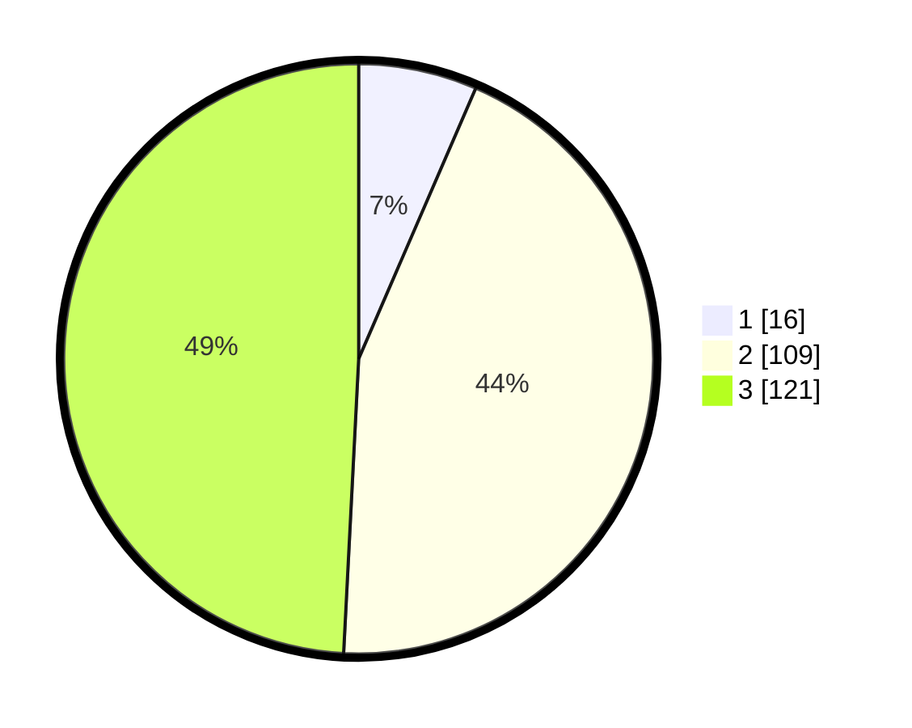

# Hasil

## Grafik

## Tabel

| No. | Nama Paslon    | Suara | Suara (raw) | Persentase |
|:--- |:-------------- | -----:| -----------:| ----------:|
| 1   | ANIES MUHAIMIN | 16    | [16][p-1]   | 6,50       |
| 2   | PRABOWO GIBRAN | 109   | [109][p-2]  | 44,31      |
| 3   | GANJAR MAHFUD  | 121   | [121][p-3]  | 49,19      |

[p-1]: https://github.com/gigit-pemilu/pemilu-2024/blob/main/pilpres/hitung-suara/sub/33-jawa-tengah/sub/20-jepara/sub/11-tahunan/sub/2015-krapyak/sub/026-tps/sub/paslon-1.txt
[p-2]: https://github.com/gigit-pemilu/pemilu-2024/blob/main/pilpres/hitung-suara/sub/33-jawa-tengah/sub/20-jepara/sub/11-tahunan/sub/2015-krapyak/sub/026-tps/sub/paslon-2.txt
[p-3]: https://github.com/gigit-pemilu/pemilu-2024/blob/main/pilpres/hitung-suara/sub/33-jawa-tengah/sub/20-jepara/sub/11-tahunan/sub/2015-krapyak/sub/026-tps/sub/paslon-3.txt

## Foto C Plano

https://sirekap-obj-formc.kpu.go.id/af2b/pemilu/ppwp/33/20/11/20/15/3320112015026-20240215-040718--0a881d36-3b27-46c5-81da-83e77df4256a.jpg

https://sirekap-obj-formc.kpu.go.id/af2b/pemilu/ppwp/33/20/11/20/15/3320112015026-20240214-224154--591c20e8-c1d1-4ff3-bc9c-3aaa03201076.jpg

https://sirekap-obj-formc.kpu.go.id/af2b/pemilu/ppwp/33/20/11/20/15/3320112015026-20240214-224353--a1ac776d-5093-4bac-bcf5-02772ab4c994.jpg

## Metadata

| Key        | Value               |
| ---------- | ------------------- |
| Time Stamp | 2024-02-15 17:30:25 |

