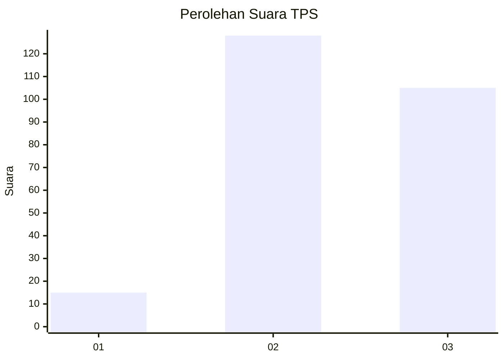
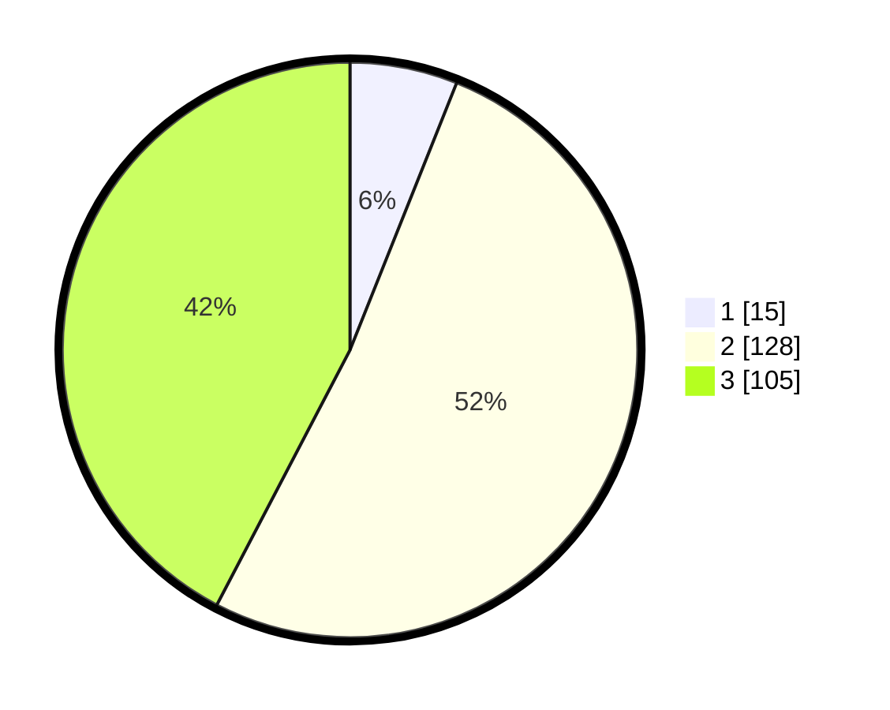

# Hasil

## Grafik

## Tabel

| No. | Nama Paslon    | Suara | Suara (raw) | Persentase |
|:--- |:-------------- | -----:| -----------:| ----------:|
| 1   | ANIES MUHAIMIN | 15    | [15][p-1]   | 6,05       |
| 2   | PRABOWO GIBRAN | 128   | [128][p-2]  | 51,61      |
| 3   | GANJAR MAHFUD  | 105   | [105][p-3]  | 42,34      |

[p-1]: https://github.com/gigit-pemilu/pemilu-2024-33-jawa-tengah/blob/main/pilpres/hitung-suara/sub/33-jawa-tengah/sub/20-jepara/sub/13-kalinyamatan/sub/2003-banyuputih/sub/012-tps/sub/paslon-1.txt
[p-2]: https://github.com/gigit-pemilu/pemilu-2024-33-jawa-tengah/blob/main/pilpres/hitung-suara/sub/33-jawa-tengah/sub/20-jepara/sub/13-kalinyamatan/sub/2003-banyuputih/sub/012-tps/sub/paslon-2.txt
[p-3]: https://github.com/gigit-pemilu/pemilu-2024-33-jawa-tengah/blob/main/pilpres/hitung-suara/sub/33-jawa-tengah/sub/20-jepara/sub/13-kalinyamatan/sub/2003-banyuputih/sub/012-tps/sub/paslon-3.txt

## Foto C Plano

https://sirekap-obj-formc.kpu.go.id/69d1/pemilu/ppwp/33/20/13/20/03/3320132003012-20240217-145726--ba84ddbb-cb04-4d63-95db-10a5c4c34de1.jpg

https://sirekap-obj-formc.kpu.go.id/69d1/pemilu/ppwp/33/20/13/20/03/3320132003012-20240217-145151--f95466e1-3ff0-46e4-8b80-b63d78f36255.jpg

https://sirekap-obj-formc.kpu.go.id/69d1/pemilu/ppwp/33/20/13/20/03/3320132003012-20240217-145912--4b0596e6-5768-4736-be86-44f0e8fd77d5.jpg

## Metadata

| Key        | Value               |
| ---------- | ------------------- |
| Time Stamp | 2024-02-17 16:00:02 |

