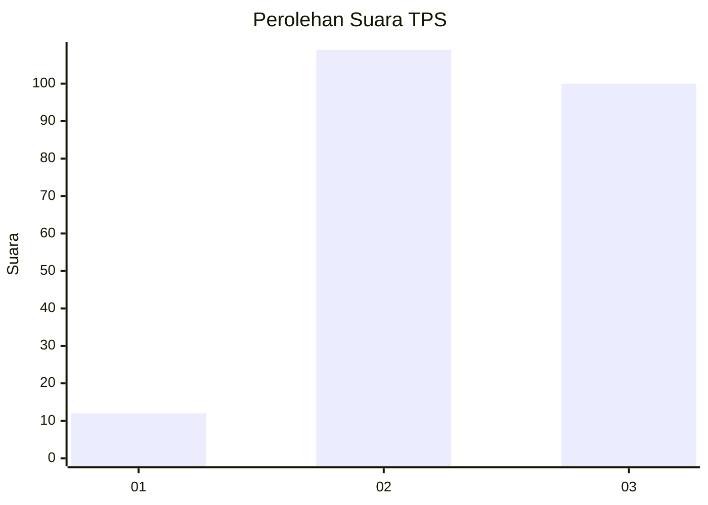
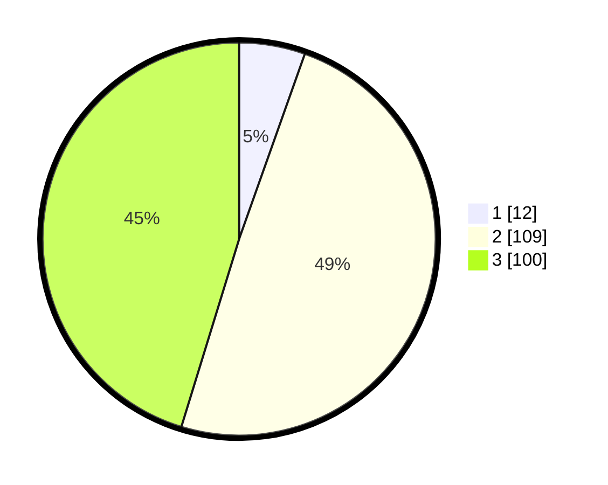

# Hasil

## Grafik

## Tabel

| No. | Nama Paslon    | Suara | Suara (raw) | Persentase |
|:--- |:-------------- | -----:| -----------:| ----------:|
| 1   | ANIES MUHAIMIN | 12    | [12][p-1]   | 5,43       |
| 2   | PRABOWO GIBRAN | 109   | [109][p-2]  | 49,32      |
| 3   | GANJAR MAHFUD  | 100   | [100][p-3]  | 45,25      |

[p-1]: https://github.com/gigit-pemilu/pemilu-2024-33-jawa-tengah/blob/main/pilpres/hitung-suara/sub/33-jawa-tengah/sub/20-jepara/sub/14-kembang/sub/2001-dudak-awu/sub/001-tps/sub/paslon-1.txt
[p-2]: https://github.com/gigit-pemilu/pemilu-2024-33-jawa-tengah/blob/main/pilpres/hitung-suara/sub/33-jawa-tengah/sub/20-jepara/sub/14-kembang/sub/2001-dudak-awu/sub/001-tps/sub/paslon-2.txt
[p-3]: https://github.com/gigit-pemilu/pemilu-2024-33-jawa-tengah/blob/main/pilpres/hitung-suara/sub/33-jawa-tengah/sub/20-jepara/sub/14-kembang/sub/2001-dudak-awu/sub/001-tps/sub/paslon-3.txt

## Foto C Plano

https://sirekap-obj-formc.kpu.go.id/6379/pemilu/ppwp/33/20/14/20/01/3320142001001-20240214-141117--80fbe8bc-e0c4-4640-8cb1-27a52d18bd33.jpg

https://sirekap-obj-formc.kpu.go.id/6379/pemilu/ppwp/33/20/14/20/01/3320142001001-20240214-141210--b4fd150d-6643-456f-bcf8-b15f2bd2c1e9.jpg

https://sirekap-obj-formc.kpu.go.id/6379/pemilu/ppwp/33/20/14/20/01/3320142001001-20240214-141628--5a12c7ed-df64-40b4-a36f-a056b0e6da7d.jpg

## Metadata

| Key        | Value               |
| ---------- | ------------------- |
| Time Stamp | 2024-02-15 21:01:18 |

