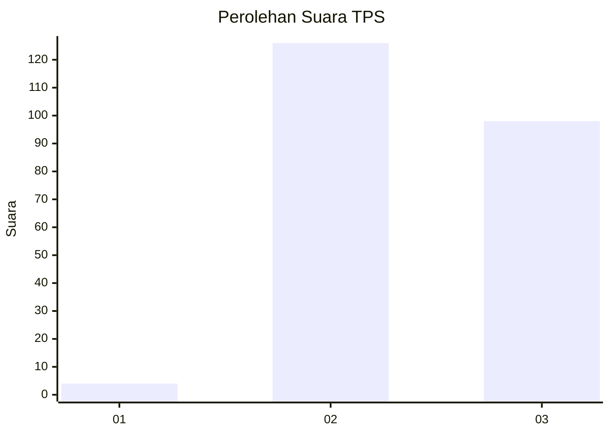
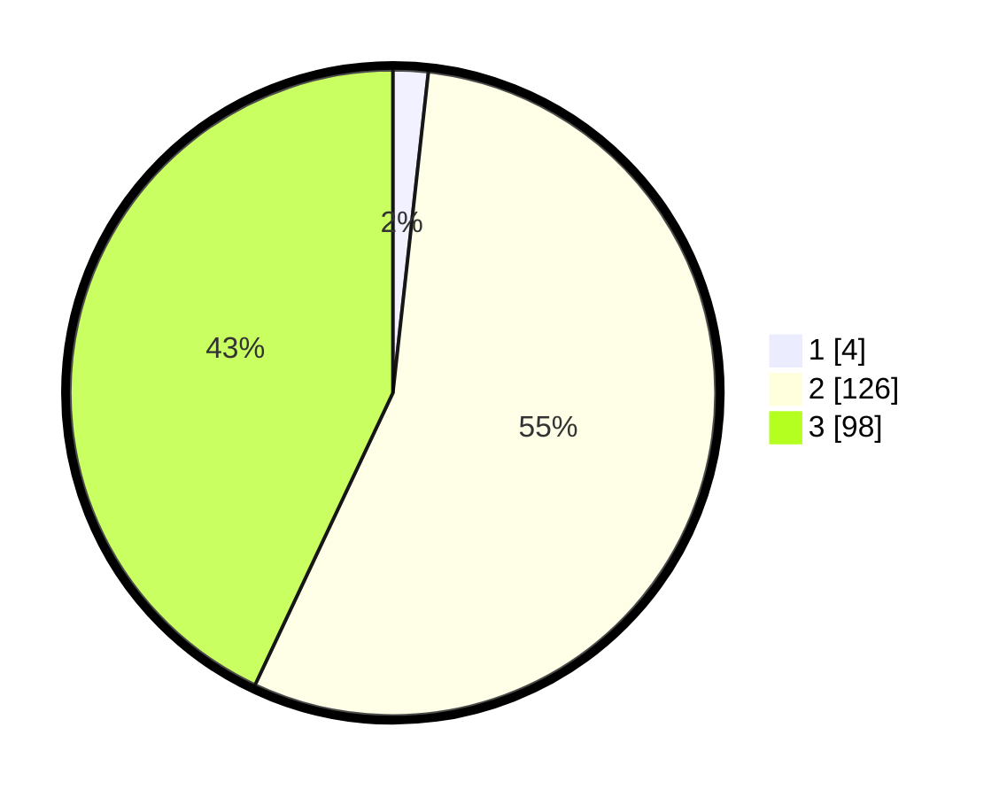

# Hasil

## Grafik

## Tabel

| No. | Nama Paslon    | Suara | Suara (raw) | Persentase |
|:--- |:-------------- | -----:| -----------:| ----------:|
| 1   | ANIES MUHAIMIN | 4     | [4][p-1]    | 1,75       |
| 2   | PRABOWO GIBRAN | 126   | [126][p-2]  | 55,26      |
| 3   | GANJAR MAHFUD  | 98    | [98][p-3]   | 42,98      |

[p-1]: https://github.com/gigit-pemilu/pemilu-2024/blob/main/pilpres/hitung-suara/sub/33-jawa-tengah/sub/20-jepara/sub/14-kembang/sub/2007-dermolo/sub/002-tps/sub/paslon-1.txt
[p-2]: https://github.com/gigit-pemilu/pemilu-2024/blob/main/pilpres/hitung-suara/sub/33-jawa-tengah/sub/20-jepara/sub/14-kembang/sub/2007-dermolo/sub/002-tps/sub/paslon-2.txt
[p-3]: https://github.com/gigit-pemilu/pemilu-2024/blob/main/pilpres/hitung-suara/sub/33-jawa-tengah/sub/20-jepara/sub/14-kembang/sub/2007-dermolo/sub/002-tps/sub/paslon-3.txt

## Foto C Plano

https://sirekap-obj-formc.kpu.go.id/c9ae/pemilu/ppwp/33/20/14/20/07/3320142007002-20240214-213737--5ac0ce91-5492-4d4e-86f5-b5acfbb09ef8.jpg

https://sirekap-obj-formc.kpu.go.id/c9ae/pemilu/ppwp/33/20/14/20/07/3320142007002-20240214-213959--3af82ded-2d5d-4cf9-a3b2-f7ba3d8558bf.jpg

https://sirekap-obj-formc.kpu.go.id/c9ae/pemilu/ppwp/33/20/14/20/07/3320142007002-20240214-214312--67706350-5af8-48ee-8a58-6779127b899a.jpg

## Metadata

| Key        | Value               |
| ---------- | ------------------- |
| Time Stamp | 2024-02-15 22:00:27 |

