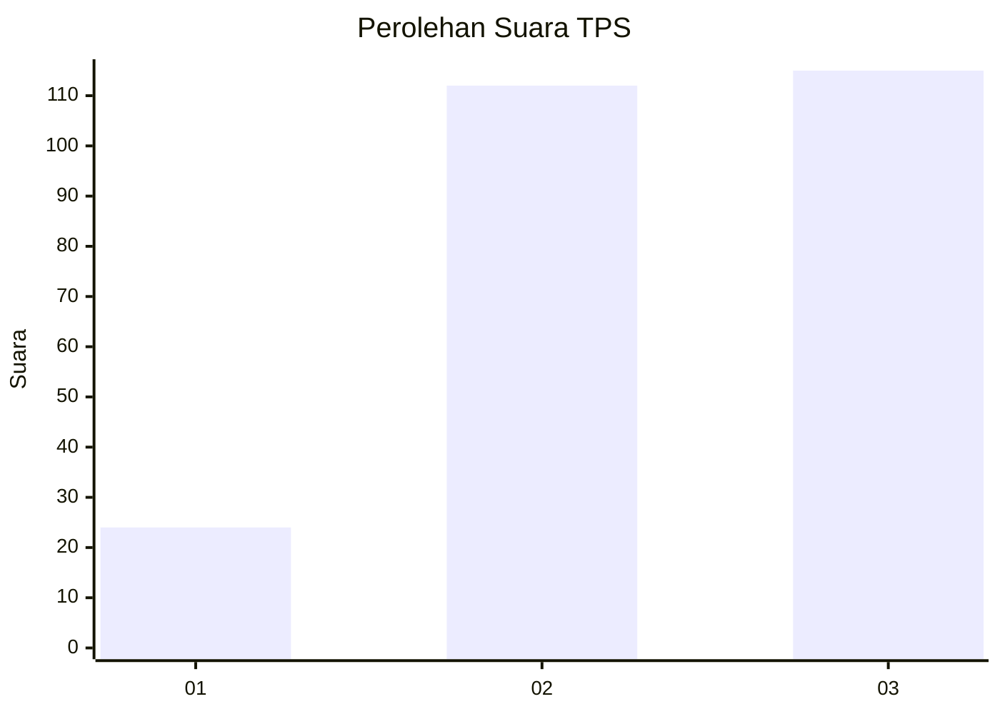
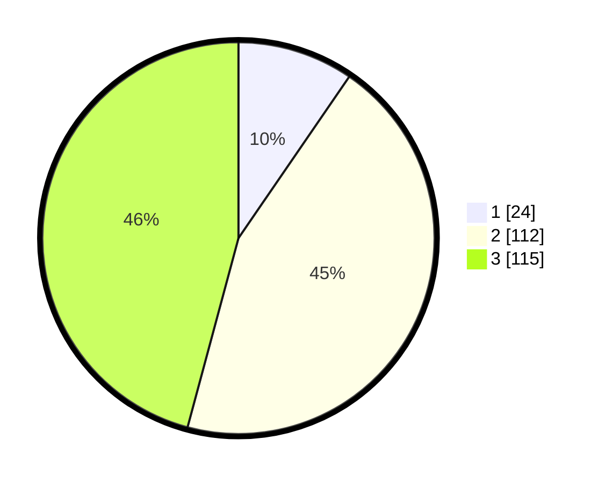

# Hasil

## Grafik

## Tabel

| No. | Nama Paslon    | Suara | Suara (raw) | Persentase |
|:--- |:-------------- | -----:| -----------:| ----------:|
| 1   | ANIES MUHAIMIN | 24    | [24][p-1]   | 9,56       |
| 2   | PRABOWO GIBRAN | 112   | [112][p-2]  | 44,62      |
| 3   | GANJAR MAHFUD  | 115   | [115][p-3]  | 45,82      |

[p-1]: https://github.com/gigit-pemilu/pemilu-2024/blob/main/pilpres/hitung-suara/sub/33-jawa-tengah/sub/20-jepara/sub/15-pakis-aji/sub/2002-bulungan/sub/033-tps/sub/paslon-1.txt
[p-2]: https://github.com/gigit-pemilu/pemilu-2024/blob/main/pilpres/hitung-suara/sub/33-jawa-tengah/sub/20-jepara/sub/15-pakis-aji/sub/2002-bulungan/sub/033-tps/sub/paslon-2.txt
[p-3]: https://github.com/gigit-pemilu/pemilu-2024/blob/main/pilpres/hitung-suara/sub/33-jawa-tengah/sub/20-jepara/sub/15-pakis-aji/sub/2002-bulungan/sub/033-tps/sub/paslon-3.txt

## Foto C Plano

https://sirekap-obj-formc.kpu.go.id/dd90/pemilu/ppwp/33/20/15/20/02/3320152002033-20240214-204327--daa60bb4-1c49-48da-93b3-b591d3ced03c.jpg

https://sirekap-obj-formc.kpu.go.id/dd90/pemilu/ppwp/33/20/15/20/02/3320152002033-20240214-204449--071a6724-985d-4e08-aa51-8936ee883cf7.jpg

https://sirekap-obj-formc.kpu.go.id/dd90/pemilu/ppwp/33/20/15/20/02/3320152002033-20240214-204619--230d77e4-2629-43f6-bee6-b4b05b9580ab.jpg

## Metadata

| Key        | Value               |
| ---------- | ------------------- |
| Time Stamp | 2024-02-15 12:00:28 |

