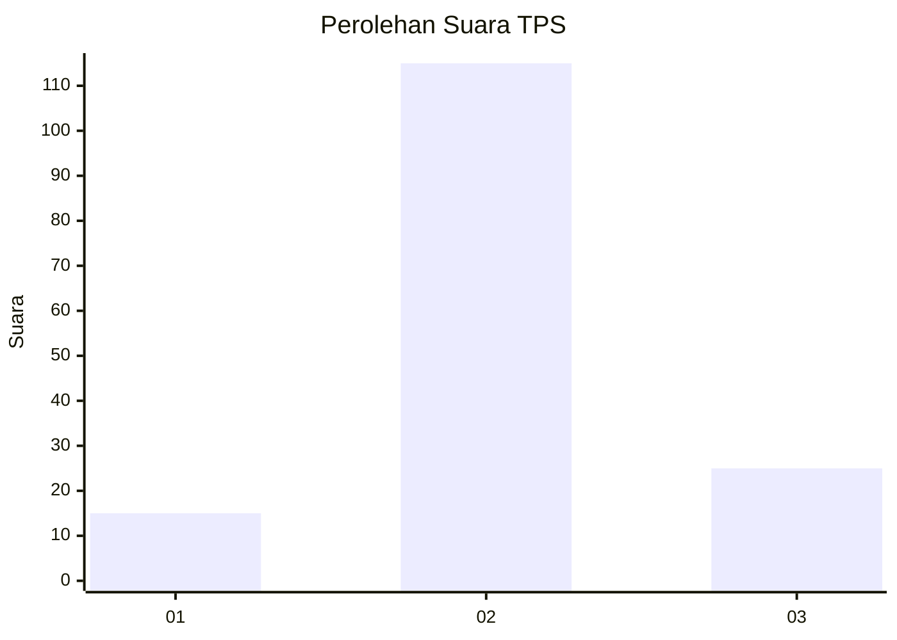
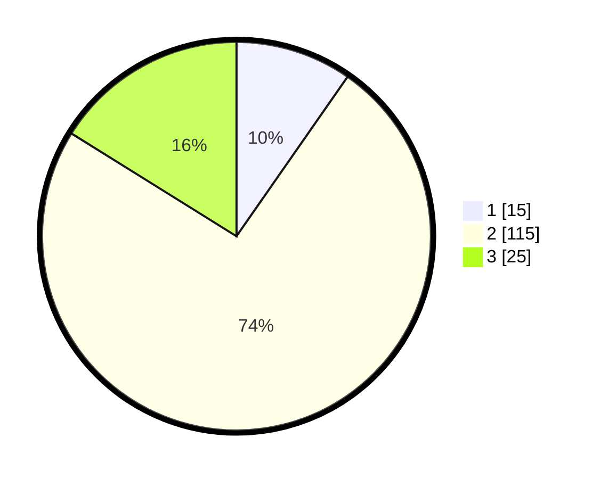

# Hasil

## Grafik

## Tabel

| No. | Nama Paslon    | Suara | Suara (raw) | Persentase |
|:--- |:-------------- | -----:| -----------:| ----------:|
| 1   | ANIES MUHAIMIN | 15    | [15][p-1]   | 9,68       |
| 2   | PRABOWO GIBRAN | 115   | [115][p-2]  | 74,19      |
| 3   | GANJAR MAHFUD  | 25    | [25][p-3]   | 16,13      |

[p-1]: https://github.com/gigit-pemilu/pemilu-2024/blob/main/pilpres/hitung-suara/sub/33-jawa-tengah/sub/20-jepara/sub/16-donorojo/sub/2001-sumberrejo/sub/001-tps/sub/paslon-1.txt
[p-2]: https://github.com/gigit-pemilu/pemilu-2024/blob/main/pilpres/hitung-suara/sub/33-jawa-tengah/sub/20-jepara/sub/16-donorojo/sub/2001-sumberrejo/sub/001-tps/sub/paslon-2.txt
[p-3]: https://github.com/gigit-pemilu/pemilu-2024/blob/main/pilpres/hitung-suara/sub/33-jawa-tengah/sub/20-jepara/sub/16-donorojo/sub/2001-sumberrejo/sub/001-tps/sub/paslon-3.txt

## Foto C Plano

https://sirekap-obj-formc.kpu.go.id/bc34/pemilu/ppwp/33/20/16/20/01/3320162001001-20240219-153039--d11f418f-5da1-4510-92c8-2698f7f60954.jpg

https://sirekap-obj-formc.kpu.go.id/bc34/pemilu/ppwp/33/20/16/20/01/3320162001001-20240219-153134--feff38d6-1d90-4b26-b47c-34aee4a0805d.jpg

https://sirekap-obj-formc.kpu.go.id/bc34/pemilu/ppwp/33/20/16/20/01/3320162001001-20240219-153227--bf45000d-37b5-48c4-9b54-c5a342afb916.jpg

## Metadata

| Key        | Value               |
| ---------- | ------------------- |
| Time Stamp | 2024-03-01 18:00:00 |

