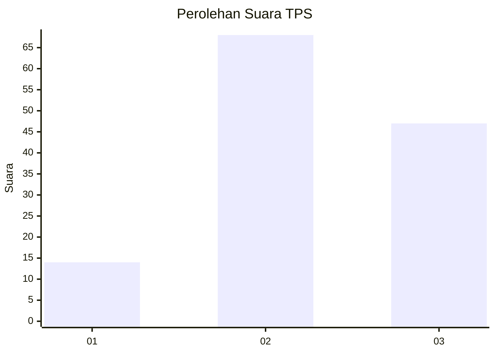
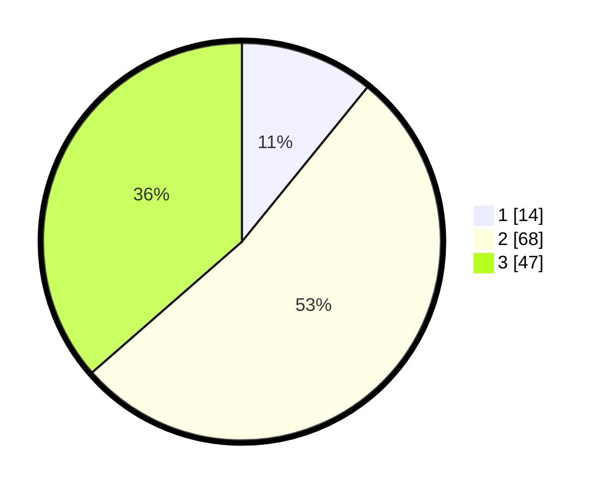

# Hasil

## Grafik

## Tabel

| No. | Nama Paslon    | Suara | Suara (raw) | Persentase |
|:--- |:-------------- | -----:| -----------:| ----------:|
| 1   | ANIES MUHAIMIN | 14    | [14][p-1]   | 10,85      |
| 2   | PRABOWO GIBRAN | 68    | [68][p-2]   | 52,71      |
| 3   | GANJAR MAHFUD  | 47    | [47][p-3]   | 36,43      |

[p-1]: https://github.com/gigit-pemilu/pemilu-2024-33-jawa-tengah/blob/main/pilpres/hitung-suara/sub/33-jawa-tengah/sub/20-jepara/sub/16-donorojo/sub/2002-clering/sub/003-tps/sub/paslon-1.txt
[p-2]: https://github.com/gigit-pemilu/pemilu-2024-33-jawa-tengah/blob/main/pilpres/hitung-suara/sub/33-jawa-tengah/sub/20-jepara/sub/16-donorojo/sub/2002-clering/sub/003-tps/sub/paslon-2.txt
[p-3]: https://github.com/gigit-pemilu/pemilu-2024-33-jawa-tengah/blob/main/pilpres/hitung-suara/sub/33-jawa-tengah/sub/20-jepara/sub/16-donorojo/sub/2002-clering/sub/003-tps/sub/paslon-3.txt

## Foto C Plano

https://sirekap-obj-formc.kpu.go.id/73b9/pemilu/ppwp/33/20/16/20/02/3320162002003-20240217-200527--a819b88b-f09e-4d6c-bb6e-b59a41d10f9d.jpg

https://sirekap-obj-formc.kpu.go.id/73b9/pemilu/ppwp/33/20/16/20/02/3320162002003-20240217-200535--924f7161-9a52-4e30-aa18-db43dbf048ec.jpg

https://sirekap-obj-formc.kpu.go.id/73b9/pemilu/ppwp/33/20/16/20/02/3320162002003-20240217-200542--5c1d97c3-247b-40f9-80d6-b6f41996ebee.jpg

## Metadata

| Key        | Value               |
| ---------- | ------------------- |
| Time Stamp | 2024-02-19 06:16:00 |

