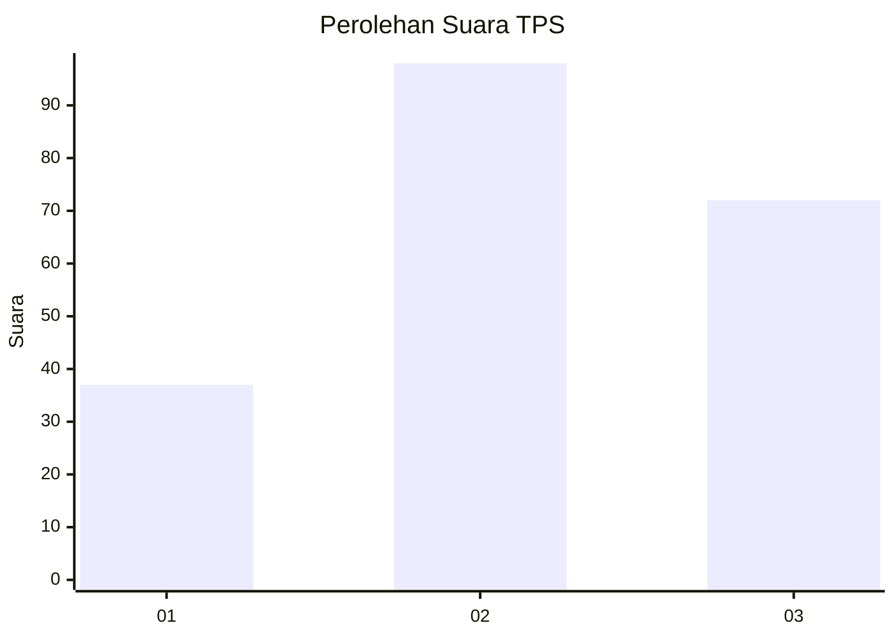
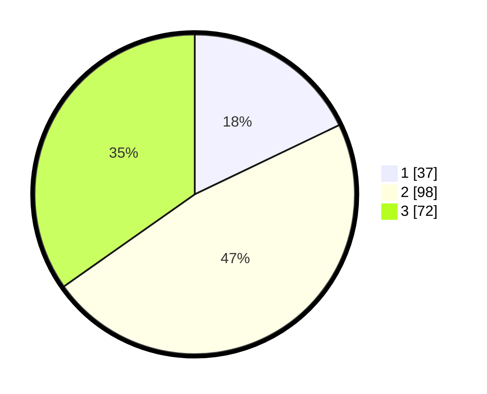

# Hasil

## Grafik

## Tabel

| No. | Nama Paslon    | Suara | Suara (raw) | Persentase |
|:--- |:-------------- | -----:| -----------:| ----------:|
| 1   | ANIES MUHAIMIN | 37    | [37][p-1]   | 17,87      |
| 2   | PRABOWO GIBRAN | 98    | [98][p-2]   | 47,34      |
| 3   | GANJAR MAHFUD  | 72    | [72][p-3]   | 34,78      |

[p-1]: https://github.com/gigit-pemilu/pemilu-2024/blob/main/pilpres/hitung-suara/sub/33-jawa-tengah/sub/21-demak/sub/01-mranggen/sub/2002-kebonbatur/sub/002-tps/sub/paslon-1.txt
[p-2]: https://github.com/gigit-pemilu/pemilu-2024/blob/main/pilpres/hitung-suara/sub/33-jawa-tengah/sub/21-demak/sub/01-mranggen/sub/2002-kebonbatur/sub/002-tps/sub/paslon-2.txt
[p-3]: https://github.com/gigit-pemilu/pemilu-2024/blob/main/pilpres/hitung-suara/sub/33-jawa-tengah/sub/21-demak/sub/01-mranggen/sub/2002-kebonbatur/sub/002-tps/sub/paslon-3.txt

## Foto C Plano

https://sirekap-obj-formc.kpu.go.id/235e/pemilu/ppwp/33/21/01/20/02/3321012002002-20240214-231034--c5bf076e-92da-41bb-b833-b4c0c03b0b40.jpg

https://sirekap-obj-formc.kpu.go.id/235e/pemilu/ppwp/33/21/01/20/02/3321012002002-20240214-231232--a98f965c-18d6-4ac9-a564-533e9ccc0db6.jpg

https://sirekap-obj-formc.kpu.go.id/235e/pemilu/ppwp/33/21/01/20/02/3321012002002-20240214-231341--5989348e-c0ca-427a-a852-2a9dd30ca886.jpg

## Metadata

| Key        | Value               |
| ---------- | ------------------- |
| Time Stamp | 2024-02-16 00:30:27 |

