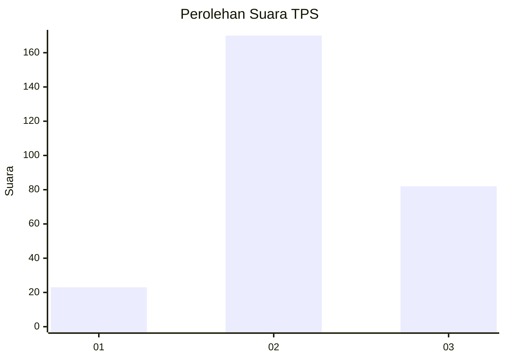
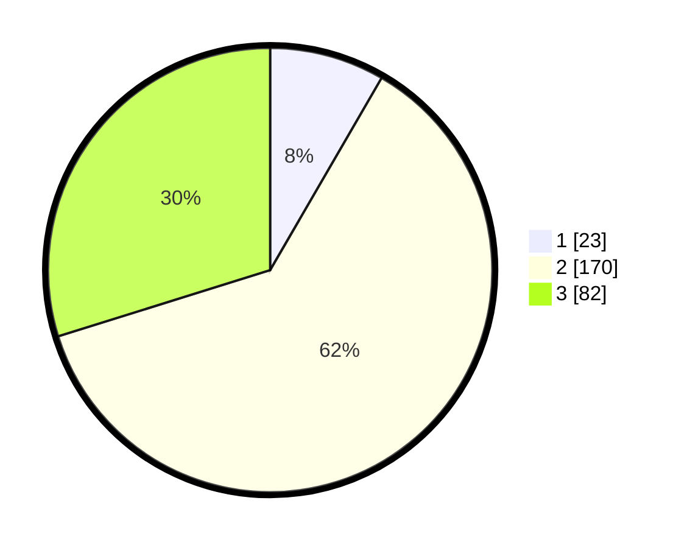

# Hasil

## Grafik

## Tabel

| No. | Nama Paslon    | Suara | Suara (raw) | Persentase |
|:--- |:-------------- | -----:| -----------:| ----------:|
| 1   | ANIES MUHAIMIN | 23    | [23][p-1]   | 8,36       |
| 2   | PRABOWO GIBRAN | 170   | [170][p-2]  | 61,82      |
| 3   | GANJAR MAHFUD  | 82    | [82][p-3]   | 29,82      |

[p-1]: https://github.com/gigit-pemilu/pemilu-2024-33-jawa-tengah/blob/main/pilpres/hitung-suara/sub/33-jawa-tengah/sub/21-demak/sub/01-mranggen/sub/2002-kebonbatur/sub/020-tps/sub/paslon-1.txt
[p-2]: https://github.com/gigit-pemilu/pemilu-2024-33-jawa-tengah/blob/main/pilpres/hitung-suara/sub/33-jawa-tengah/sub/21-demak/sub/01-mranggen/sub/2002-kebonbatur/sub/020-tps/sub/paslon-2.txt
[p-3]: https://github.com/gigit-pemilu/pemilu-2024-33-jawa-tengah/blob/main/pilpres/hitung-suara/sub/33-jawa-tengah/sub/21-demak/sub/01-mranggen/sub/2002-kebonbatur/sub/020-tps/sub/paslon-3.txt

## Foto C Plano

https://sirekap-obj-formc.kpu.go.id/5ef9/pemilu/ppwp/33/21/01/20/02/3321012002020-20240214-221840--cf766208-10c5-4bfe-9b2c-2644e27b1598.jpg

https://sirekap-obj-formc.kpu.go.id/5ef9/pemilu/ppwp/33/21/01/20/02/3321012002020-20240214-221944--e03a0450-ae70-4d16-90b8-81883a8d66a2.jpg

https://sirekap-obj-formc.kpu.go.id/5ef9/pemilu/ppwp/33/21/01/20/02/3321012002020-20240214-222021--18b751b6-8af6-43f9-8534-4ac7fe90aa65.jpg

## Metadata

| Key        | Value               |
| ---------- | ------------------- |
| Time Stamp | 2024-02-16 09:00:28 |

