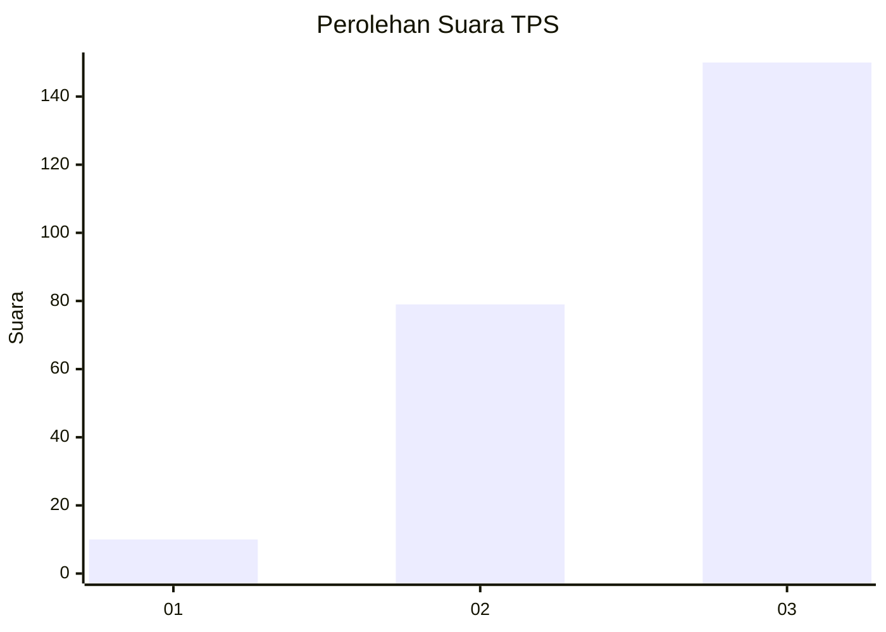
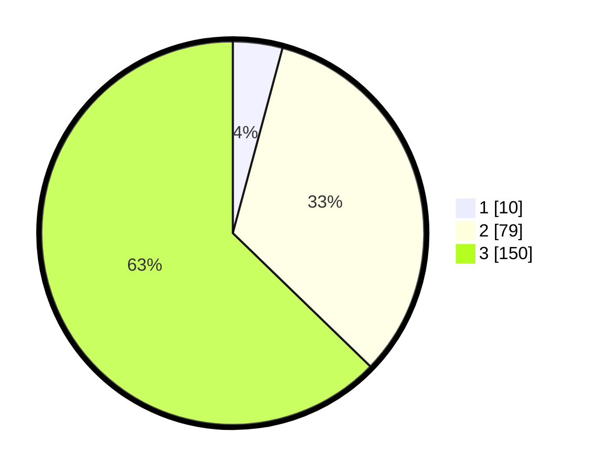

# Hasil

## Grafik

## Tabel

| No. | Nama Paslon    | Suara | Suara (raw) | Persentase |
|:--- |:-------------- | -----:| -----------:| ----------:|
| 1   | ANIES MUHAIMIN | 10    | [10][p-1]   | 4,18       |
| 2   | PRABOWO GIBRAN | 79    | [79][p-2]   | 33,05      |
| 3   | GANJAR MAHFUD  | 150   | [150][p-3]  | 62,76      |

[p-1]: https://github.com/gigit-pemilu/pemilu-2024/blob/main/pilpres/hitung-suara/sub/33-jawa-tengah/sub/21-demak/sub/01-mranggen/sub/2003-sumberejo/sub/002-tps/sub/paslon-1.txt
[p-2]: https://github.com/gigit-pemilu/pemilu-2024/blob/main/pilpres/hitung-suara/sub/33-jawa-tengah/sub/21-demak/sub/01-mranggen/sub/2003-sumberejo/sub/002-tps/sub/paslon-2.txt
[p-3]: https://github.com/gigit-pemilu/pemilu-2024/blob/main/pilpres/hitung-suara/sub/33-jawa-tengah/sub/21-demak/sub/01-mranggen/sub/2003-sumberejo/sub/002-tps/sub/paslon-3.txt

## Foto C Plano

https://sirekap-obj-formc.kpu.go.id/6a93/pemilu/ppwp/33/21/01/20/03/3321012003002-20240214-195636--128abd0f-8f10-414d-a862-4e2a955a25e7.jpg

https://sirekap-obj-formc.kpu.go.id/6a93/pemilu/ppwp/33/21/01/20/03/3321012003002-20240214-195654--78c3feb5-1024-4769-8ae5-9ded584b2f2e.jpg

https://sirekap-obj-formc.kpu.go.id/6a93/pemilu/ppwp/33/21/01/20/03/3321012003002-20240214-195712--ab18773d-f0ad-45dc-b598-3dab6acb4c82.jpg

## Metadata

| Key        | Value               |
| ---------- | ------------------- |
| Time Stamp | 2024-02-16 14:00:34 |

