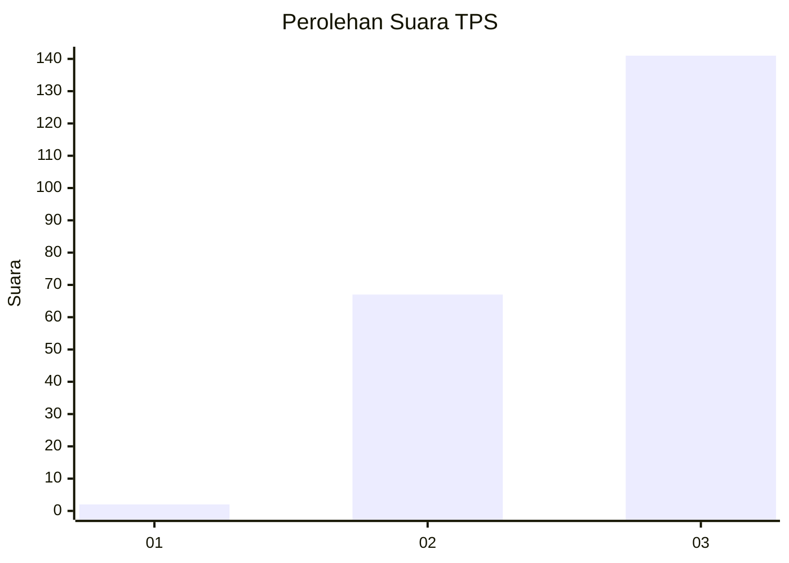
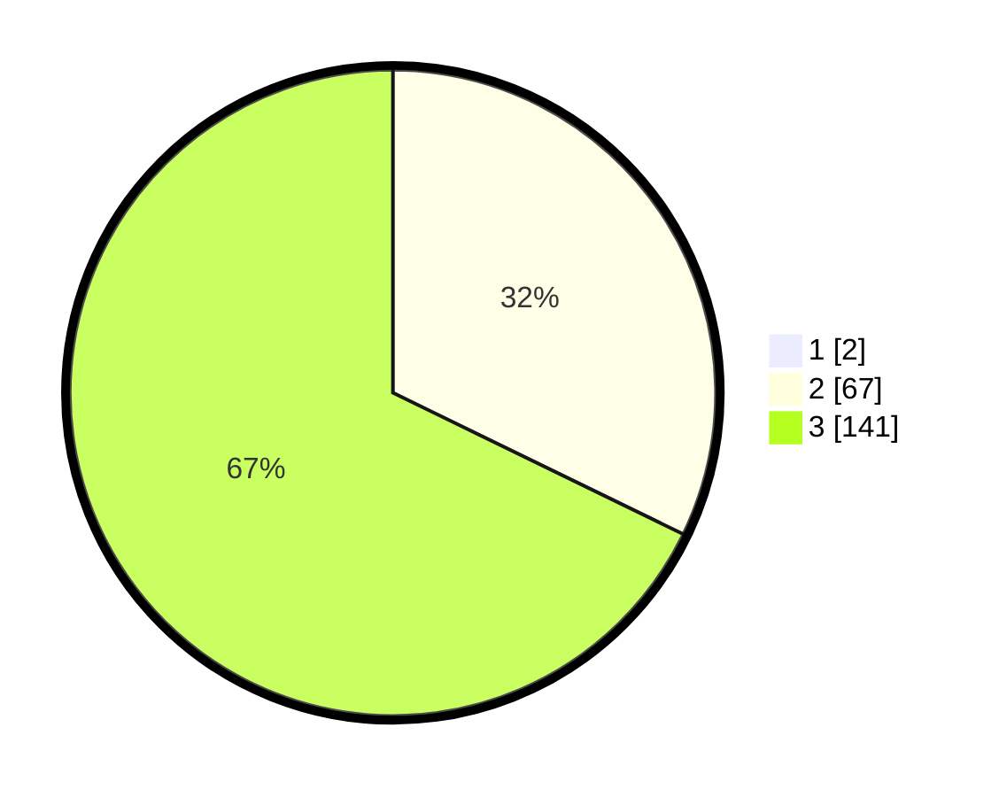

# Hasil

## Grafik

## Tabel

| No. | Nama Paslon    | Suara | Suara (raw) | Persentase |
|:--- |:-------------- | -----:| -----------:| ----------:|
| 1   | ANIES MUHAIMIN | 2     | [2][p-1]    | 0,95       |
| 2   | PRABOWO GIBRAN | 67    | [67][p-2]   | 31,90      |
| 3   | GANJAR MAHFUD  | 141   | [141][p-3]  | 67,14      |

[p-1]: https://github.com/gigit-pemilu/pemilu-2024/blob/main/pilpres/hitung-suara/sub/33-jawa-tengah/sub/21-demak/sub/01-mranggen/sub/2003-sumberejo/sub/011-tps/sub/paslon-1.txt
[p-2]: https://github.com/gigit-pemilu/pemilu-2024/blob/main/pilpres/hitung-suara/sub/33-jawa-tengah/sub/21-demak/sub/01-mranggen/sub/2003-sumberejo/sub/011-tps/sub/paslon-2.txt
[p-3]: https://github.com/gigit-pemilu/pemilu-2024/blob/main/pilpres/hitung-suara/sub/33-jawa-tengah/sub/21-demak/sub/01-mranggen/sub/2003-sumberejo/sub/011-tps/sub/paslon-3.txt

## Foto C Plano

https://sirekap-obj-formc.kpu.go.id/f24c/pemilu/ppwp/33/21/01/20/03/3321012003011-20240214-204219--2e6bfd2f-1eae-4103-b165-157963695c6a.jpg

https://sirekap-obj-formc.kpu.go.id/f24c/pemilu/ppwp/33/21/01/20/03/3321012003011-20240214-204250--02df24e9-5ccc-4710-8691-049f8857a424.jpg

https://sirekap-obj-formc.kpu.go.id/f24c/pemilu/ppwp/33/21/01/20/03/3321012003011-20240214-204328--8f446c79-af8d-4a9d-a34b-77964294fc05.jpg

## Metadata

| Key        | Value               |
| ---------- | ------------------- |
| Time Stamp | 2024-02-25 15:00:00 |

