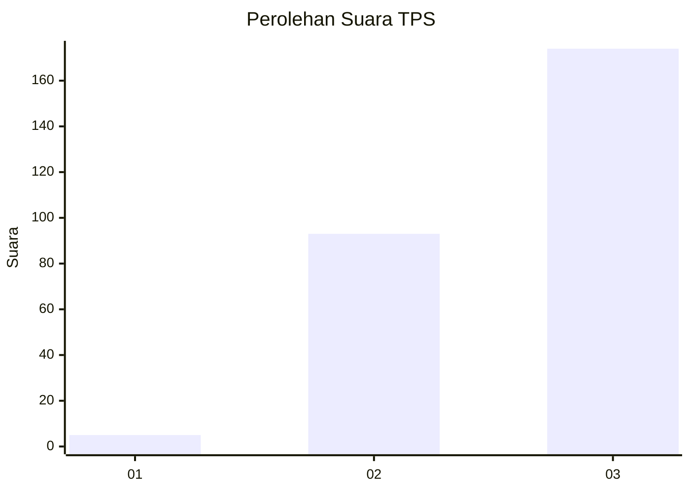
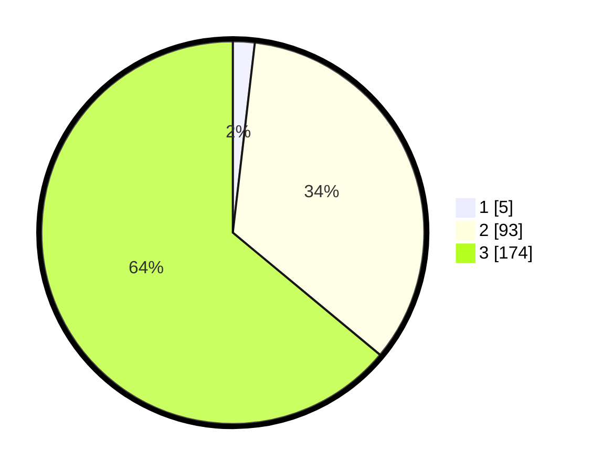

# Hasil

## Grafik

## Tabel

| No. | Nama Paslon    | Suara | Suara (raw) | Persentase |
|:--- |:-------------- | -----:| -----------:| ----------:|
| 1   | ANIES MUHAIMIN | 5     | [5][p-1]    | 1,84       |
| 2   | PRABOWO GIBRAN | 93    | [93][p-2]   | 34,19      |
| 3   | GANJAR MAHFUD  | 174   | [174][p-3]  | 63,97      |

[p-1]: https://github.com/gigit-pemilu/pemilu-2024/blob/main/pilpres/hitung-suara/sub/33-jawa-tengah/sub/21-demak/sub/01-mranggen/sub/2003-sumberejo/sub/018-tps/sub/paslon-1.txt
[p-2]: https://github.com/gigit-pemilu/pemilu-2024/blob/main/pilpres/hitung-suara/sub/33-jawa-tengah/sub/21-demak/sub/01-mranggen/sub/2003-sumberejo/sub/018-tps/sub/paslon-2.txt
[p-3]: https://github.com/gigit-pemilu/pemilu-2024/blob/main/pilpres/hitung-suara/sub/33-jawa-tengah/sub/21-demak/sub/01-mranggen/sub/2003-sumberejo/sub/018-tps/sub/paslon-3.txt

## Foto C Plano

https://sirekap-obj-formc.kpu.go.id/6f0c/pemilu/ppwp/33/21/01/20/03/3321012003018-20240224-113714--d49648bc-204c-419d-aae1-68f0b6a7aba3.jpg

https://sirekap-obj-formc.kpu.go.id/6f0c/pemilu/ppwp/33/21/01/20/03/3321012003018-20240224-114241--98a855c6-7c76-40d2-9a63-59ec1b72482e.jpg

https://sirekap-obj-formc.kpu.go.id/6f0c/pemilu/ppwp/33/21/01/20/03/3321012003018-20240224-114524--710e14a5-0600-4d7b-a739-38b2cd87fc23.jpg

## Metadata

| Key        | Value               |
| ---------- | ------------------- |
| Time Stamp | 2024-02-24 22:31:28 |

