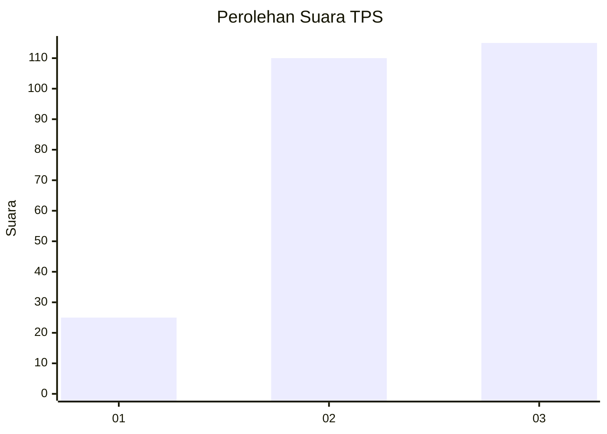
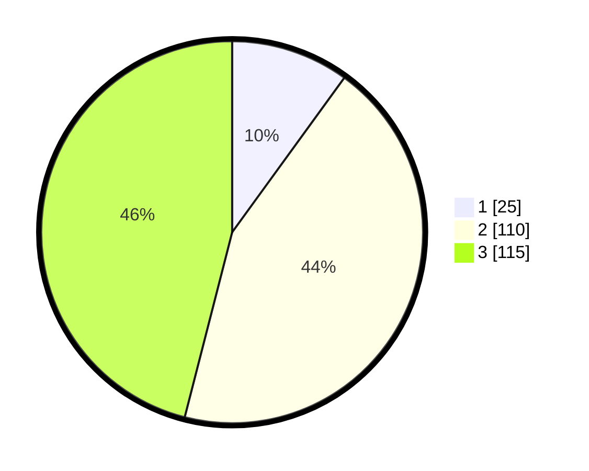

# Hasil

## Grafik

## Tabel

| No. | Nama Paslon    | Suara | Suara (raw) | Persentase |
|:--- |:-------------- | -----:| -----------:| ----------:|
| 1   | ANIES MUHAIMIN | 25    | [25][p-1]   | 10,00      |
| 2   | PRABOWO GIBRAN | 110   | [110][p-2]  | 44,00      |
| 3   | GANJAR MAHFUD  | 115   | [115][p-3]  | 46,00      |

[p-1]: https://github.com/gigit-pemilu/pemilu-2024/blob/main/pilpres/hitung-suara/sub/33-jawa-tengah/sub/21-demak/sub/01-mranggen/sub/2005-kangkung/sub/016-tps/sub/paslon-1.txt
[p-2]: https://github.com/gigit-pemilu/pemilu-2024/blob/main/pilpres/hitung-suara/sub/33-jawa-tengah/sub/21-demak/sub/01-mranggen/sub/2005-kangkung/sub/016-tps/sub/paslon-2.txt
[p-3]: https://github.com/gigit-pemilu/pemilu-2024/blob/main/pilpres/hitung-suara/sub/33-jawa-tengah/sub/21-demak/sub/01-mranggen/sub/2005-kangkung/sub/016-tps/sub/paslon-3.txt

## Foto C Plano

https://sirekap-obj-formc.kpu.go.id/797d/pemilu/ppwp/33/21/01/20/05/3321012005016-20240217-015120--16bdadd4-4c53-4411-8c2c-a55f0d694970.jpg

https://sirekap-obj-formc.kpu.go.id/797d/pemilu/ppwp/33/21/01/20/05/3321012005016-20240217-013220--a545901f-f3e4-4aa1-8c4a-e070a704cdb1.jpg

https://sirekap-obj-formc.kpu.go.id/797d/pemilu/ppwp/33/21/01/20/05/3321012005016-20240217-013224--0def231d-6f22-405f-a948-2524bd95622b.jpg

## Metadata

| Key        | Value               |
| ---------- | ------------------- |
| Time Stamp | 2024-02-21 15:00:00 |

