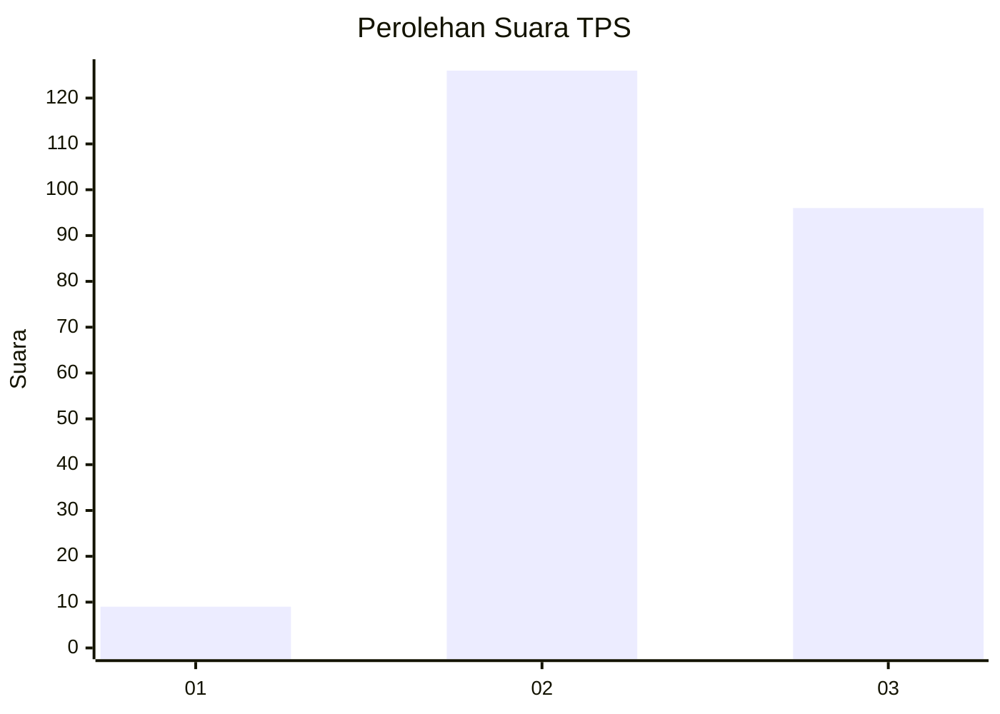
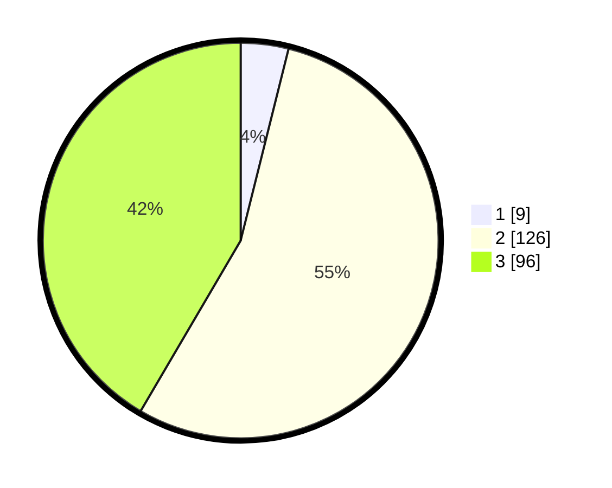

# Hasil

## Grafik

## Tabel

| No. | Nama Paslon    | Suara | Suara (raw) | Persentase |
|:--- |:-------------- | -----:| -----------:| ----------:|
| 1   | ANIES MUHAIMIN | 9     | [9][p-1]    | 3,90       |
| 2   | PRABOWO GIBRAN | 126   | [126][p-2]  | 54,55      |
| 3   | GANJAR MAHFUD  | 96    | [96][p-3]   | 41,56      |

[p-1]: https://github.com/gigit-pemilu/pemilu-2024/blob/main/pilpres/hitung-suara/sub/33-jawa-tengah/sub/21-demak/sub/01-mranggen/sub/2016-wringinjajar/sub/005-tps/sub/paslon-1.txt
[p-2]: https://github.com/gigit-pemilu/pemilu-2024/blob/main/pilpres/hitung-suara/sub/33-jawa-tengah/sub/21-demak/sub/01-mranggen/sub/2016-wringinjajar/sub/005-tps/sub/paslon-2.txt
[p-3]: https://github.com/gigit-pemilu/pemilu-2024/blob/main/pilpres/hitung-suara/sub/33-jawa-tengah/sub/21-demak/sub/01-mranggen/sub/2016-wringinjajar/sub/005-tps/sub/paslon-3.txt

## Foto C Plano

https://sirekap-obj-formc.kpu.go.id/66b0/pemilu/ppwp/33/21/01/20/16/3321012016005-20240216-200147--8ab7f1c7-7974-48bb-89c0-a8adf3b63f29.jpg

https://sirekap-obj-formc.kpu.go.id/66b0/pemilu/ppwp/33/21/01/20/16/3321012016005-20240216-201727--33417c9e-ffcb-4c79-83a5-a0ff7af1a7e6.jpg

https://sirekap-obj-formc.kpu.go.id/66b0/pemilu/ppwp/33/21/01/20/16/3321012016005-20240216-201841--e87c4458-65fe-47a7-a579-671c4b1bd424.jpg

## Metadata

| Key        | Value               |
| ---------- | ------------------- |
| Time Stamp | 2024-02-16 21:01:00 |

