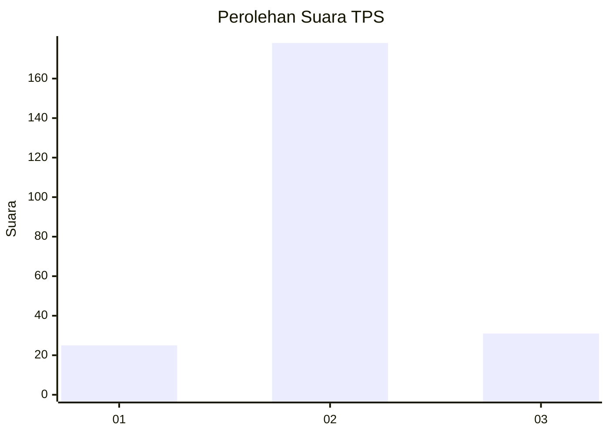
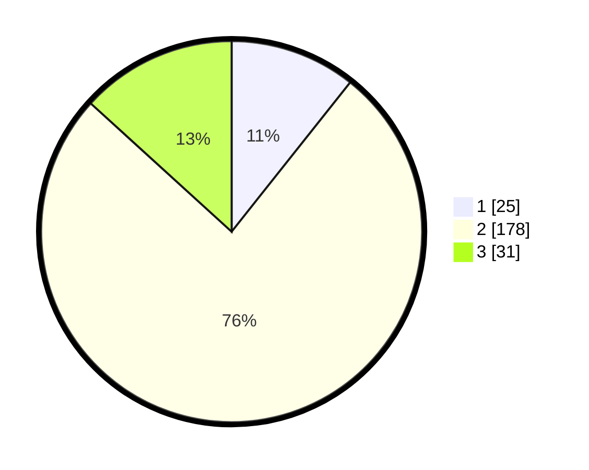

# Hasil

## Grafik

## Tabel

| No. | Nama Paslon    | Suara | Suara (raw) | Persentase |
|:--- |:-------------- | -----:| -----------:| ----------:|
| 1   | ANIES MUHAIMIN | 25    | [25][p-1]   | 10,68      |
| 2   | PRABOWO GIBRAN | 178   | [178][p-2]  | 76,07      |
| 3   | GANJAR MAHFUD  | 31    | [31][p-3]   | 13,25      |

[p-1]: https://github.com/gigit-pemilu/pemilu-2024/blob/main/pilpres/hitung-suara/sub/33-jawa-tengah/sub/21-demak/sub/01-mranggen/sub/2018-tegalarum/sub/005-tps/sub/paslon-1.txt
[p-2]: https://github.com/gigit-pemilu/pemilu-2024/blob/main/pilpres/hitung-suara/sub/33-jawa-tengah/sub/21-demak/sub/01-mranggen/sub/2018-tegalarum/sub/005-tps/sub/paslon-2.txt
[p-3]: https://github.com/gigit-pemilu/pemilu-2024/blob/main/pilpres/hitung-suara/sub/33-jawa-tengah/sub/21-demak/sub/01-mranggen/sub/2018-tegalarum/sub/005-tps/sub/paslon-3.txt

## Foto C Plano

https://sirekap-obj-formc.kpu.go.id/ec18/pemilu/ppwp/33/21/01/20/18/3321012018005-20240215-014351--1c4d1695-421b-4ccf-84a0-aeb2d2ee5eb9.jpg

https://sirekap-obj-formc.kpu.go.id/ec18/pemilu/ppwp/33/21/01/20/18/3321012018005-20240215-014434--d8ee70ac-deb8-4c2e-9dce-019c0f4b0b4b.jpg

https://sirekap-obj-formc.kpu.go.id/ec18/pemilu/ppwp/33/21/01/20/18/3321012018005-20240215-014509--2bc573ed-3ab3-4e23-808c-bc7bb329cb89.jpg

## Metadata

| Key        | Value               |
| ---------- | ------------------- |
| Time Stamp | 2024-02-16 23:00:00 |

