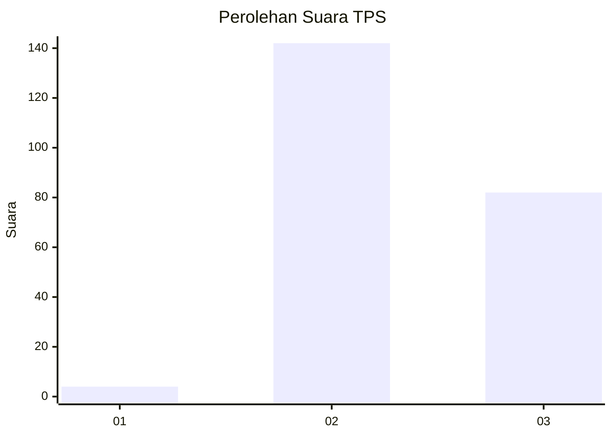
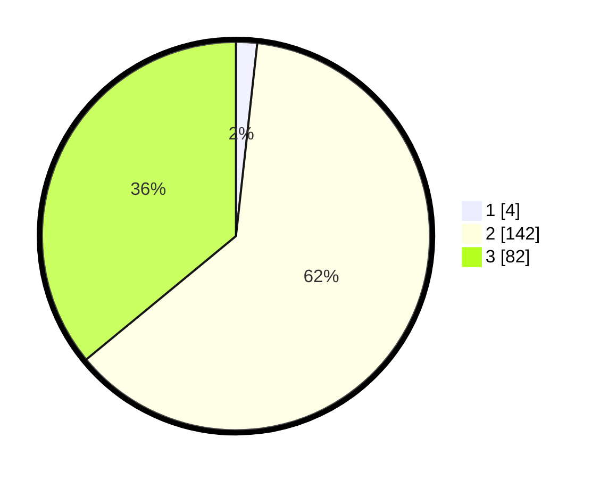

# Hasil

## Grafik

## Tabel

| No. | Nama Paslon    | Suara | Suara (raw) | Persentase |
|:--- |:-------------- | -----:| -----------:| ----------:|
| 1   | ANIES MUHAIMIN | 4     | [4][p-1]    | 1,75       |
| 2   | PRABOWO GIBRAN | 142   | [142][p-2]  | 62,28      |
| 3   | GANJAR MAHFUD  | 82    | [82][p-3]   | 35,96      |

[p-1]: https://github.com/gigit-pemilu/pemilu-2024-33-jawa-tengah/blob/main/pilpres/hitung-suara/sub/33-jawa-tengah/sub/21-demak/sub/02-karangawen/sub/2001-jragung/sub/004-tps/sub/paslon-1.txt
[p-2]: https://github.com/gigit-pemilu/pemilu-2024-33-jawa-tengah/blob/main/pilpres/hitung-suara/sub/33-jawa-tengah/sub/21-demak/sub/02-karangawen/sub/2001-jragung/sub/004-tps/sub/paslon-2.txt
[p-3]: https://github.com/gigit-pemilu/pemilu-2024-33-jawa-tengah/blob/main/pilpres/hitung-suara/sub/33-jawa-tengah/sub/21-demak/sub/02-karangawen/sub/2001-jragung/sub/004-tps/sub/paslon-3.txt

## Foto C Plano

https://sirekap-obj-formc.kpu.go.id/f3dc/pemilu/ppwp/33/21/02/20/01/3321022001004-20240214-225401--f845affb-96fd-4c09-87fd-0a43f4cebda1.jpg

https://sirekap-obj-formc.kpu.go.id/f3dc/pemilu/ppwp/33/21/02/20/01/3321022001004-20240216-025414--c1f5768d-a621-420b-ad41-8cc9141b673d.jpg

https://sirekap-obj-formc.kpu.go.id/f3dc/pemilu/ppwp/33/21/02/20/01/3321022001004-20240216-025404--40a81c81-f209-4cca-8c7b-50724521a52a.jpg

## Metadata

| Key        | Value               |
| ---------- | ------------------- |
| Time Stamp | 2024-02-21 13:00:00 |

