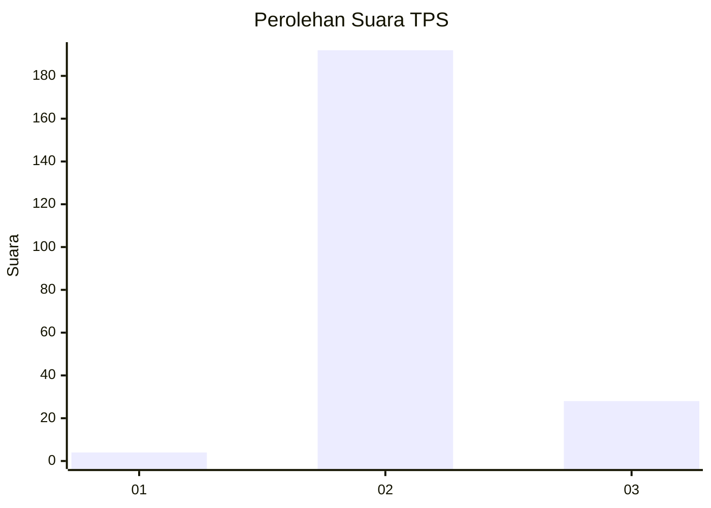
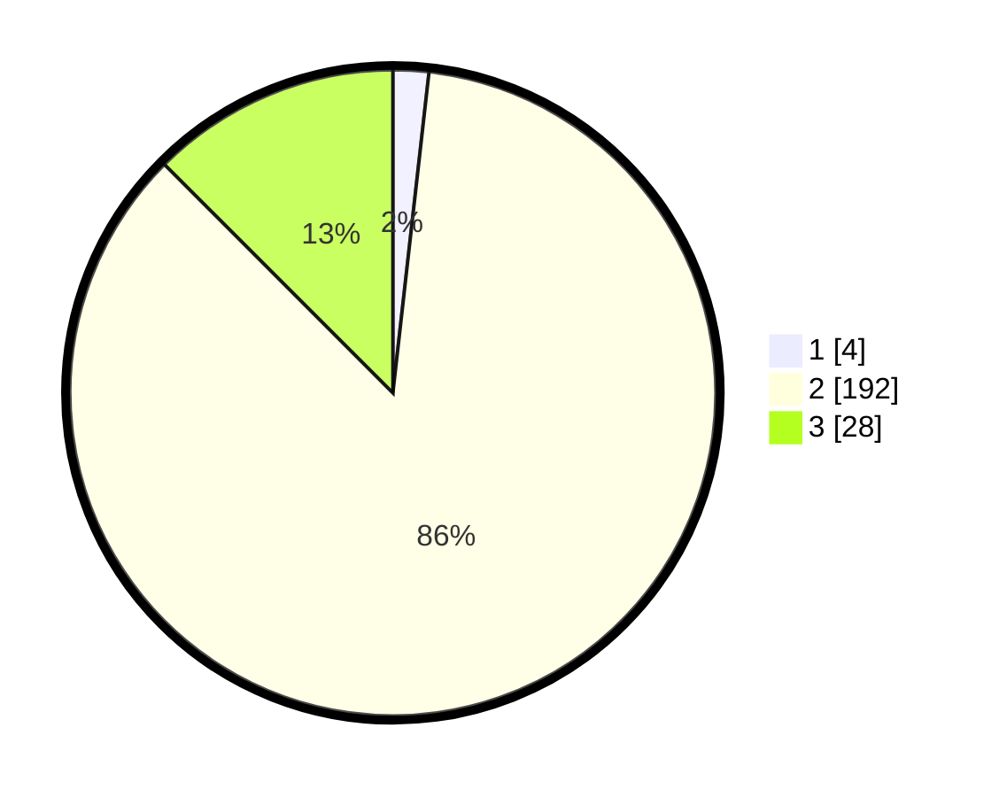

# Hasil

## Grafik

## Tabel

| No. | Nama Paslon    | Suara | Suara (raw) | Persentase |
|:--- |:-------------- | -----:| -----------:| ----------:|
| 1   | ANIES MUHAIMIN | 4     | [4][p-1]    | 1,79       |
| 2   | PRABOWO GIBRAN | 192   | [192][p-2]  | 85,71      |
| 3   | GANJAR MAHFUD  | 28    | [28][p-3]   | 12,50      |

[p-1]: https://github.com/gigit-pemilu/pemilu-2024-33-jawa-tengah/blob/main/pilpres/hitung-suara/sub/33-jawa-tengah/sub/21-demak/sub/02-karangawen/sub/2001-jragung/sub/005-tps/sub/paslon-1.txt
[p-2]: https://github.com/gigit-pemilu/pemilu-2024-33-jawa-tengah/blob/main/pilpres/hitung-suara/sub/33-jawa-tengah/sub/21-demak/sub/02-karangawen/sub/2001-jragung/sub/005-tps/sub/paslon-2.txt
[p-3]: https://github.com/gigit-pemilu/pemilu-2024-33-jawa-tengah/blob/main/pilpres/hitung-suara/sub/33-jawa-tengah/sub/21-demak/sub/02-karangawen/sub/2001-jragung/sub/005-tps/sub/paslon-3.txt

## Foto C Plano

https://sirekap-obj-formc.kpu.go.id/785d/pemilu/ppwp/33/21/02/20/01/3321022001005-20240215-085440--f391528e-13b5-401f-8627-978eb1b7c532.jpg

https://sirekap-obj-formc.kpu.go.id/785d/pemilu/ppwp/33/21/02/20/01/3321022001005-20240215-085543--25d55bdc-1776-4c57-bfaa-fea7921c4759.jpg

https://sirekap-obj-formc.kpu.go.id/785d/pemilu/ppwp/33/21/02/20/01/3321022001005-20240215-085639--70430b76-391b-44e9-a08e-1f604c354740.jpg

## Metadata

| Key        | Value               |
| ---------- | ------------------- |
| Time Stamp | 2024-02-25 11:00:00 |

