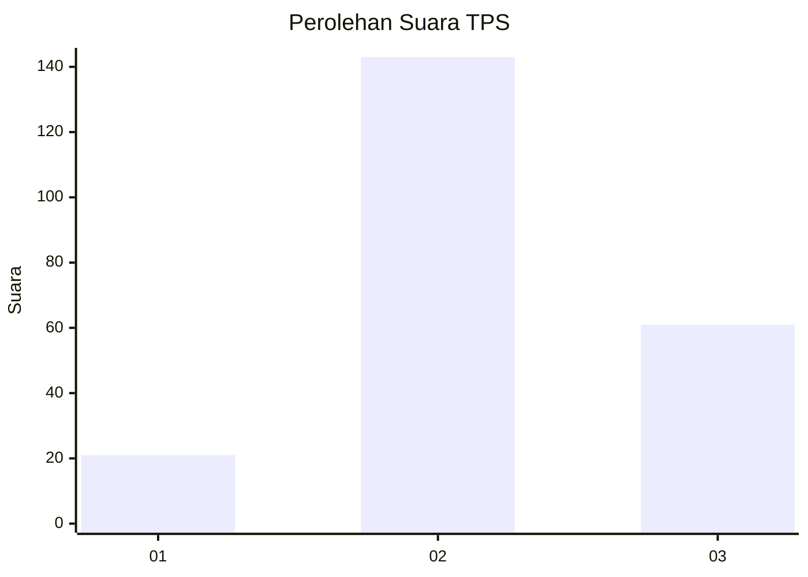
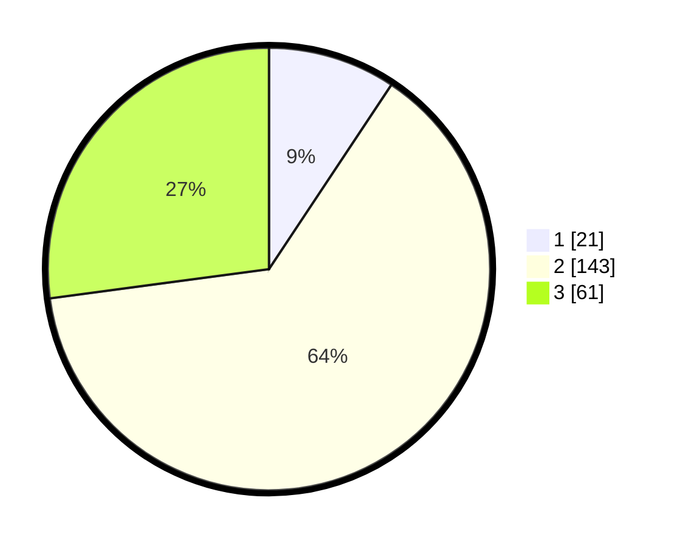

# Hasil

## Grafik

## Tabel

| No. | Nama Paslon    | Suara | Suara (raw) | Persentase |
|:--- |:-------------- | -----:| -----------:| ----------:|
| 1   | ANIES MUHAIMIN | 21    | [21][p-1]   | 9,33       |
| 2   | PRABOWO GIBRAN | 143   | [143][p-2]  | 63,56      |
| 3   | GANJAR MAHFUD  | 61    | [61][p-3]   | 27,11      |

[p-1]: https://github.com/gigit-pemilu/pemilu-2024-33-jawa-tengah/blob/main/pilpres/hitung-suara/sub/33-jawa-tengah/sub/21-demak/sub/03-guntur/sub/2001-blerong/sub/004-tps/sub/paslon-1.txt
[p-2]: https://github.com/gigit-pemilu/pemilu-2024-33-jawa-tengah/blob/main/pilpres/hitung-suara/sub/33-jawa-tengah/sub/21-demak/sub/03-guntur/sub/2001-blerong/sub/004-tps/sub/paslon-2.txt
[p-3]: https://github.com/gigit-pemilu/pemilu-2024-33-jawa-tengah/blob/main/pilpres/hitung-suara/sub/33-jawa-tengah/sub/21-demak/sub/03-guntur/sub/2001-blerong/sub/004-tps/sub/paslon-3.txt

## Foto C Plano

https://sirekap-obj-formc.kpu.go.id/e50d/pemilu/ppwp/33/21/03/20/01/3321032001004-20240214-235931--e52ab645-56fb-40a0-b7d1-9c50d43f9bc9.jpg

https://sirekap-obj-formc.kpu.go.id/e50d/pemilu/ppwp/33/21/03/20/01/3321032001004-20240216-154013--5375f0dd-90f6-4745-b79c-28c1cae5db8c.jpg

https://sirekap-obj-formc.kpu.go.id/e50d/pemilu/ppwp/33/21/03/20/01/3321032001004-20240216-153310--9c191bb2-fe61-4797-8d7d-d4e0898c58b7.jpg

## Metadata

| Key        | Value               |
| ---------- | ------------------- |
| Time Stamp | 2024-02-25 16:00:00 |

