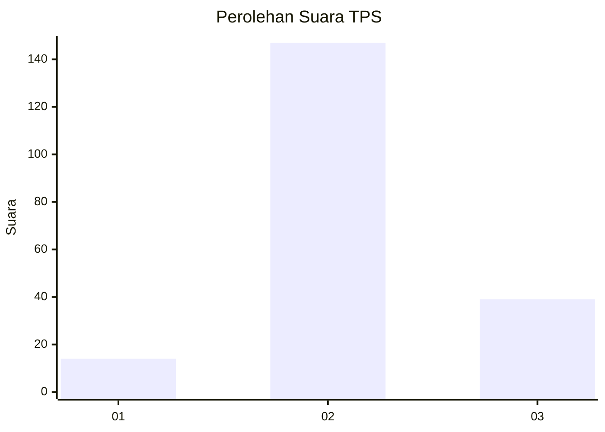
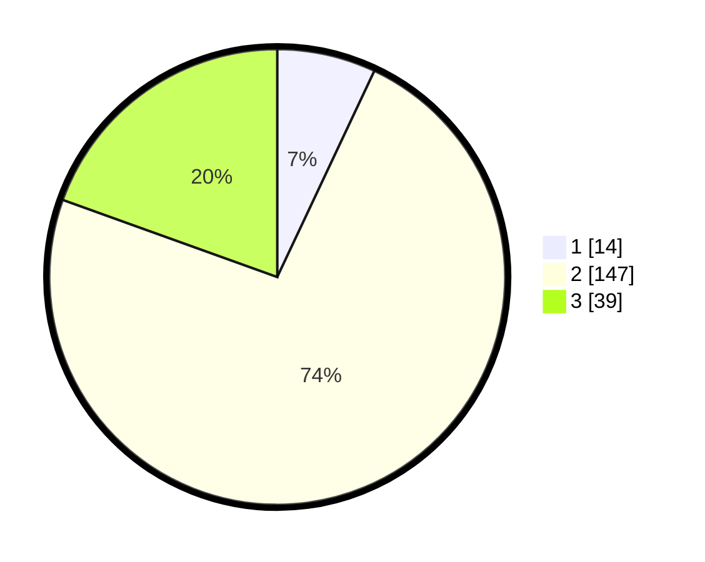

# Hasil

## Grafik

## Tabel

| No. | Nama Paslon    | Suara | Suara (raw) | Persentase |
|:--- |:-------------- | -----:| -----------:| ----------:|
| 1   | ANIES MUHAIMIN | 14    | [14][p-1]   | 7,00       |
| 2   | PRABOWO GIBRAN | 147   | [147][p-2]  | 73,50      |
| 3   | GANJAR MAHFUD  | 39    | [39][p-3]   | 19,50      |

[p-1]: https://github.com/gigit-pemilu/pemilu-2024/blob/main/pilpres/hitung-suara/sub/33-jawa-tengah/sub/21-demak/sub/03-guntur/sub/2001-blerong/sub/008-tps/sub/paslon-1.txt
[p-2]: https://github.com/gigit-pemilu/pemilu-2024/blob/main/pilpres/hitung-suara/sub/33-jawa-tengah/sub/21-demak/sub/03-guntur/sub/2001-blerong/sub/008-tps/sub/paslon-2.txt
[p-3]: https://github.com/gigit-pemilu/pemilu-2024/blob/main/pilpres/hitung-suara/sub/33-jawa-tengah/sub/21-demak/sub/03-guntur/sub/2001-blerong/sub/008-tps/sub/paslon-3.txt

## Foto C Plano

https://sirekap-obj-formc.kpu.go.id/4400/pemilu/ppwp/33/21/03/20/01/3321032001008-20240218-002323--6a4c37ec-06cb-4b4b-ac98-312e29e08bb4.jpg

https://sirekap-obj-formc.kpu.go.id/4400/pemilu/ppwp/33/21/03/20/01/3321032001008-20240218-002522--ac8fef77-e169-48b3-8b4e-50c53ee01a82.jpg

https://sirekap-obj-formc.kpu.go.id/4400/pemilu/ppwp/33/21/03/20/01/3321032001008-20240216-173437--50f2236b-927f-4483-a0f6-d738849103da.jpg

## Metadata

| Key        | Value               |
| ---------- | ------------------- |
| Time Stamp | 2024-02-24 22:31:28 |

