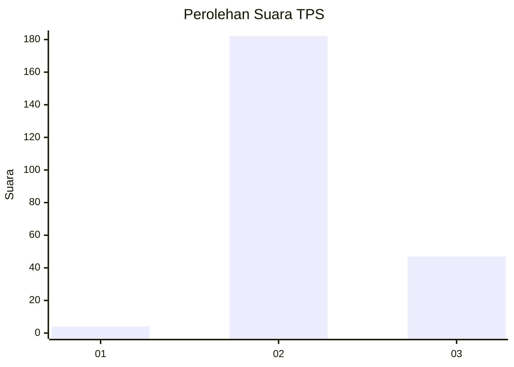

# Hasil

## Grafik

## Tabel

| No. | Nama Paslon    | Suara | Suara (raw) | Persentase |
|:--- |:-------------- | -----:| -----------:| ----------:|
| 1   | ANIES MUHAIMIN | 4     | [4][p-1]    | 1,72       |
| 2   | PRABOWO GIBRAN | 182   | [182][p-2]  | 78,11      |
| 3   | GANJAR MAHFUD  | 47    | [47][p-3]   | 20,17      |

[p-1]: https://github.com/gigit-pemilu/pemilu-2024/blob/main/pilpres/hitung-suara/sub/33-jawa-tengah/sub/21-demak/sub/03-guntur/sub/2005-pamongan/sub/008-tps/sub/paslon-1.txt
[p-2]: https://github.com/gigit-pemilu/pemilu-2024/blob/main/pilpres/hitung-suara/sub/33-jawa-tengah/sub/21-demak/sub/03-guntur/sub/2005-pamongan/sub/008-tps/sub/paslon-2.txt
[p-3]: https://github.com/gigit-pemilu/pemilu-2024/blob/main/pilpres/hitung-suara/sub/33-jawa-tengah/sub/21-demak/sub/03-guntur/sub/2005-pamongan/sub/008-tps/sub/paslon-3.txt

## Foto C Plano

https://sirekap-obj-formc.kpu.go.id/cf96/pemilu/ppwp/33/21/03/20/05/3321032005008-20240214-200142--880a13cf-c05d-47e6-b5a7-de9a2c2bec85.jpg

https://sirekap-obj-formc.kpu.go.id/cf96/pemilu/ppwp/33/21/03/20/05/3321032005008-20240214-200154--4daa038d-ce1a-479c-95c6-f9c3056ace82.jpg

https://sirekap-obj-formc.kpu.go.id/cf96/pemilu/ppwp/33/21/03/20/05/3321032005008-20240214-200249--37955c6b-89b5-4fb7-a2ab-3f7f3a0bb9d8.jpg

## Metadata

| Key        | Value               |
| ---------- | ------------------- |
| Time Stamp | 2024-02-24 22:31:28 |

