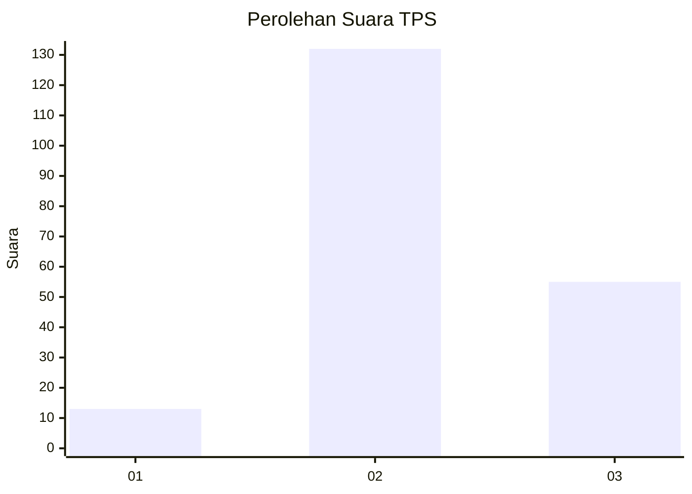

# Hasil

## Grafik

## Tabel

| No. | Nama Paslon    | Suara | Suara (raw) | Persentase |
|:--- |:-------------- | -----:| -----------:| ----------:|
| 1   | ANIES MUHAIMIN | 13    | [13][p-1]   | 6,50       |
| 2   | PRABOWO GIBRAN | 132   | [132][p-2]  | 66,00      |
| 3   | GANJAR MAHFUD  | 55    | [55][p-3]   | 27,50      |

[p-1]: https://github.com/gigit-pemilu/pemilu-2024/blob/main/pilpres/hitung-suara/sub/33-jawa-tengah/sub/21-demak/sub/03-guntur/sub/2006-tlogoweru/sub/005-tps/sub/paslon-1.txt
[p-2]: https://github.com/gigit-pemilu/pemilu-2024/blob/main/pilpres/hitung-suara/sub/33-jawa-tengah/sub/21-demak/sub/03-guntur/sub/2006-tlogoweru/sub/005-tps/sub/paslon-2.txt
[p-3]: https://github.com/gigit-pemilu/pemilu-2024/blob/main/pilpres/hitung-suara/sub/33-jawa-tengah/sub/21-demak/sub/03-guntur/sub/2006-tlogoweru/sub/005-tps/sub/paslon-3.txt

## Foto C Plano

https://sirekap-obj-formc.kpu.go.id/71b8/pemilu/ppwp/33/21/03/20/06/3321032006005-20240214-200504--26359726-a8c5-45be-a713-b50282ae652e.jpg

https://sirekap-obj-formc.kpu.go.id/71b8/pemilu/ppwp/33/21/03/20/06/3321032006005-20240215-000136--b1972f72-ab44-4bd6-b9c6-8259d7106e34.jpg

https://sirekap-obj-formc.kpu.go.id/71b8/pemilu/ppwp/33/21/03/20/06/3321032006005-20240214-200832--fa216072-f784-49fb-a81a-69e35efb614e.jpg

## Metadata

| Key        | Value               |
| ---------- | ------------------- |
| Time Stamp | 2024-02-24 22:31:28 |

