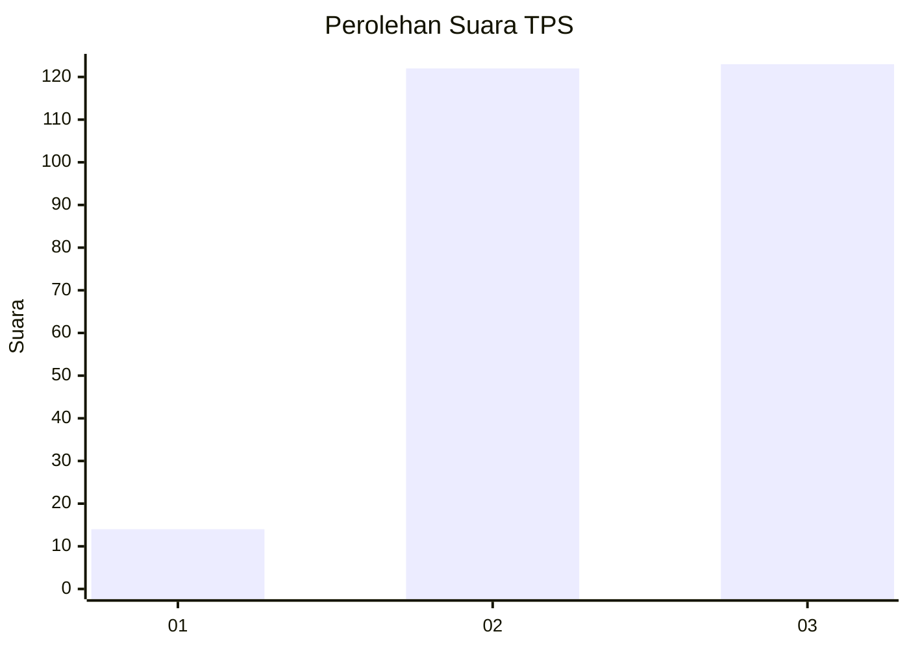
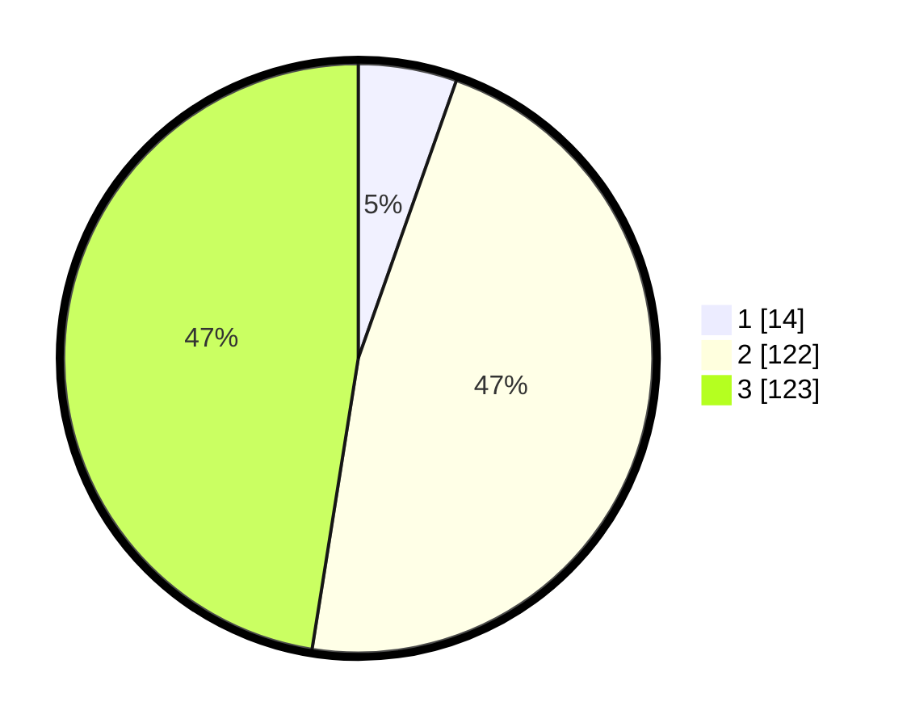

# Hasil

## Grafik

## Tabel

| No. | Nama Paslon    | Suara | Suara (raw) | Persentase |
|:--- |:-------------- | -----:| -----------:| ----------:|
| 1   | ANIES MUHAIMIN | 14    | [14][p-1]   | 5,41       |
| 2   | PRABOWO GIBRAN | 122   | [122][p-2]  | 47,10      |
| 3   | GANJAR MAHFUD  | 123   | [123][p-3]  | 47,49      |

[p-1]: https://github.com/gigit-pemilu/pemilu-2024-33-jawa-tengah/blob/main/pilpres/hitung-suara/sub/33-jawa-tengah/sub/21-demak/sub/03-guntur/sub/2014-bakalrejo/sub/002-tps/sub/paslon-1.txt
[p-2]: https://github.com/gigit-pemilu/pemilu-2024-33-jawa-tengah/blob/main/pilpres/hitung-suara/sub/33-jawa-tengah/sub/21-demak/sub/03-guntur/sub/2014-bakalrejo/sub/002-tps/sub/paslon-2.txt
[p-3]: https://github.com/gigit-pemilu/pemilu-2024-33-jawa-tengah/blob/main/pilpres/hitung-suara/sub/33-jawa-tengah/sub/21-demak/sub/03-guntur/sub/2014-bakalrejo/sub/002-tps/sub/paslon-3.txt

## Foto C Plano

https://sirekap-obj-formc.kpu.go.id/a035/pemilu/ppwp/33/21/03/20/14/3321032014002-20240214-232530--59f63247-9160-45a1-85c5-7e22f3d2f5e7.jpg

https://sirekap-obj-formc.kpu.go.id/a035/pemilu/ppwp/33/21/03/20/14/3321032014002-20240214-232644--fa90059e-a084-4312-b4fa-7a7010c9e463.jpg

https://sirekap-obj-formc.kpu.go.id/a035/pemilu/ppwp/33/21/03/20/14/3321032014002-20240214-232736--b70224c9-2a96-44ed-a31b-f13054650559.jpg

## Metadata

| Key        | Value               |
| ---------- | ------------------- |
| Time Stamp | 2024-02-24 22:31:28 |

