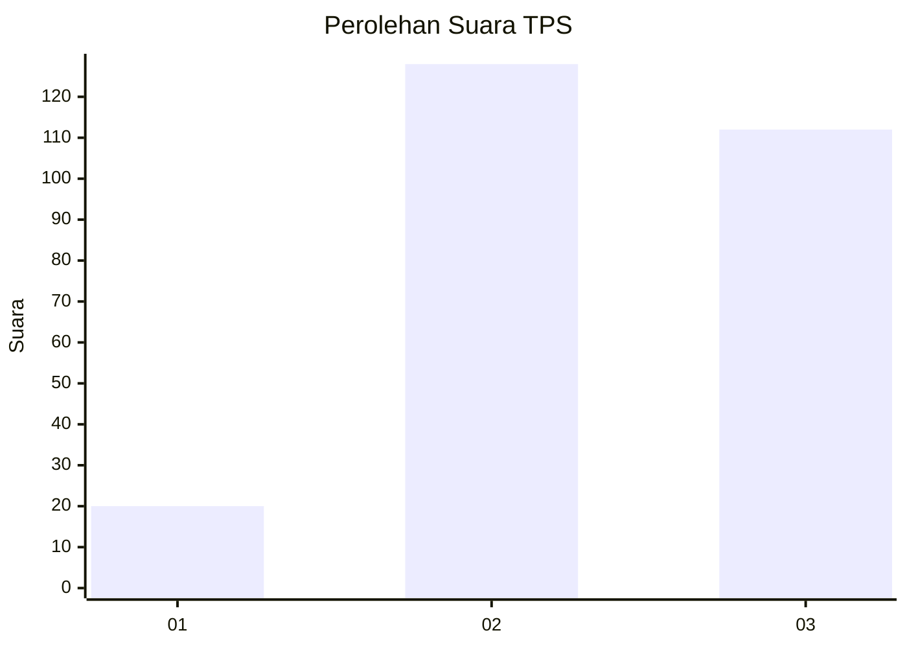
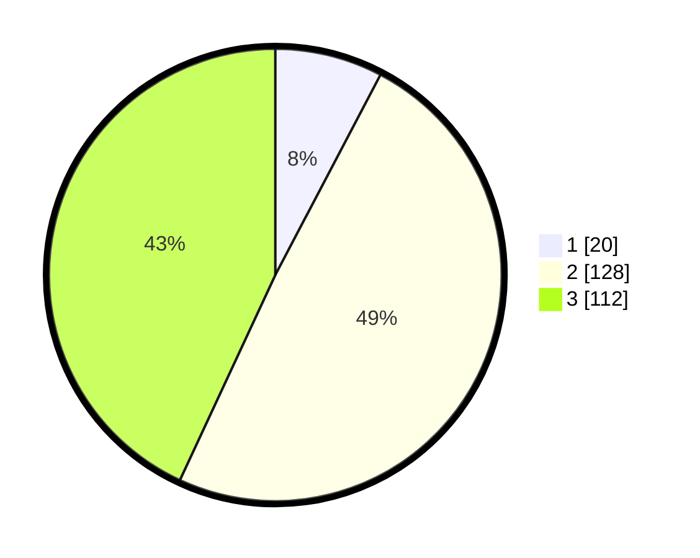

# Hasil

## Grafik

## Tabel

| No. | Nama Paslon    | Suara | Suara (raw) | Persentase |
|:--- |:-------------- | -----:| -----------:| ----------:|
| 1   | ANIES MUHAIMIN | 20    | [20][p-1]   | 7,69       |
| 2   | PRABOWO GIBRAN | 128   | [128][p-2]  | 49,23      |
| 3   | GANJAR MAHFUD  | 112   | [112][p-3]  | 43,08      |

[p-1]: https://github.com/gigit-pemilu/pemilu-2024/blob/main/pilpres/hitung-suara/sub/33-jawa-tengah/sub/21-demak/sub/04-sayung/sub/2004-kalisari/sub/006-tps/sub/paslon-1.txt
[p-2]: https://github.com/gigit-pemilu/pemilu-2024/blob/main/pilpres/hitung-suara/sub/33-jawa-tengah/sub/21-demak/sub/04-sayung/sub/2004-kalisari/sub/006-tps/sub/paslon-2.txt
[p-3]: https://github.com/gigit-pemilu/pemilu-2024/blob/main/pilpres/hitung-suara/sub/33-jawa-tengah/sub/21-demak/sub/04-sayung/sub/2004-kalisari/sub/006-tps/sub/paslon-3.txt

## Foto C Plano

https://sirekap-obj-formc.kpu.go.id/c427/pemilu/ppwp/33/21/04/20/04/3321042004006-20240214-214028--eb93a047-e6b3-469a-b733-419f700b857c.jpg

https://sirekap-obj-formc.kpu.go.id/c427/pemilu/ppwp/33/21/04/20/04/3321042004006-20240214-214639--f2f192ab-9532-40c2-a4f6-a5f6b5ef86d6.jpg

https://sirekap-obj-formc.kpu.go.id/c427/pemilu/ppwp/33/21/04/20/04/3321042004006-20240214-214809--bbfd2537-2ec9-4300-88b4-20275d1f9bca.jpg

## Metadata

| Key        | Value               |
| ---------- | ------------------- |
| Time Stamp | 2024-02-24 22:31:28 |

