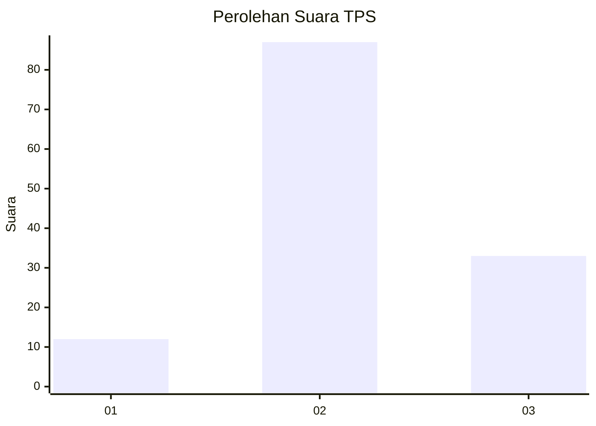
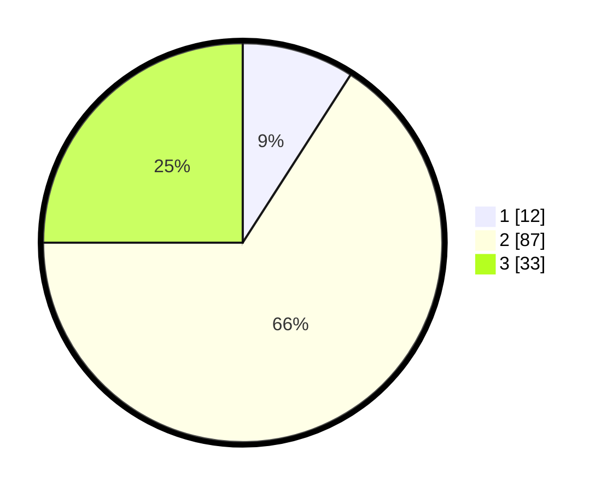

# Hasil

## Grafik

## Tabel

| No. | Nama Paslon    | Suara | Suara (raw) | Persentase |
|:--- |:-------------- | -----:| -----------:| ----------:|
| 1   | ANIES MUHAIMIN | 12    | [12][p-1]   | 9,09       |
| 2   | PRABOWO GIBRAN | 87    | [87][p-2]   | 65,91      |
| 3   | GANJAR MAHFUD  | 33    | [33][p-3]   | 25,00      |

[p-1]: https://github.com/gigit-pemilu/pemilu-2024-33-jawa-tengah/blob/main/pilpres/hitung-suara/sub/33-jawa-tengah/sub/21-demak/sub/04-sayung/sub/2004-kalisari/sub/030-tps/sub/paslon-1.txt
[p-2]: https://github.com/gigit-pemilu/pemilu-2024-33-jawa-tengah/blob/main/pilpres/hitung-suara/sub/33-jawa-tengah/sub/21-demak/sub/04-sayung/sub/2004-kalisari/sub/030-tps/sub/paslon-2.txt
[p-3]: https://github.com/gigit-pemilu/pemilu-2024-33-jawa-tengah/blob/main/pilpres/hitung-suara/sub/33-jawa-tengah/sub/21-demak/sub/04-sayung/sub/2004-kalisari/sub/030-tps/sub/paslon-3.txt

## Foto C Plano

https://sirekap-obj-formc.kpu.go.id/3b25/pemilu/ppwp/33/21/04/20/04/3321042004030-20240214-221026--41968bb6-ed5e-44ff-a6d2-392714237ce7.jpg

https://sirekap-obj-formc.kpu.go.id/3b25/pemilu/ppwp/33/21/04/20/04/3321042004030-20240214-221157--28199141-426d-4e6f-834f-957488ce0834.jpg

https://sirekap-obj-formc.kpu.go.id/3b25/pemilu/ppwp/33/21/04/20/04/3321042004030-20240214-221244--36ad7e26-d480-4632-90cf-11f86af3d9c7.jpg

## Metadata

| Key        | Value               |
| ---------- | ------------------- |
| Time Stamp | 2024-02-24 23:00:00 |

