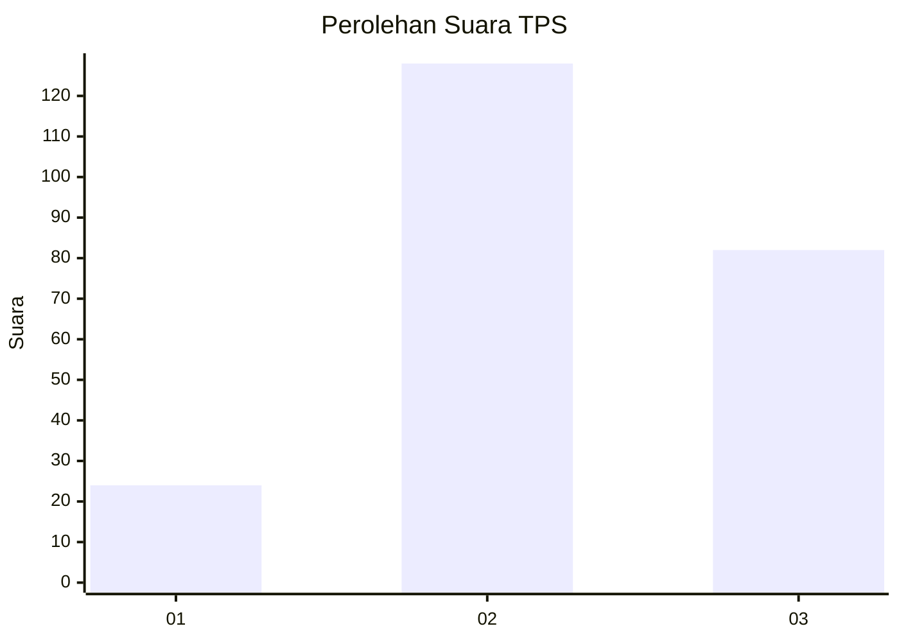
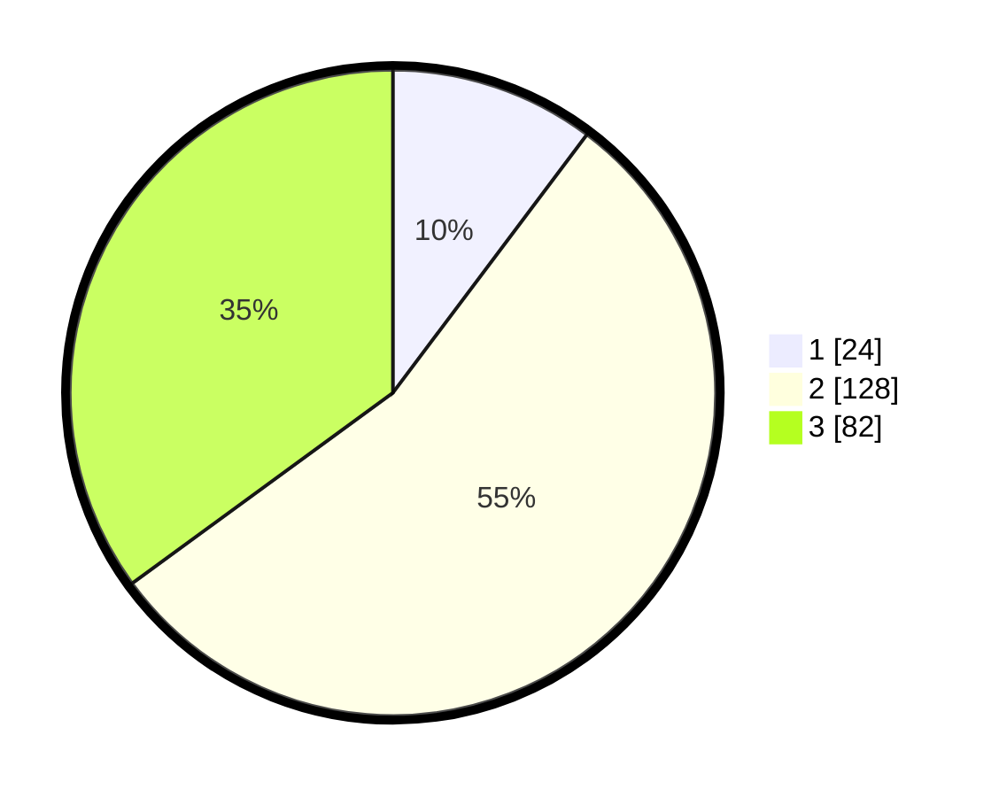

# Hasil

## Grafik

## Tabel

| No. | Nama Paslon    | Suara | Suara (raw) | Persentase |
|:--- |:-------------- | -----:| -----------:| ----------:|
| 1   | ANIES MUHAIMIN | 24    | [24][p-1]   | 10,26      |
| 2   | PRABOWO GIBRAN | 128   | [128][p-2]  | 54,70      |
| 3   | GANJAR MAHFUD  | 82    | [82][p-3]   | 35,04      |

[p-1]: https://github.com/gigit-pemilu/pemilu-2024/blob/main/pilpres/hitung-suara/sub/33-jawa-tengah/sub/21-demak/sub/05-karangtengah/sub/2001-ploso/sub/003-tps/sub/paslon-1.txt
[p-2]: https://github.com/gigit-pemilu/pemilu-2024/blob/main/pilpres/hitung-suara/sub/33-jawa-tengah/sub/21-demak/sub/05-karangtengah/sub/2001-ploso/sub/003-tps/sub/paslon-2.txt
[p-3]: https://github.com/gigit-pemilu/pemilu-2024/blob/main/pilpres/hitung-suara/sub/33-jawa-tengah/sub/21-demak/sub/05-karangtengah/sub/2001-ploso/sub/003-tps/sub/paslon-3.txt

## Foto C Plano

https://sirekap-obj-formc.kpu.go.id/1413/pemilu/ppwp/33/21/05/20/01/3321052001003-20240215-082354--10ea5578-9e42-4519-a88e-58dedc0ace59.jpg

https://sirekap-obj-formc.kpu.go.id/1413/pemilu/ppwp/33/21/05/20/01/3321052001003-20240215-082532--99baf88f-e5e1-4f8a-b0b7-0c20d57a531b.jpg

https://sirekap-obj-formc.kpu.go.id/1413/pemilu/ppwp/33/21/05/20/01/3321052001003-20240215-082710--00030865-1e4d-4197-ab9c-ba82204ba855.jpg

## Metadata

| Key        | Value               |
| ---------- | ------------------- |
| Time Stamp | 2024-02-25 11:00:00 |

