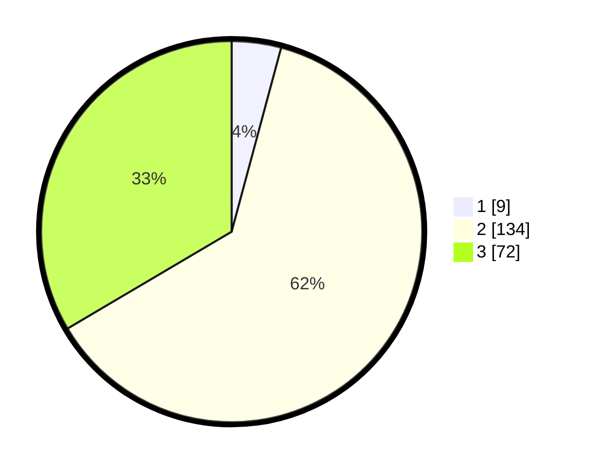

# Hasil

## Grafik

## Tabel

| No. | Nama Paslon    | Suara | Suara (raw) | Persentase |
|:--- |:-------------- | -----:| -----------:| ----------:|
| 1   | ANIES MUHAIMIN | 9     | [9][p-1]    | 4,19       |
| 2   | PRABOWO GIBRAN | 134   | [134][p-2]  | 62,33      |
| 3   | GANJAR MAHFUD  | 72    | [72][p-3]   | 33,49      |

[p-1]: https://github.com/gigit-pemilu/pemilu-2024/blob/main/pilpres/hitung-suara/sub/33-jawa-tengah/sub/21-demak/sub/05-karangtengah/sub/2001-ploso/sub/004-tps/sub/paslon-1.txt
[p-2]: https://github.com/gigit-pemilu/pemilu-2024/blob/main/pilpres/hitung-suara/sub/33-jawa-tengah/sub/21-demak/sub/05-karangtengah/sub/2001-ploso/sub/004-tps/sub/paslon-2.txt
[p-3]: https://github.com/gigit-pemilu/pemilu-2024/blob/main/pilpres/hitung-suara/sub/33-jawa-tengah/sub/21-demak/sub/05-karangtengah/sub/2001-ploso/sub/004-tps/sub/paslon-3.txt

## Foto C Plano

https://sirekap-obj-formc.kpu.go.id/dcaa/pemilu/ppwp/33/21/05/20/01/3321052001004-20240215-064055--b0762bff-b8c2-4d01-bea3-85b05bcaed36.jpg

https://sirekap-obj-formc.kpu.go.id/dcaa/pemilu/ppwp/33/21/05/20/01/3321052001004-20240215-085522--6b938595-0cb2-4411-9897-692ab96d901f.jpg

https://sirekap-obj-formc.kpu.go.id/dcaa/pemilu/ppwp/33/21/05/20/01/3321052001004-20240215-085610--6dc19b5f-a39d-43ae-af64-53203e10a7d0.jpg

## Metadata

| Key        | Value               |
| ---------- | ------------------- |
| Time Stamp | 2024-02-25 18:00:00 |

