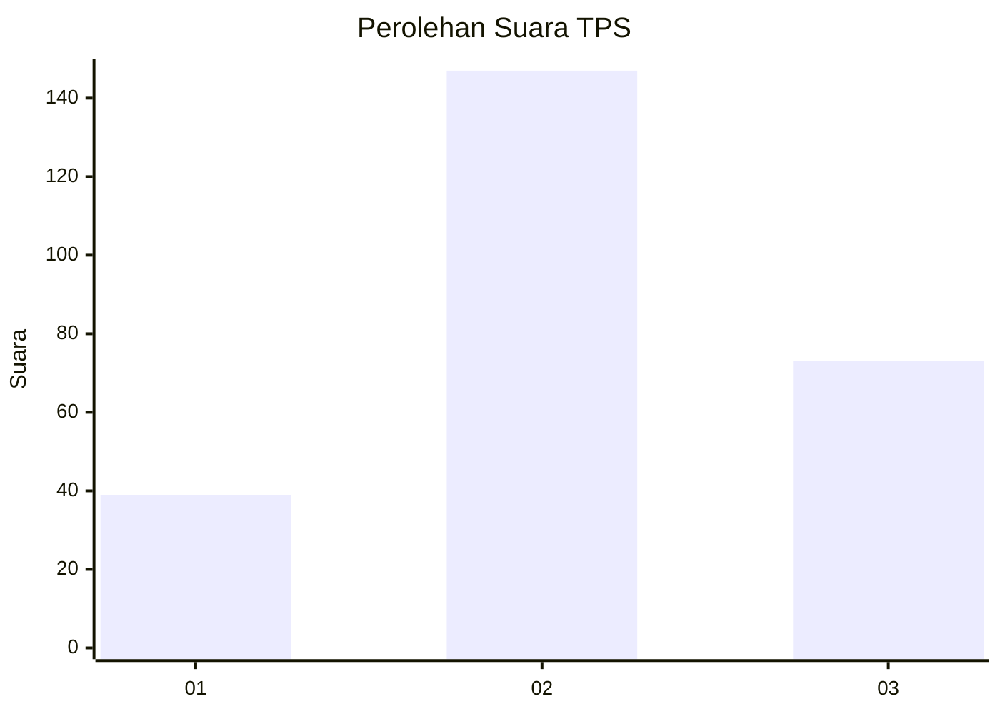
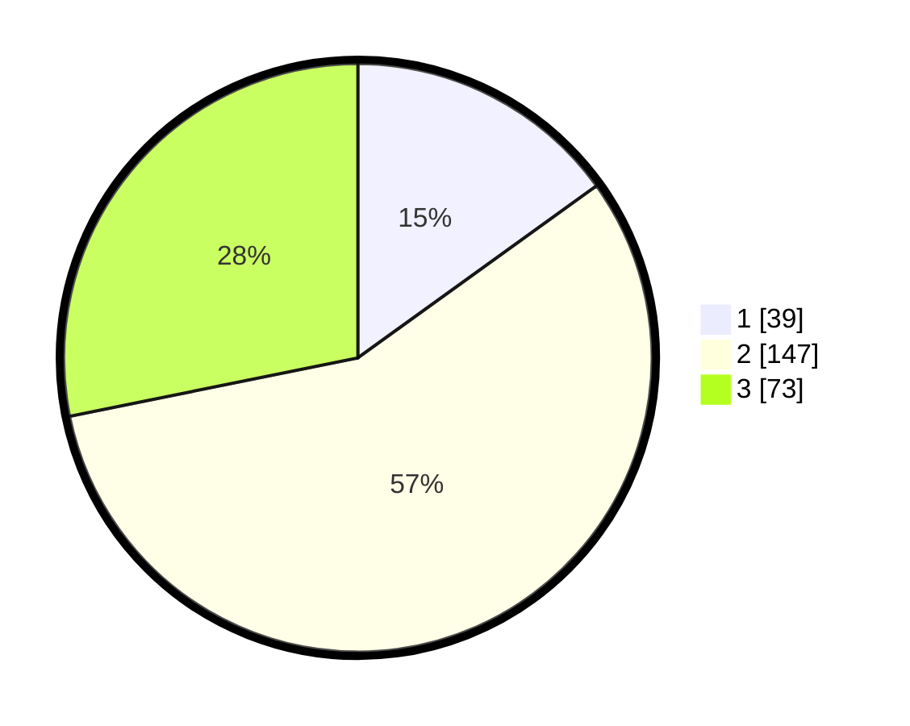

# Hasil

## Grafik

## Tabel

| No. | Nama Paslon    | Suara | Suara (raw) | Persentase |
|:--- |:-------------- | -----:| -----------:| ----------:|
| 1   | ANIES MUHAIMIN | 39    | [39][p-1]   | 15,06      |
| 2   | PRABOWO GIBRAN | 147   | [147][p-2]  | 56,76      |
| 3   | GANJAR MAHFUD  | 73    | [73][p-3]   | 28,19      |

[p-1]: https://github.com/gigit-pemilu/pemilu-2024/blob/main/pilpres/hitung-suara/sub/33-jawa-tengah/sub/21-demak/sub/05-karangtengah/sub/2011-karangtowo/sub/001-tps/sub/paslon-1.txt
[p-2]: https://github.com/gigit-pemilu/pemilu-2024/blob/main/pilpres/hitung-suara/sub/33-jawa-tengah/sub/21-demak/sub/05-karangtengah/sub/2011-karangtowo/sub/001-tps/sub/paslon-2.txt
[p-3]: https://github.com/gigit-pemilu/pemilu-2024/blob/main/pilpres/hitung-suara/sub/33-jawa-tengah/sub/21-demak/sub/05-karangtengah/sub/2011-karangtowo/sub/001-tps/sub/paslon-3.txt

## Foto C Plano

https://sirekap-obj-formc.kpu.go.id/1150/pemilu/ppwp/33/21/05/20/11/3321052011001-20240214-211939--34ab13ec-edd1-438c-849c-71ec976d2efa.jpg

https://sirekap-obj-formc.kpu.go.id/1150/pemilu/ppwp/33/21/05/20/11/3321052011001-20240215-005118--6c98daa3-029f-40b2-9174-4de5da6d9de5.jpg

https://sirekap-obj-formc.kpu.go.id/1150/pemilu/ppwp/33/21/05/20/11/3321052011001-20240214-233647--225a9366-cc27-404c-a162-521c2e1bf35e.jpg

## Metadata

| Key        | Value               |
| ---------- | ------------------- |
| Time Stamp | 2024-02-24 22:31:28 |

