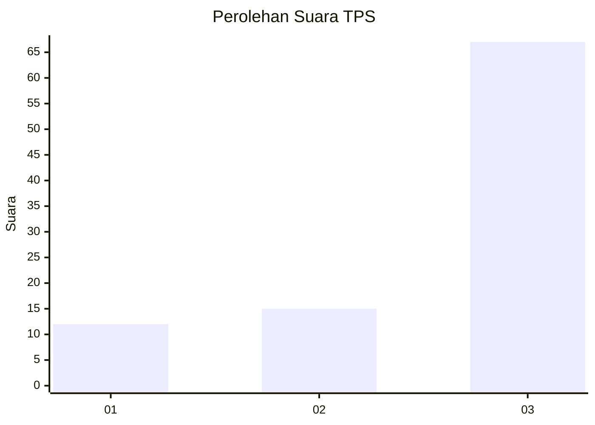
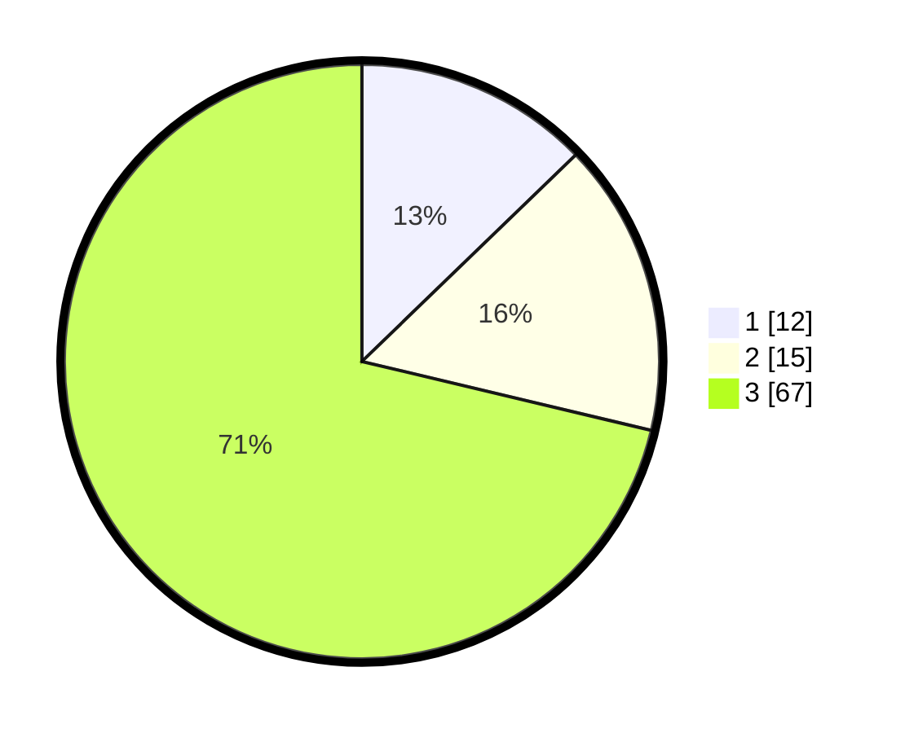

# Hasil

## Grafik

## Tabel

| No. | Nama Paslon    | Suara | Suara (raw) | Persentase |
|:--- |:-------------- | -----:| -----------:| ----------:|
| 1   | ANIES MUHAIMIN | 12    | [12][p-1]   | 12,77      |
| 2   | PRABOWO GIBRAN | 15    | [15][p-2]   | 15,96      |
| 3   | GANJAR MAHFUD  | 67    | [67][p-3]   | 71,28      |

[p-1]: https://github.com/gigit-pemilu/pemilu-2024-33-jawa-tengah/blob/main/pilpres/hitung-suara/sub/33-jawa-tengah/sub/21-demak/sub/05-karangtengah/sub/2015-rejosari/sub/005-tps/sub/paslon-1.txt
[p-2]: https://github.com/gigit-pemilu/pemilu-2024-33-jawa-tengah/blob/main/pilpres/hitung-suara/sub/33-jawa-tengah/sub/21-demak/sub/05-karangtengah/sub/2015-rejosari/sub/005-tps/sub/paslon-2.txt
[p-3]: https://github.com/gigit-pemilu/pemilu-2024-33-jawa-tengah/blob/main/pilpres/hitung-suara/sub/33-jawa-tengah/sub/21-demak/sub/05-karangtengah/sub/2015-rejosari/sub/005-tps/sub/paslon-3.txt

## Foto C Plano

https://sirekap-obj-formc.kpu.go.id/03cd/pemilu/ppwp/33/21/05/20/15/3321052015005-20240214-141758--1cccf3fe-e977-4c3b-a9fb-6f237441933e.jpg

https://sirekap-obj-formc.kpu.go.id/03cd/pemilu/ppwp/33/21/05/20/15/3321052015005-20240214-141635--72990654-d1a3-4a83-9565-655cf5211f6f.jpg

https://sirekap-obj-formc.kpu.go.id/03cd/pemilu/ppwp/33/21/05/20/15/3321052015005-20240214-141714--6f88b44b-c6f2-4261-9c6b-94e439e41086.jpg

## Metadata

| Key        | Value               |
| ---------- | ------------------- |
| Time Stamp | 2024-02-24 22:31:28 |

