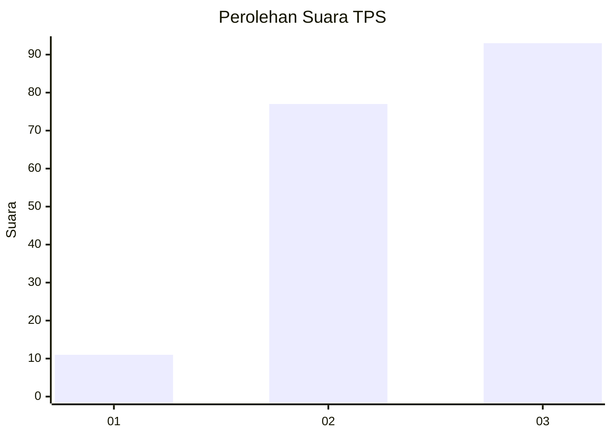
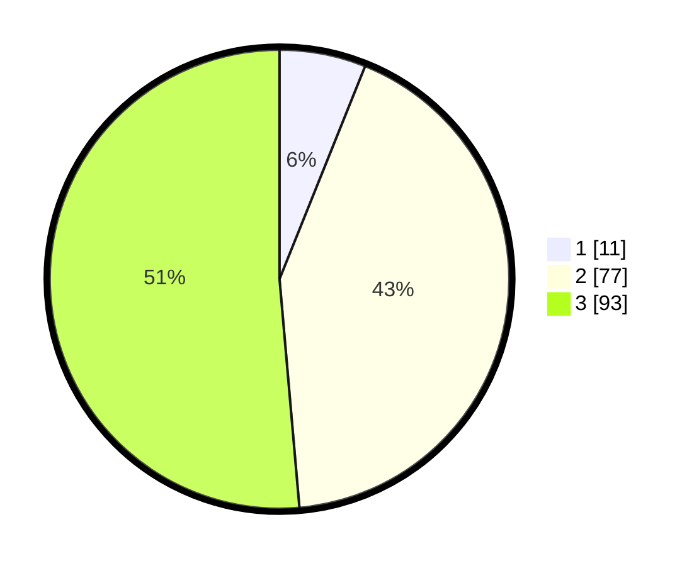

# Hasil

## Grafik

## Tabel

| No. | Nama Paslon    | Suara | Suara (raw) | Persentase |
|:--- |:-------------- | -----:| -----------:| ----------:|
| 1   | ANIES MUHAIMIN | 11    | [11][p-1]   | 6,08       |
| 2   | PRABOWO GIBRAN | 77    | [77][p-2]   | 42,54      |
| 3   | GANJAR MAHFUD  | 93    | [93][p-3]   | 51,38      |

[p-1]: https://github.com/gigit-pemilu/pemilu-2024/blob/main/pilpres/hitung-suara/sub/33-jawa-tengah/sub/21-demak/sub/06-wonosalam/sub/2014-kerangkulon/sub/004-tps/sub/paslon-1.txt
[p-2]: https://github.com/gigit-pemilu/pemilu-2024/blob/main/pilpres/hitung-suara/sub/33-jawa-tengah/sub/21-demak/sub/06-wonosalam/sub/2014-kerangkulon/sub/004-tps/sub/paslon-2.txt
[p-3]: https://github.com/gigit-pemilu/pemilu-2024/blob/main/pilpres/hitung-suara/sub/33-jawa-tengah/sub/21-demak/sub/06-wonosalam/sub/2014-kerangkulon/sub/004-tps/sub/paslon-3.txt

## Foto C Plano

https://sirekap-obj-formc.kpu.go.id/cc2f/pemilu/ppwp/33/21/06/20/14/3321062014004-20240215-005415--a24e95f0-bdbc-41dd-932a-bec6a20d6c15.jpg

https://sirekap-obj-formc.kpu.go.id/cc2f/pemilu/ppwp/33/21/06/20/14/3321062014004-20240217-095212--59d4f9ac-acb7-46ff-89a0-019bd13cb70c.jpg

https://sirekap-obj-formc.kpu.go.id/cc2f/pemilu/ppwp/33/21/06/20/14/3321062014004-20240214-213248--18b6a281-457b-4d92-aa33-971497cd0039.jpg

## Metadata

| Key        | Value               |
| ---------- | ------------------- |
| Time Stamp | 2024-02-24 22:31:28 |

