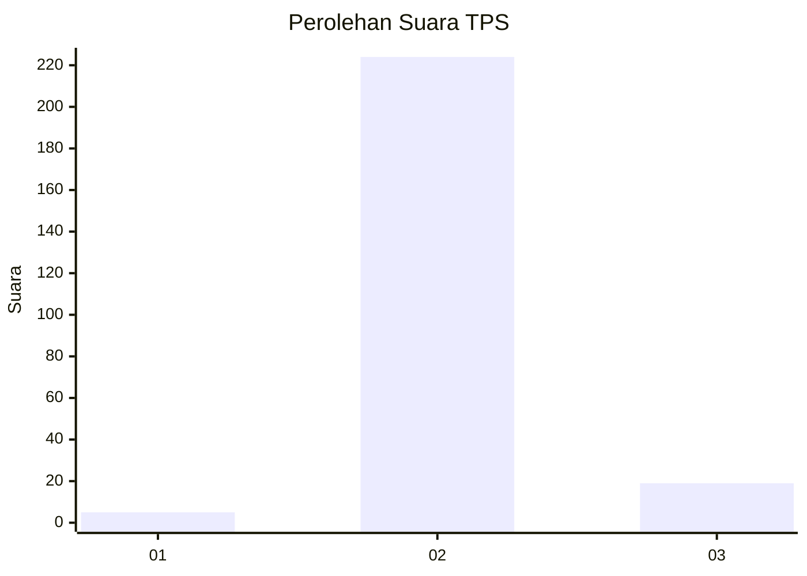
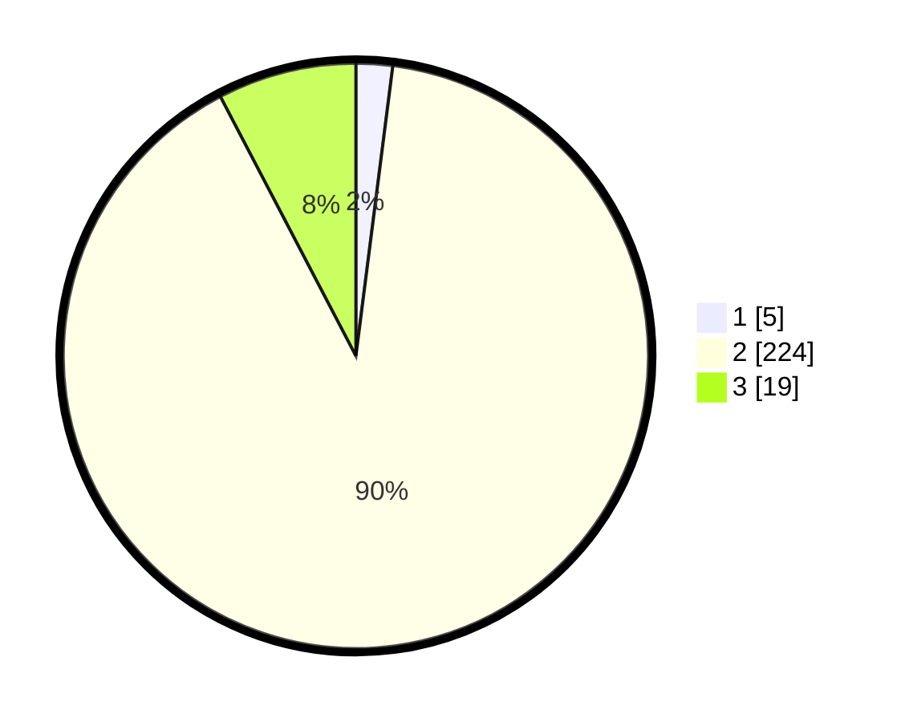

# Hasil

## Grafik

## Tabel

| No. | Nama Paslon    | Suara | Suara (raw) | Persentase |
|:--- |:-------------- | -----:| -----------:| ----------:|
| 1   | ANIES MUHAIMIN | 5     | [5][p-1]    | 2,02       |
| 2   | PRABOWO GIBRAN | 224   | [224][p-2]  | 90,32      |
| 3   | GANJAR MAHFUD  | 19    | [19][p-3]   | 7,66       |

[p-1]: https://github.com/gigit-pemilu/pemilu-2024/blob/main/pilpres/hitung-suara/sub/33-jawa-tengah/sub/21-demak/sub/07-dempet/sub/2011-kuwu/sub/004-tps/sub/paslon-1.txt
[p-2]: https://github.com/gigit-pemilu/pemilu-2024/blob/main/pilpres/hitung-suara/sub/33-jawa-tengah/sub/21-demak/sub/07-dempet/sub/2011-kuwu/sub/004-tps/sub/paslon-2.txt
[p-3]: https://github.com/gigit-pemilu/pemilu-2024/blob/main/pilpres/hitung-suara/sub/33-jawa-tengah/sub/21-demak/sub/07-dempet/sub/2011-kuwu/sub/004-tps/sub/paslon-3.txt

## Foto C Plano

https://sirekap-obj-formc.kpu.go.id/46ee/pemilu/ppwp/33/21/07/20/11/3321072011004-20240214-235833--4c158de4-8950-4b94-bbe6-ff0ce7413506.jpg

https://sirekap-obj-formc.kpu.go.id/46ee/pemilu/ppwp/33/21/07/20/11/3321072011004-20240215-000307--573a1162-d964-4ffc-a73b-58349605480b.jpg

https://sirekap-obj-formc.kpu.go.id/46ee/pemilu/ppwp/33/21/07/20/11/3321072011004-20240215-000357--7d1c71d6-1be2-4655-8924-cdcdea63a169.jpg

## Metadata

| Key        | Value               |
| ---------- | ------------------- |
| Time Stamp | 2024-02-25 17:00:00 |

