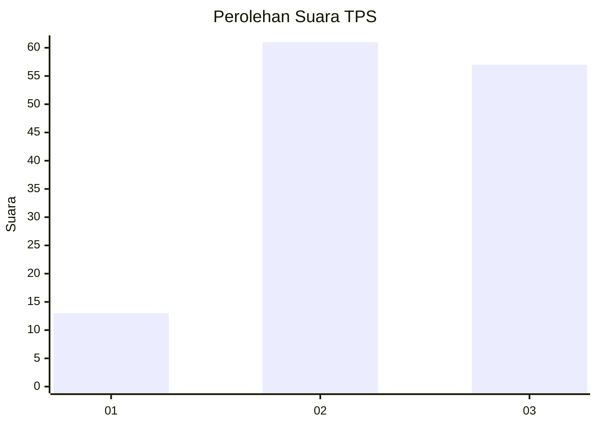
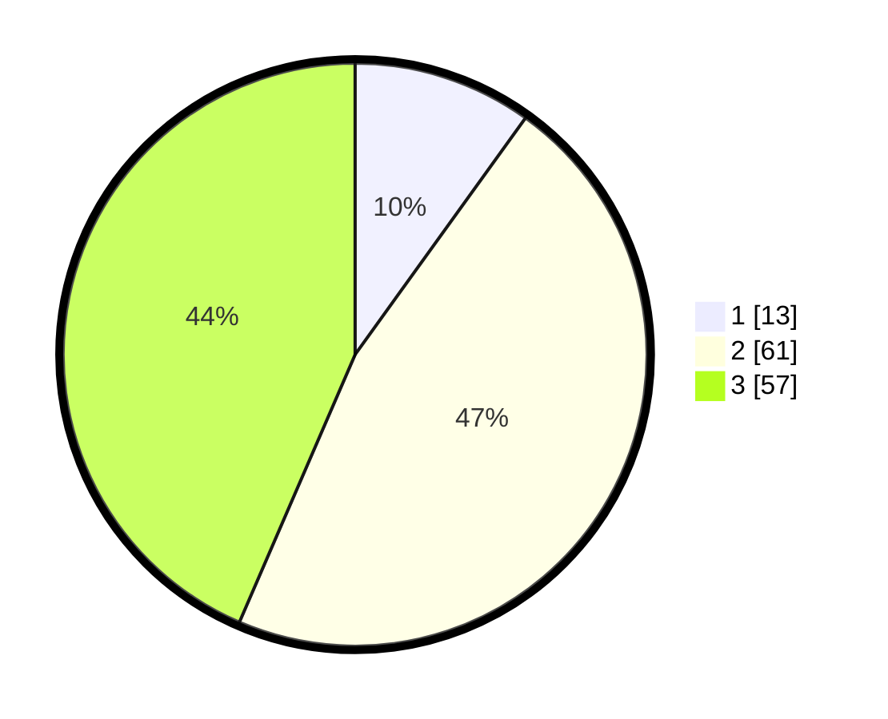

# Hasil

## Grafik

## Tabel

| No. | Nama Paslon    | Suara | Suara (raw) | Persentase |
|:--- |:-------------- | -----:| -----------:| ----------:|
| 1   | ANIES MUHAIMIN | 13    | [13][p-1]   | 9,92       |
| 2   | PRABOWO GIBRAN | 61    | [61][p-2]   | 46,56      |
| 3   | GANJAR MAHFUD  | 57    | [57][p-3]   | 43,51      |

[p-1]: https://github.com/gigit-pemilu/pemilu-2024-33-jawa-tengah/blob/main/pilpres/hitung-suara/sub/33-jawa-tengah/sub/21-demak/sub/07-dempet/sub/2017-dempet/sub/008-tps/sub/paslon-1.txt
[p-2]: https://github.com/gigit-pemilu/pemilu-2024-33-jawa-tengah/blob/main/pilpres/hitung-suara/sub/33-jawa-tengah/sub/21-demak/sub/07-dempet/sub/2017-dempet/sub/008-tps/sub/paslon-2.txt
[p-3]: https://github.com/gigit-pemilu/pemilu-2024-33-jawa-tengah/blob/main/pilpres/hitung-suara/sub/33-jawa-tengah/sub/21-demak/sub/07-dempet/sub/2017-dempet/sub/008-tps/sub/paslon-3.txt

## Foto C Plano

https://sirekap-obj-formc.kpu.go.id/953a/pemilu/ppwp/33/21/07/20/17/3321072017008-20240214-185247--f6e8e4c7-ca29-4cf2-b6ce-1759a638809e.jpg

https://sirekap-obj-formc.kpu.go.id/953a/pemilu/ppwp/33/21/07/20/17/3321072017008-20240214-194422--01a65753-6617-488b-8387-036ef8422cb4.jpg

https://sirekap-obj-formc.kpu.go.id/953a/pemilu/ppwp/33/21/07/20/17/3321072017008-20240214-193908--e3d2f5ab-d646-40c7-8a91-627c97fcfb2a.jpg

## Metadata

| Key        | Value               |
| ---------- | ------------------- |
| Time Stamp | 2024-02-25 14:00:00 |

