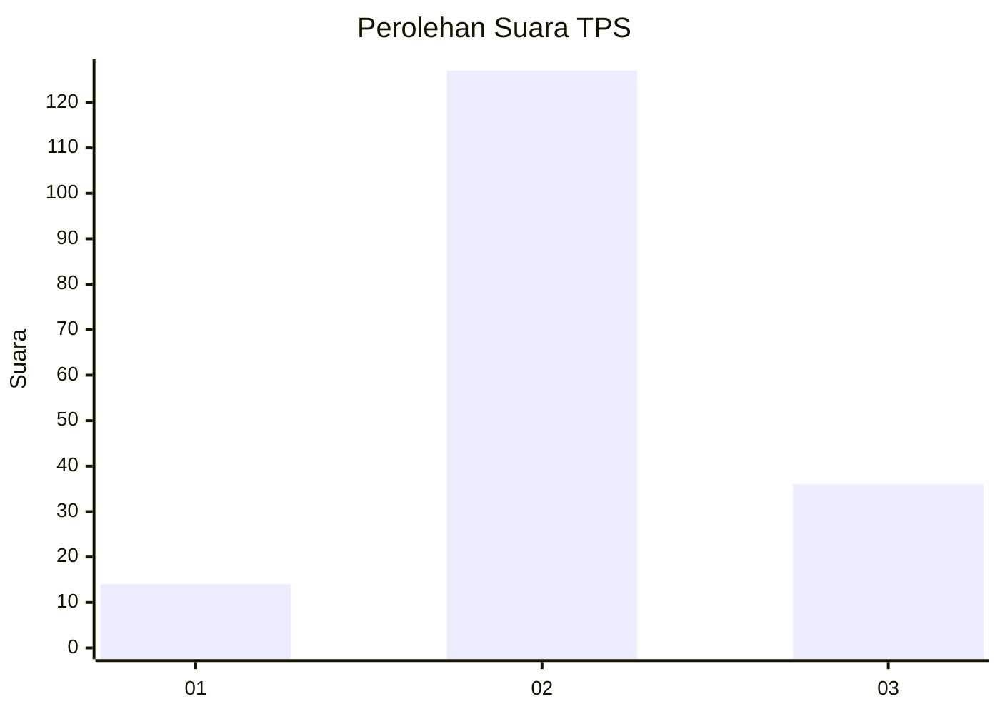
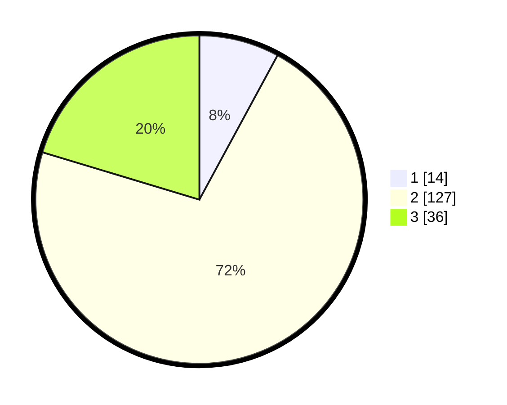

# Hasil

## Grafik

## Tabel

| No. | Nama Paslon    | Suara | Suara (raw) | Persentase |
|:--- |:-------------- | -----:| -----------:| ----------:|
| 1   | ANIES MUHAIMIN | 14    | [14][p-1]   | 7,91       |
| 2   | PRABOWO GIBRAN | 127   | [127][p-2]  | 71,75      |
| 3   | GANJAR MAHFUD  | 36    | [36][p-3]   | 20,34      |

[p-1]: https://github.com/gigit-pemilu/pemilu-2024/blob/main/pilpres/hitung-suara/sub/33-jawa-tengah/sub/21-demak/sub/08-gajah/sub/2001-surodadi/sub/004-tps/sub/paslon-1.txt
[p-2]: https://github.com/gigit-pemilu/pemilu-2024/blob/main/pilpres/hitung-suara/sub/33-jawa-tengah/sub/21-demak/sub/08-gajah/sub/2001-surodadi/sub/004-tps/sub/paslon-2.txt
[p-3]: https://github.com/gigit-pemilu/pemilu-2024/blob/main/pilpres/hitung-suara/sub/33-jawa-tengah/sub/21-demak/sub/08-gajah/sub/2001-surodadi/sub/004-tps/sub/paslon-3.txt

## Foto C Plano

https://sirekap-obj-formc.kpu.go.id/02e9/pemilu/ppwp/33/21/08/20/01/3321082001004-20240217-121048--aa356c0c-4e4c-4863-ae68-ab95ed789f4e.jpg

https://sirekap-obj-formc.kpu.go.id/02e9/pemilu/ppwp/33/21/08/20/01/3321082001004-20240217-121132--e033ec48-5db7-42b2-8ab3-e26ffad5218a.jpg

https://sirekap-obj-formc.kpu.go.id/02e9/pemilu/ppwp/33/21/08/20/01/3321082001004-20240217-121224--5ad7cc5e-6aaf-4035-b196-4bc5ea024d8a.jpg

## Metadata

| Key        | Value               |
| ---------- | ------------------- |
| Time Stamp | 2024-02-24 22:31:28 |

