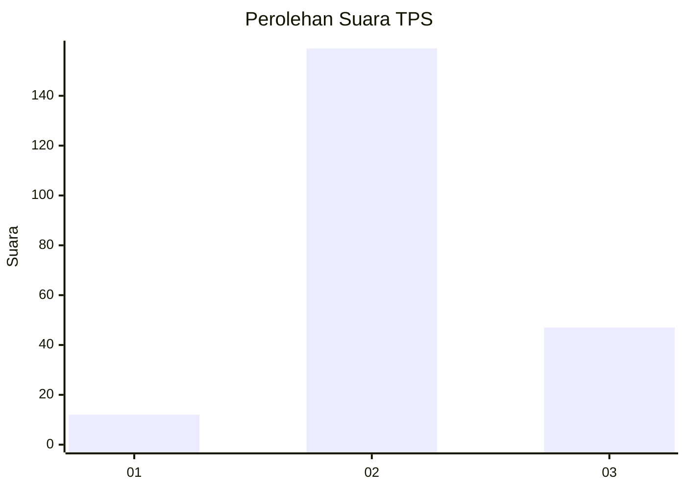
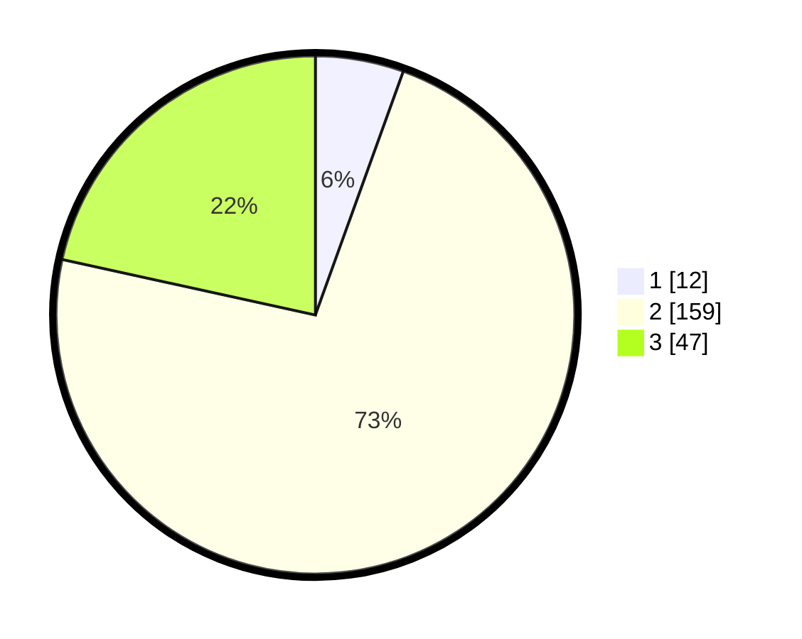

# Hasil

## Grafik

## Tabel

| No. | Nama Paslon    | Suara | Suara (raw) | Persentase |
|:--- |:-------------- | -----:| -----------:| ----------:|
| 1   | ANIES MUHAIMIN | 12    | [12][p-1]   | 5,50       |
| 2   | PRABOWO GIBRAN | 159   | [159][p-2]  | 72,94      |
| 3   | GANJAR MAHFUD  | 47    | [47][p-3]   | 21,56      |

[p-1]: https://github.com/gigit-pemilu/pemilu-2024/blob/main/pilpres/hitung-suara/sub/33-jawa-tengah/sub/21-demak/sub/08-gajah/sub/2002-jatisono/sub/003-tps/sub/paslon-1.txt
[p-2]: https://github.com/gigit-pemilu/pemilu-2024/blob/main/pilpres/hitung-suara/sub/33-jawa-tengah/sub/21-demak/sub/08-gajah/sub/2002-jatisono/sub/003-tps/sub/paslon-2.txt
[p-3]: https://github.com/gigit-pemilu/pemilu-2024/blob/main/pilpres/hitung-suara/sub/33-jawa-tengah/sub/21-demak/sub/08-gajah/sub/2002-jatisono/sub/003-tps/sub/paslon-3.txt

## Foto C Plano

https://sirekap-obj-formc.kpu.go.id/f6d2/pemilu/ppwp/33/21/08/20/02/3321082002003-20240214-215934--6bba188f-821d-47df-b6fb-53815200922e.jpg

https://sirekap-obj-formc.kpu.go.id/f6d2/pemilu/ppwp/33/21/08/20/02/3321082002003-20240214-220045--4c1d1a14-9ef4-49ee-b94f-b13d25ceb410.jpg

https://sirekap-obj-formc.kpu.go.id/f6d2/pemilu/ppwp/33/21/08/20/02/3321082002003-20240214-220150--c5823f08-e61a-42ba-9e1e-8203122e4610.jpg

## Metadata

| Key        | Value               |
| ---------- | ------------------- |
| Time Stamp | 2024-02-24 22:31:28 |

