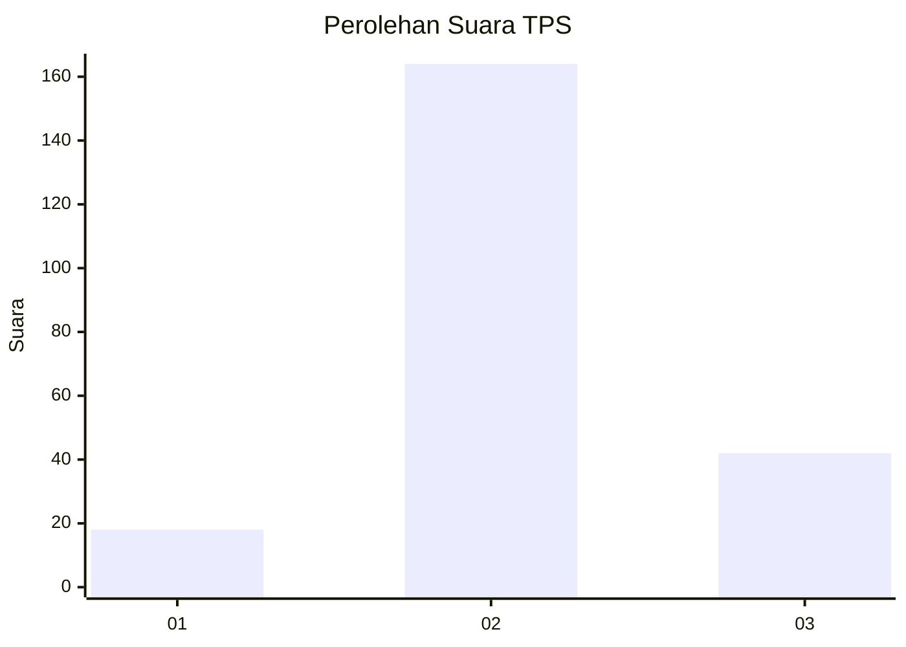
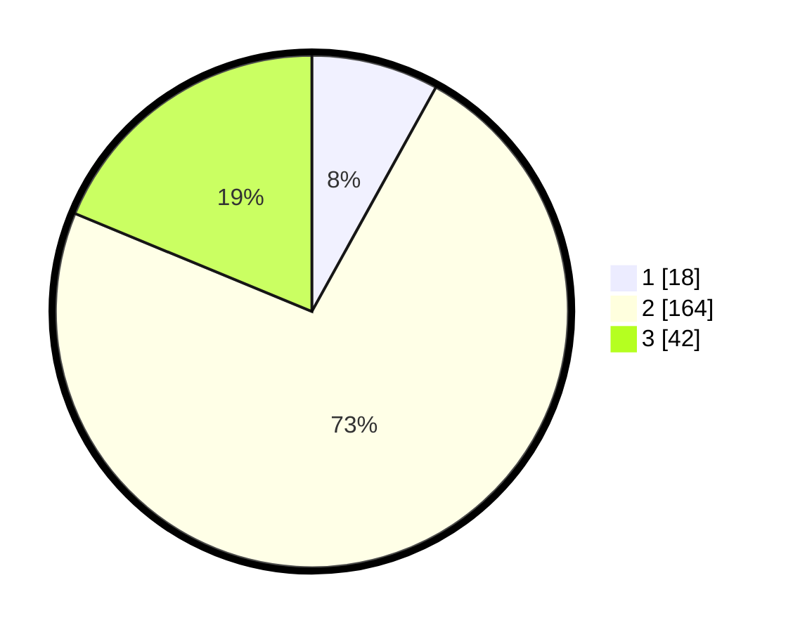

# Hasil

## Grafik

## Tabel

| No. | Nama Paslon    | Suara | Suara (raw) | Persentase |
|:--- |:-------------- | -----:| -----------:| ----------:|
| 1   | ANIES MUHAIMIN | 18    | [18][p-1]   | 8,04       |
| 2   | PRABOWO GIBRAN | 164   | [164][p-2]  | 73,21      |
| 3   | GANJAR MAHFUD  | 42    | [42][p-3]   | 18,75      |

[p-1]: https://github.com/gigit-pemilu/pemilu-2024/blob/main/pilpres/hitung-suara/sub/33-jawa-tengah/sub/21-demak/sub/08-gajah/sub/2015-mlekang/sub/003-tps/sub/paslon-1.txt
[p-2]: https://github.com/gigit-pemilu/pemilu-2024/blob/main/pilpres/hitung-suara/sub/33-jawa-tengah/sub/21-demak/sub/08-gajah/sub/2015-mlekang/sub/003-tps/sub/paslon-2.txt
[p-3]: https://github.com/gigit-pemilu/pemilu-2024/blob/main/pilpres/hitung-suara/sub/33-jawa-tengah/sub/21-demak/sub/08-gajah/sub/2015-mlekang/sub/003-tps/sub/paslon-3.txt

## Foto C Plano

https://sirekap-obj-formc.kpu.go.id/88f7/pemilu/ppwp/33/21/08/20/15/3321082015003-20240214-220823--edc1db9c-c0c2-402d-97c9-10e6bc4e36cf.jpg

https://sirekap-obj-formc.kpu.go.id/88f7/pemilu/ppwp/33/21/08/20/15/3321082015003-20240215-190145--8f95e841-9d27-4044-8a19-d9d6bec85328.jpg

https://sirekap-obj-formc.kpu.go.id/88f7/pemilu/ppwp/33/21/08/20/15/3321082015003-20240215-190150--33cbaba8-14df-4c6e-9e1f-d18d5fd9b14d.jpg

## Metadata

| Key        | Value               |
| ---------- | ------------------- |
| Time Stamp | 2024-02-24 22:31:28 |

