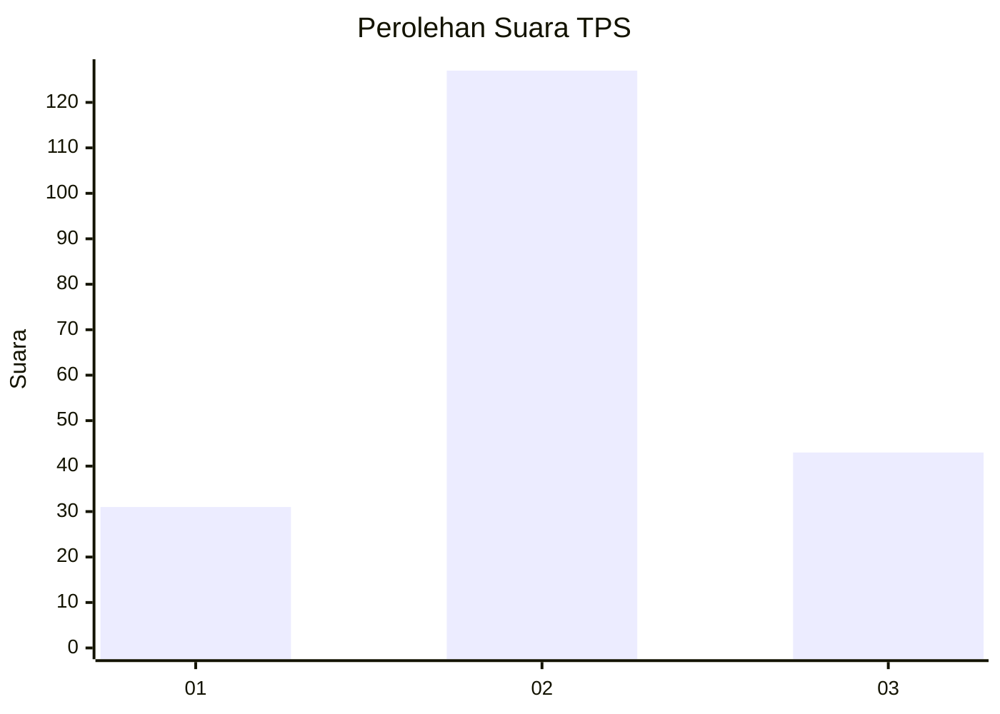
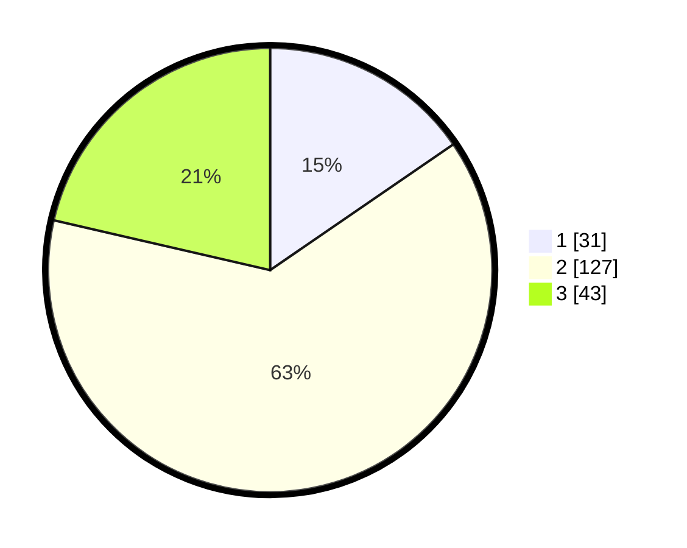

# Hasil

## Grafik

## Tabel

| No. | Nama Paslon    | Suara | Suara (raw) | Persentase |
|:--- |:-------------- | -----:| -----------:| ----------:|
| 1   | ANIES MUHAIMIN | 31    | [31][p-1]   | 15,42      |
| 2   | PRABOWO GIBRAN | 127   | [127][p-2]  | 63,18      |
| 3   | GANJAR MAHFUD  | 43    | [43][p-3]   | 21,39      |

[p-1]: https://github.com/gigit-pemilu/pemilu-2024/blob/main/pilpres/hitung-suara/sub/33-jawa-tengah/sub/21-demak/sub/08-gajah/sub/2015-mlekang/sub/006-tps/sub/paslon-1.txt
[p-2]: https://github.com/gigit-pemilu/pemilu-2024/blob/main/pilpres/hitung-suara/sub/33-jawa-tengah/sub/21-demak/sub/08-gajah/sub/2015-mlekang/sub/006-tps/sub/paslon-2.txt
[p-3]: https://github.com/gigit-pemilu/pemilu-2024/blob/main/pilpres/hitung-suara/sub/33-jawa-tengah/sub/21-demak/sub/08-gajah/sub/2015-mlekang/sub/006-tps/sub/paslon-3.txt

## Foto C Plano

https://sirekap-obj-formc.kpu.go.id/b950/pemilu/ppwp/33/21/08/20/15/3321082015006-20240215-015206--ca078683-c8c7-4ca8-a72c-9c25ca8b14f9.jpg

https://sirekap-obj-formc.kpu.go.id/b950/pemilu/ppwp/33/21/08/20/15/3321082015006-20240215-015428--3a02f29f-3ce4-43d4-9775-3e43c39a8148.jpg

https://sirekap-obj-formc.kpu.go.id/b950/pemilu/ppwp/33/21/08/20/15/3321082015006-20240215-015625--d7ade610-e8ee-4706-88a5-7d6d9f0cc7e0.jpg

## Metadata

| Key        | Value               |
| ---------- | ------------------- |
| Time Stamp | 2024-02-24 22:31:28 |

