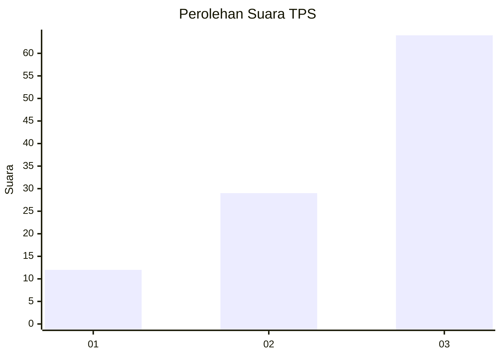
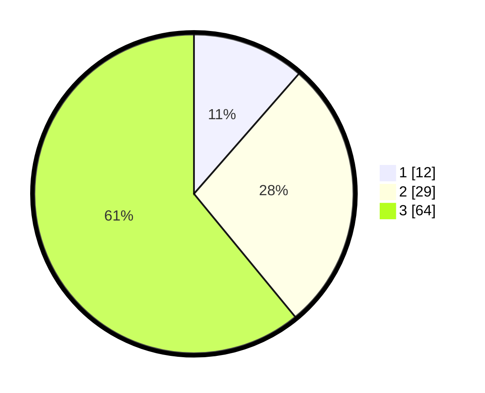

# Hasil

## Grafik

## Tabel

| No. | Nama Paslon    | Suara | Suara (raw) | Persentase |
|:--- |:-------------- | -----:| -----------:| ----------:|
| 1   | ANIES MUHAIMIN | 12    | [12][p-1]   | 11,43      |
| 2   | PRABOWO GIBRAN | 29    | [29][p-2]   | 27,62      |
| 3   | GANJAR MAHFUD  | 64    | [64][p-3]   | 60,95      |

[p-1]: https://github.com/gigit-pemilu/pemilu-2024-33-jawa-tengah/blob/main/pilpres/hitung-suara/sub/33-jawa-tengah/sub/21-demak/sub/08-gajah/sub/2016-sambung/sub/007-tps/sub/paslon-1.txt
[p-2]: https://github.com/gigit-pemilu/pemilu-2024-33-jawa-tengah/blob/main/pilpres/hitung-suara/sub/33-jawa-tengah/sub/21-demak/sub/08-gajah/sub/2016-sambung/sub/007-tps/sub/paslon-2.txt
[p-3]: https://github.com/gigit-pemilu/pemilu-2024-33-jawa-tengah/blob/main/pilpres/hitung-suara/sub/33-jawa-tengah/sub/21-demak/sub/08-gajah/sub/2016-sambung/sub/007-tps/sub/paslon-3.txt

## Foto C Plano

https://sirekap-obj-formc.kpu.go.id/856c/pemilu/ppwp/33/21/08/20/16/3321082016007-20240215-085338--90220496-9666-42c9-83f2-e2240c5fbac6.jpg

https://sirekap-obj-formc.kpu.go.id/856c/pemilu/ppwp/33/21/08/20/16/3321082016007-20240215-085354--7dab21b2-2895-44ff-981f-c06558ed70bb.jpg

https://sirekap-obj-formc.kpu.go.id/856c/pemilu/ppwp/33/21/08/20/16/3321082016007-20240215-085404--a12aa6db-24dc-4a2c-ad1e-cdf864d5ae3b.jpg

## Metadata

| Key        | Value               |
| ---------- | ------------------- |
| Time Stamp | 2024-02-25 14:00:00 |

