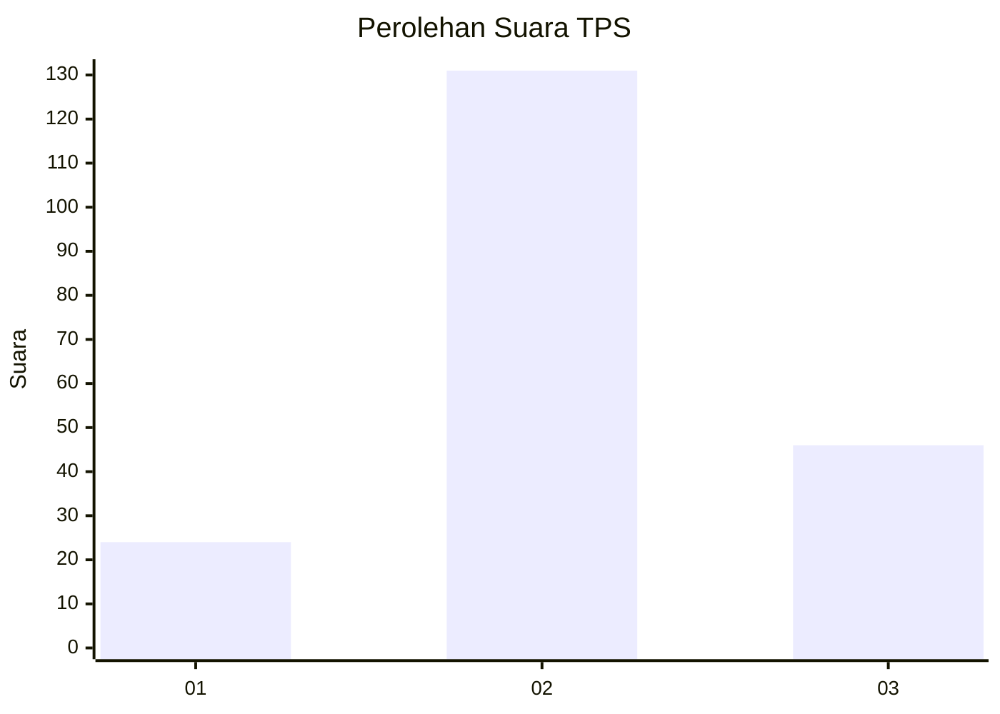
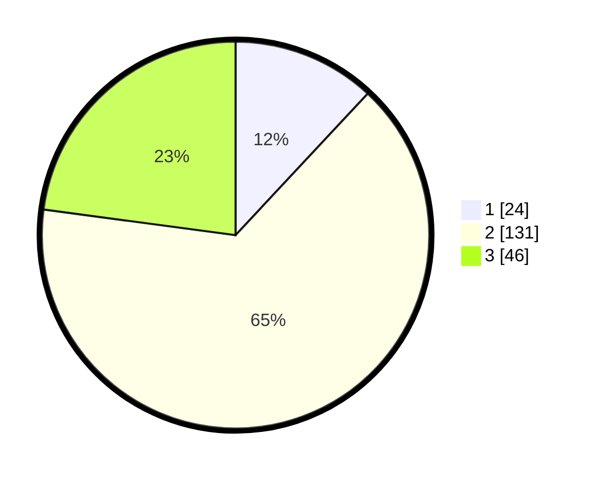

# Hasil

## Grafik

## Tabel

| No. | Nama Paslon    | Suara | Suara (raw) | Persentase |
|:--- |:-------------- | -----:| -----------:| ----------:|
| 1   | ANIES MUHAIMIN | 24    | [24][p-1]   | 11,94      |
| 2   | PRABOWO GIBRAN | 131   | [131][p-2]  | 65,17      |
| 3   | GANJAR MAHFUD  | 46    | [46][p-3]   | 22,89      |

[p-1]: https://github.com/gigit-pemilu/pemilu-2024/blob/main/pilpres/hitung-suara/sub/33-jawa-tengah/sub/21-demak/sub/08-gajah/sub/2018-tlogopandogan/sub/001-tps/sub/paslon-1.txt
[p-2]: https://github.com/gigit-pemilu/pemilu-2024/blob/main/pilpres/hitung-suara/sub/33-jawa-tengah/sub/21-demak/sub/08-gajah/sub/2018-tlogopandogan/sub/001-tps/sub/paslon-2.txt
[p-3]: https://github.com/gigit-pemilu/pemilu-2024/blob/main/pilpres/hitung-suara/sub/33-jawa-tengah/sub/21-demak/sub/08-gajah/sub/2018-tlogopandogan/sub/001-tps/sub/paslon-3.txt

## Foto C Plano

https://sirekap-obj-formc.kpu.go.id/cbdf/pemilu/ppwp/33/21/08/20/18/3321082018001-20240215-004716--25765fcc-4a43-4c5e-a48d-06035042d3b6.jpg

https://sirekap-obj-formc.kpu.go.id/cbdf/pemilu/ppwp/33/21/08/20/18/3321082018001-20240215-004418--e8a917d8-b90b-4ff7-b3eb-cfa016363554.jpg

https://sirekap-obj-formc.kpu.go.id/cbdf/pemilu/ppwp/33/21/08/20/18/3321082018001-20240215-004519--2201a1a6-69ef-49dd-81e4-419d33baafc6.jpg

## Metadata

| Key        | Value               |
| ---------- | ------------------- |
| Time Stamp | 2024-02-24 22:31:28 |

