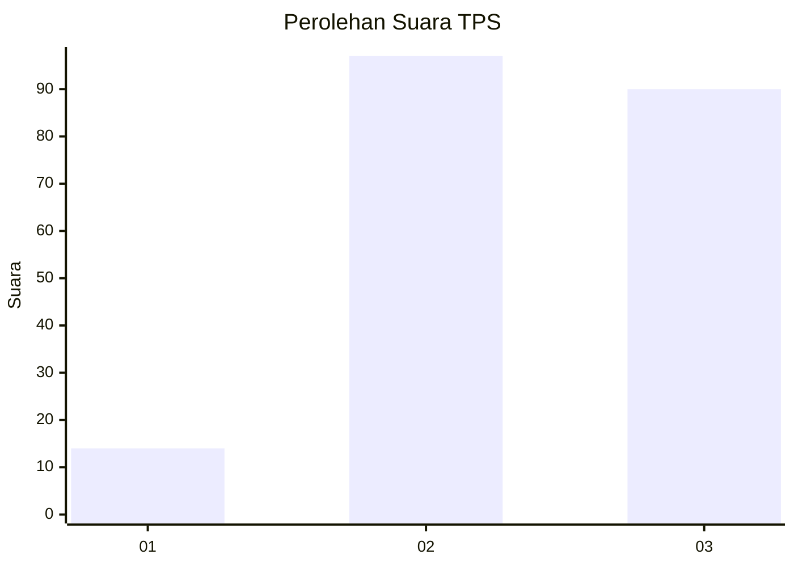
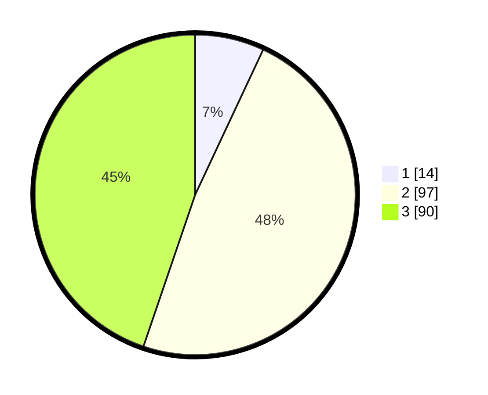

# Hasil

## Grafik

## Tabel

| No. | Nama Paslon    | Suara | Suara (raw) | Persentase |
|:--- |:-------------- | -----:| -----------:| ----------:|
| 1   | ANIES MUHAIMIN | 14    | [14][p-1]   | 6,97       |
| 2   | PRABOWO GIBRAN | 97    | [97][p-2]   | 48,26      |
| 3   | GANJAR MAHFUD  | 90    | [90][p-3]   | 44,78      |

[p-1]: https://github.com/gigit-pemilu/pemilu-2024/blob/main/pilpres/hitung-suara/sub/33-jawa-tengah/sub/21-demak/sub/08-gajah/sub/2018-tlogopandogan/sub/004-tps/sub/paslon-1.txt
[p-2]: https://github.com/gigit-pemilu/pemilu-2024/blob/main/pilpres/hitung-suara/sub/33-jawa-tengah/sub/21-demak/sub/08-gajah/sub/2018-tlogopandogan/sub/004-tps/sub/paslon-2.txt
[p-3]: https://github.com/gigit-pemilu/pemilu-2024/blob/main/pilpres/hitung-suara/sub/33-jawa-tengah/sub/21-demak/sub/08-gajah/sub/2018-tlogopandogan/sub/004-tps/sub/paslon-3.txt

## Foto C Plano

https://sirekap-obj-formc.kpu.go.id/c5ba/pemilu/ppwp/33/21/08/20/18/3321082018004-20240215-000522--713c9da4-4586-4202-bf84-896ab1065622.jpg

https://sirekap-obj-formc.kpu.go.id/c5ba/pemilu/ppwp/33/21/08/20/18/3321082018004-20240215-000712--f7a2bbac-4d27-4b88-b57c-4ef3b47c7582.jpg

https://sirekap-obj-formc.kpu.go.id/c5ba/pemilu/ppwp/33/21/08/20/18/3321082018004-20240215-000823--e5cabdb7-6624-4eb2-b230-40a860d2d541.jpg

## Metadata

| Key        | Value               |
| ---------- | ------------------- |
| Time Stamp | 2024-02-25 20:00:00 |

