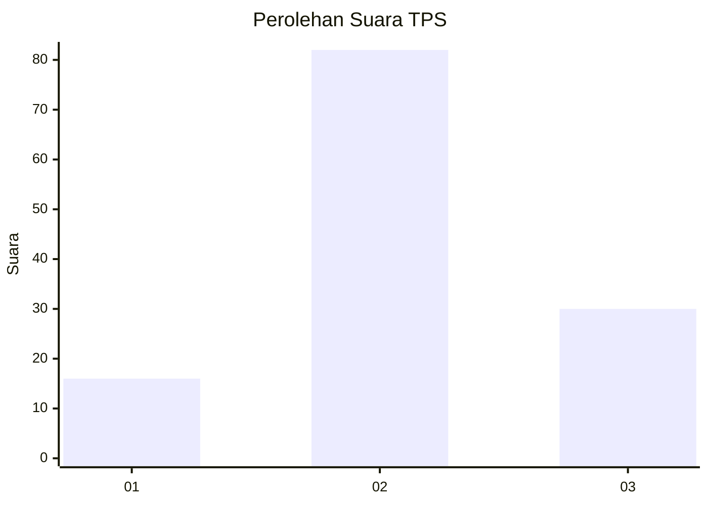
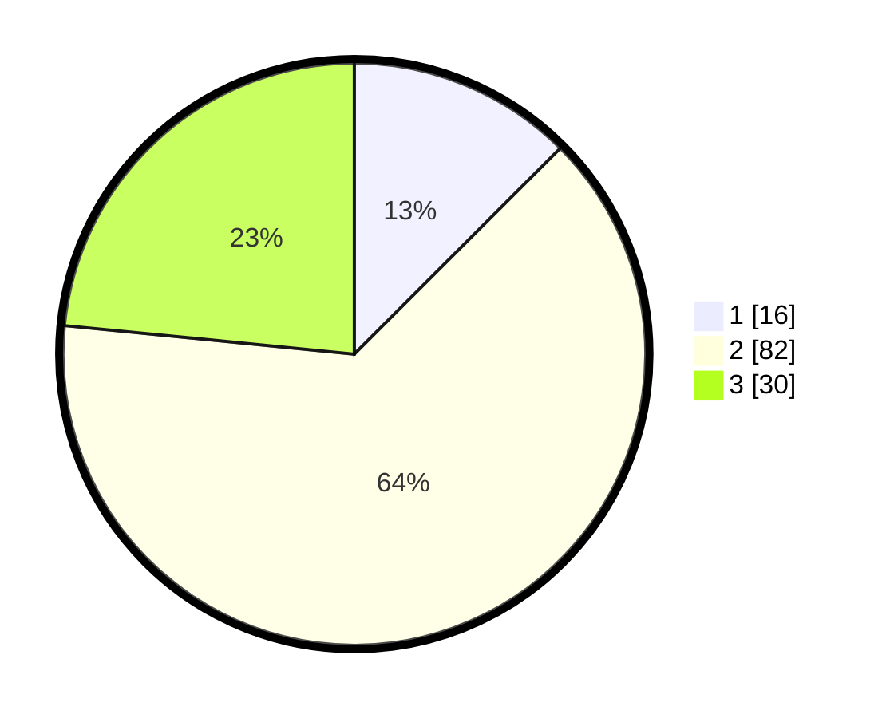

# Hasil

## Grafik

## Tabel

| No. | Nama Paslon    | Suara | Suara (raw) | Persentase |
|:--- |:-------------- | -----:| -----------:| ----------:|
| 1   | ANIES MUHAIMIN | 16    | [16][p-1]   | 12,50      |
| 2   | PRABOWO GIBRAN | 82    | [82][p-2]   | 64,06      |
| 3   | GANJAR MAHFUD  | 30    | [30][p-3]   | 23,44      |

[p-1]: https://github.com/gigit-pemilu/pemilu-2024/blob/main/pilpres/hitung-suara/sub/33-jawa-tengah/sub/21-demak/sub/10-mijen/sub/2001-geneng/sub/005-tps/sub/paslon-1.txt
[p-2]: https://github.com/gigit-pemilu/pemilu-2024/blob/main/pilpres/hitung-suara/sub/33-jawa-tengah/sub/21-demak/sub/10-mijen/sub/2001-geneng/sub/005-tps/sub/paslon-2.txt
[p-3]: https://github.com/gigit-pemilu/pemilu-2024/blob/main/pilpres/hitung-suara/sub/33-jawa-tengah/sub/21-demak/sub/10-mijen/sub/2001-geneng/sub/005-tps/sub/paslon-3.txt

## Foto C Plano

https://sirekap-obj-formc.kpu.go.id/8d9e/pemilu/ppwp/33/21/10/20/01/3321102001005-20240216-230615--087dbf99-70ec-4660-8670-87c619ec7963.jpg

https://sirekap-obj-formc.kpu.go.id/8d9e/pemilu/ppwp/33/21/10/20/01/3321102001005-20240216-215230--800c00da-262e-4b36-9930-4e656a88f330.jpg

https://sirekap-obj-formc.kpu.go.id/8d9e/pemilu/ppwp/33/21/10/20/01/3321102001005-20240216-230926--bee9bec1-8262-4673-9c84-a100e6bba086.jpg

## Metadata

| Key        | Value               |
| ---------- | ------------------- |
| Time Stamp | 2024-02-25 21:00:00 |

