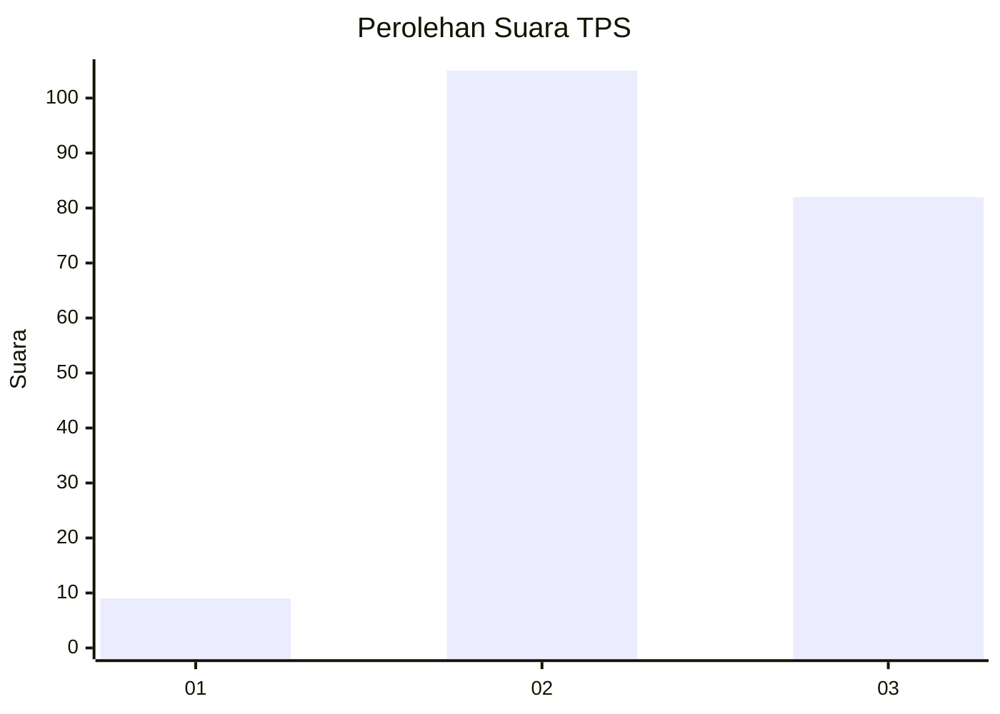
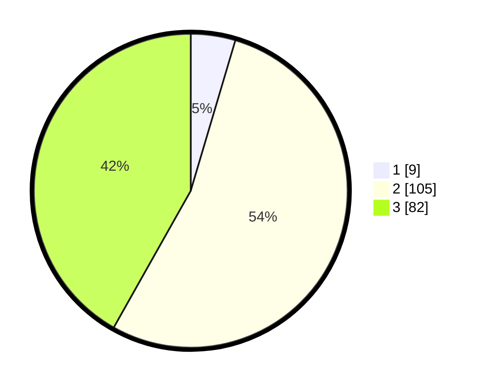

# Hasil

## Grafik

## Tabel

| No. | Nama Paslon    | Suara | Suara (raw) | Persentase |
|:--- |:-------------- | -----:| -----------:| ----------:|
| 1   | ANIES MUHAIMIN | 9     | [9][p-1]    | 4,59       |
| 2   | PRABOWO GIBRAN | 105   | [105][p-2]  | 53,57      |
| 3   | GANJAR MAHFUD  | 82    | [82][p-3]   | 41,84      |

[p-1]: https://github.com/gigit-pemilu/pemilu-2024/blob/main/pilpres/hitung-suara/sub/33-jawa-tengah/sub/21-demak/sub/10-mijen/sub/2002-ngelowetan/sub/001-tps/sub/paslon-1.txt
[p-2]: https://github.com/gigit-pemilu/pemilu-2024/blob/main/pilpres/hitung-suara/sub/33-jawa-tengah/sub/21-demak/sub/10-mijen/sub/2002-ngelowetan/sub/001-tps/sub/paslon-2.txt
[p-3]: https://github.com/gigit-pemilu/pemilu-2024/blob/main/pilpres/hitung-suara/sub/33-jawa-tengah/sub/21-demak/sub/10-mijen/sub/2002-ngelowetan/sub/001-tps/sub/paslon-3.txt

## Foto C Plano

https://sirekap-obj-formc.kpu.go.id/5d94/pemilu/ppwp/33/21/10/20/02/3321102002001-20240215-005916--09eb011f-b154-49b0-a00a-c73e80bd5df3.jpg

https://sirekap-obj-formc.kpu.go.id/5d94/pemilu/ppwp/33/21/10/20/02/3321102002001-20240215-010500--6870f41c-54c7-4a98-8a4c-62a57dbee9d9.jpg

https://sirekap-obj-formc.kpu.go.id/5d94/pemilu/ppwp/33/21/10/20/02/3321102002001-20240215-010607--31eb97d1-b882-4217-9ae8-2c1229a9d375.jpg

## Metadata

| Key        | Value               |
| ---------- | ------------------- |
| Time Stamp | 2024-02-25 13:00:00 |

