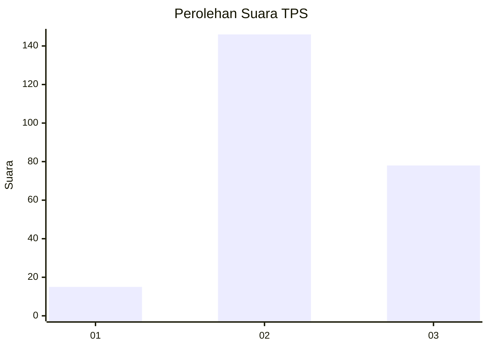
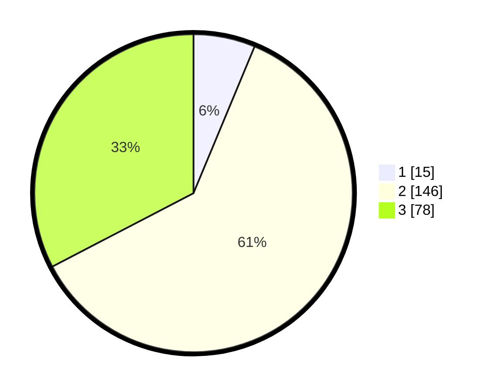

# Hasil

## Grafik

## Tabel

| No. | Nama Paslon    | Suara | Suara (raw) | Persentase |
|:--- |:-------------- | -----:| -----------:| ----------:|
| 1   | ANIES MUHAIMIN | 15    | [15][p-1]   | 6,28       |
| 2   | PRABOWO GIBRAN | 146   | [146][p-2]  | 61,09      |
| 3   | GANJAR MAHFUD  | 78    | [78][p-3]   | 32,64      |

[p-1]: https://github.com/gigit-pemilu/pemilu-2024/blob/main/pilpres/hitung-suara/sub/33-jawa-tengah/sub/21-demak/sub/10-mijen/sub/2013-bermi/sub/004-tps/sub/paslon-1.txt
[p-2]: https://github.com/gigit-pemilu/pemilu-2024/blob/main/pilpres/hitung-suara/sub/33-jawa-tengah/sub/21-demak/sub/10-mijen/sub/2013-bermi/sub/004-tps/sub/paslon-2.txt
[p-3]: https://github.com/gigit-pemilu/pemilu-2024/blob/main/pilpres/hitung-suara/sub/33-jawa-tengah/sub/21-demak/sub/10-mijen/sub/2013-bermi/sub/004-tps/sub/paslon-3.txt

## Foto C Plano

https://sirekap-obj-formc.kpu.go.id/01de/pemilu/ppwp/33/21/10/20/13/3321102013004-20240216-150408--9ed31aca-cc6e-48e1-a0b9-a9fc73e2cf98.jpg

https://sirekap-obj-formc.kpu.go.id/01de/pemilu/ppwp/33/21/10/20/13/3321102013004-20240216-151256--29af9548-4c3b-4a5a-a2a6-433a8801a14c.jpg

https://sirekap-obj-formc.kpu.go.id/01de/pemilu/ppwp/33/21/10/20/13/3321102013004-20240216-151440--a3be9f94-6d4a-456a-9ea7-9bab48902097.jpg

## Metadata

| Key        | Value               |
| ---------- | ------------------- |
| Time Stamp | 2024-02-25 17:00:00 |

