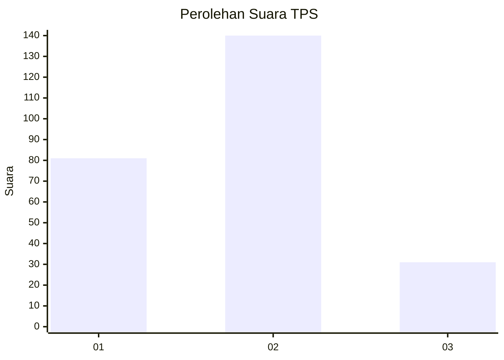
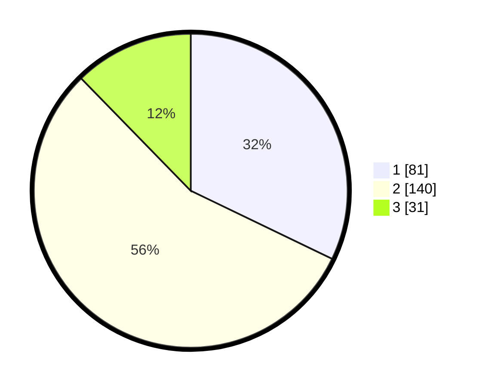

# Hasil

## Grafik

## Tabel

| No. | Nama Paslon    | Suara | Suara (raw) | Persentase |
|:--- |:-------------- | -----:| -----------:| ----------:|
| 1   | ANIES MUHAIMIN | 81    | [81][p-1]   | 32,14      |
| 2   | PRABOWO GIBRAN | 140   | [140][p-2]  | 55,56      |
| 3   | GANJAR MAHFUD  | 31    | [31][p-3]   | 12,30      |

[p-1]: https://github.com/gigit-pemilu/pemilu-2024-33-jawa-tengah/blob/main/pilpres/hitung-suara/sub/33-jawa-tengah/sub/21-demak/sub/11-demak/sub/1014-mangunjiwan/sub/005-tps/sub/paslon-1.txt
[p-2]: https://github.com/gigit-pemilu/pemilu-2024-33-jawa-tengah/blob/main/pilpres/hitung-suara/sub/33-jawa-tengah/sub/21-demak/sub/11-demak/sub/1014-mangunjiwan/sub/005-tps/sub/paslon-2.txt
[p-3]: https://github.com/gigit-pemilu/pemilu-2024-33-jawa-tengah/blob/main/pilpres/hitung-suara/sub/33-jawa-tengah/sub/21-demak/sub/11-demak/sub/1014-mangunjiwan/sub/005-tps/sub/paslon-3.txt

## Foto C Plano

https://sirekap-obj-formc.kpu.go.id/eca1/pemilu/ppwp/33/21/11/10/14/3321111014005-20240217-211036--eea6e03a-55b9-4c8d-af68-aa25c22bebb0.jpg

https://sirekap-obj-formc.kpu.go.id/eca1/pemilu/ppwp/33/21/11/10/14/3321111014005-20240221-132529--21824b39-9dfb-4b34-9794-6074e814cbca.jpg

https://sirekap-obj-formc.kpu.go.id/eca1/pemilu/ppwp/33/21/11/10/14/3321111014005-20240221-132825--0afe10a8-940a-49e7-bc8d-821a6b62409d.jpg

## Metadata

| Key        | Value               |
| ---------- | ------------------- |
| Time Stamp | 2024-02-21 17:00:00 |

