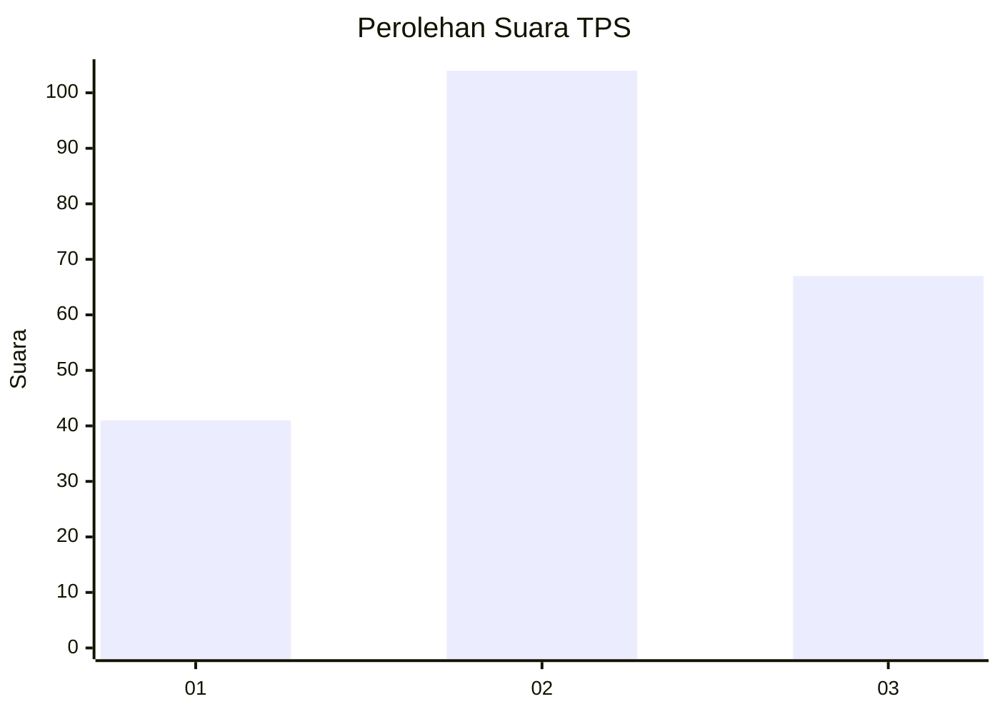
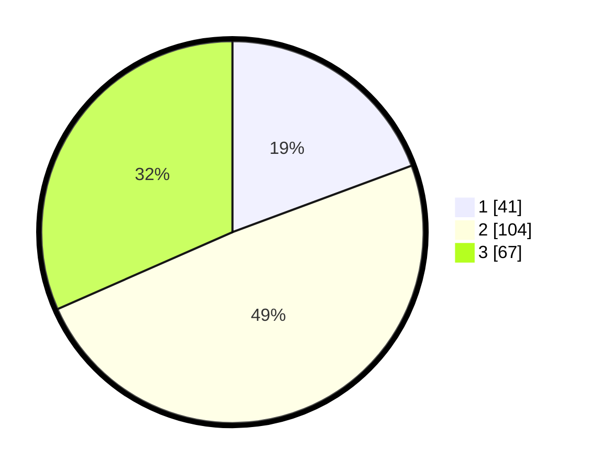

# Hasil

## Grafik

## Tabel

| No. | Nama Paslon    | Suara | Suara (raw) | Persentase |
|:--- |:-------------- | -----:| -----------:| ----------:|
| 1   | ANIES MUHAIMIN | 41    | [41][p-1]   | 19,34      |
| 2   | PRABOWO GIBRAN | 104   | [104][p-2]  | 49,06      |
| 3   | GANJAR MAHFUD  | 67    | [67][p-3]   | 31,60      |

[p-1]: https://github.com/gigit-pemilu/pemilu-2024/blob/main/pilpres/hitung-suara/sub/33-jawa-tengah/sub/21-demak/sub/11-demak/sub/1014-mangunjiwan/sub/007-tps/sub/paslon-1.txt
[p-2]: https://github.com/gigit-pemilu/pemilu-2024/blob/main/pilpres/hitung-suara/sub/33-jawa-tengah/sub/21-demak/sub/11-demak/sub/1014-mangunjiwan/sub/007-tps/sub/paslon-2.txt
[p-3]: https://github.com/gigit-pemilu/pemilu-2024/blob/main/pilpres/hitung-suara/sub/33-jawa-tengah/sub/21-demak/sub/11-demak/sub/1014-mangunjiwan/sub/007-tps/sub/paslon-3.txt

## Foto C Plano

https://sirekap-obj-formc.kpu.go.id/133e/pemilu/ppwp/33/21/11/10/14/3321111014007-20240219-195419--a0796cbc-cf50-412c-9a9d-c7465edece2d.jpg

https://sirekap-obj-formc.kpu.go.id/133e/pemilu/ppwp/33/21/11/10/14/3321111014007-20240219-195934--cf970cb2-ee3e-4d3f-913b-f1fc63053fa6.jpg

https://sirekap-obj-formc.kpu.go.id/133e/pemilu/ppwp/33/21/11/10/14/3321111014007-20240219-200311--8d0dcda6-27cb-47d3-9313-3673132b2822.jpg

## Metadata

| Key        | Value               |
| ---------- | ------------------- |
| Time Stamp | 2024-02-25 11:00:00 |

