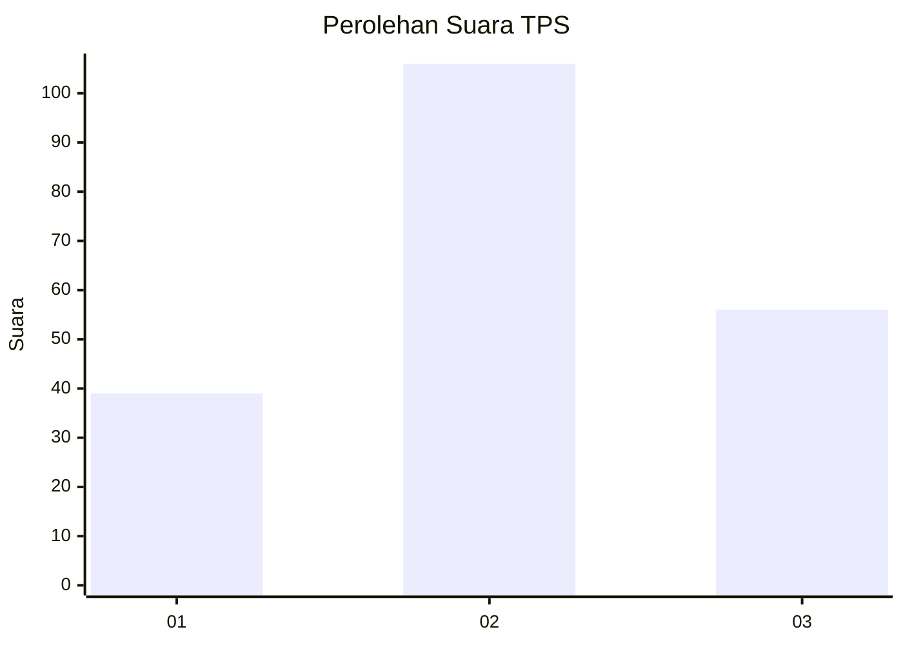
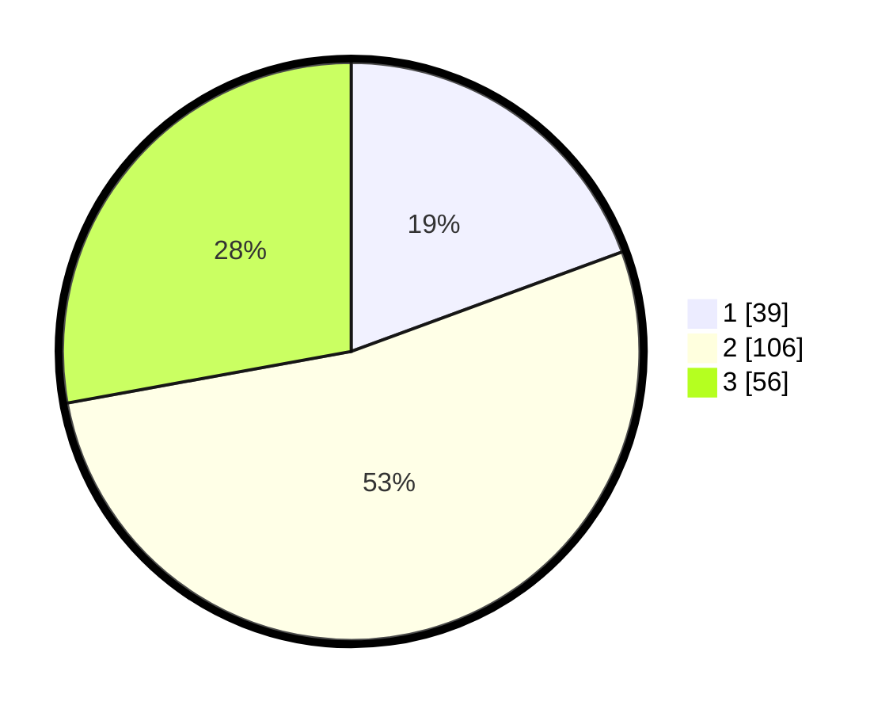

# Hasil

## Grafik

## Tabel

| No. | Nama Paslon    | Suara | Suara (raw) | Persentase |
|:--- |:-------------- | -----:| -----------:| ----------:|
| 1   | ANIES MUHAIMIN | 39    | [39][p-1]   | 19,40      |
| 2   | PRABOWO GIBRAN | 106   | [106][p-2]  | 52,74      |
| 3   | GANJAR MAHFUD  | 56    | [56][p-3]   | 27,86      |

[p-1]: https://github.com/gigit-pemilu/pemilu-2024-33-jawa-tengah/blob/main/pilpres/hitung-suara/sub/33-jawa-tengah/sub/21-demak/sub/11-demak/sub/1014-mangunjiwan/sub/008-tps/sub/paslon-1.txt
[p-2]: https://github.com/gigit-pemilu/pemilu-2024-33-jawa-tengah/blob/main/pilpres/hitung-suara/sub/33-jawa-tengah/sub/21-demak/sub/11-demak/sub/1014-mangunjiwan/sub/008-tps/sub/paslon-2.txt
[p-3]: https://github.com/gigit-pemilu/pemilu-2024-33-jawa-tengah/blob/main/pilpres/hitung-suara/sub/33-jawa-tengah/sub/21-demak/sub/11-demak/sub/1014-mangunjiwan/sub/008-tps/sub/paslon-3.txt

## Foto C Plano

https://sirekap-obj-formc.kpu.go.id/8e8c/pemilu/ppwp/33/21/11/10/14/3321111014008-20240216-214058--a2152f78-88ac-4e59-950d-12230e9b9da6.jpg

https://sirekap-obj-formc.kpu.go.id/8e8c/pemilu/ppwp/33/21/11/10/14/3321111014008-20240216-214220--96761594-f8c0-4ccf-85f3-6c731aeffcf4.jpg

https://sirekap-obj-formc.kpu.go.id/8e8c/pemilu/ppwp/33/21/11/10/14/3321111014008-20240216-214308--b5cd2e15-1499-4d61-a350-97a7005c587a.jpg

## Metadata

| Key        | Value               |
| ---------- | ------------------- |
| Time Stamp | 2024-02-25 12:00:00 |

