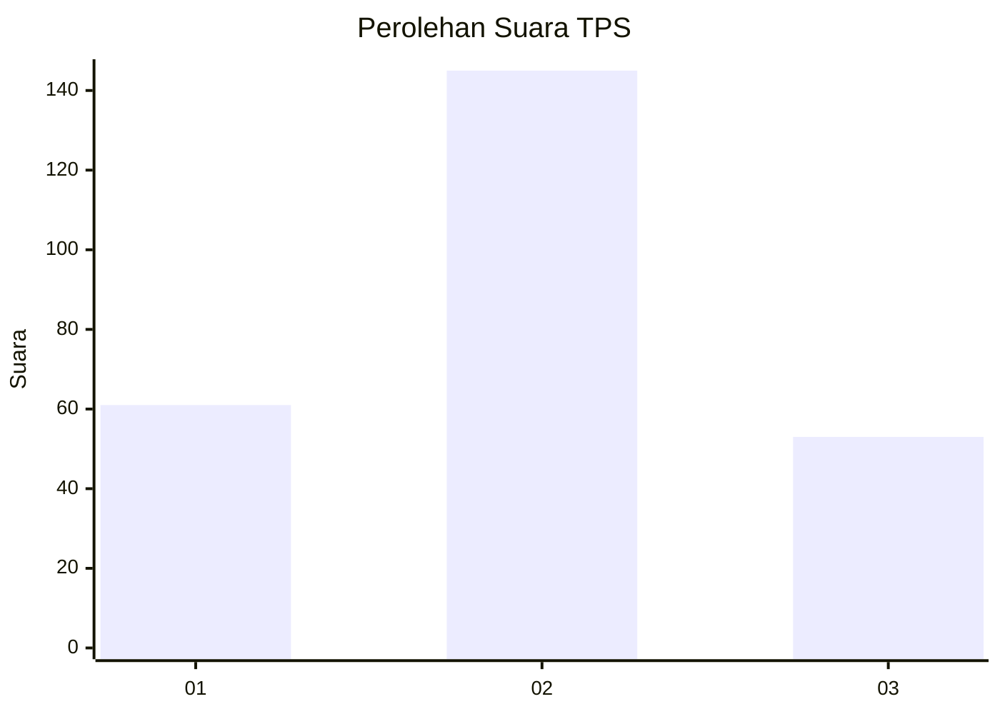
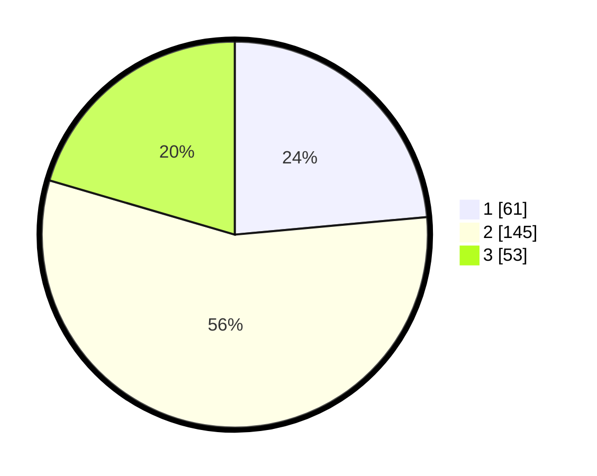

# Hasil

## Grafik

## Tabel

| No. | Nama Paslon    | Suara | Suara (raw) | Persentase |
|:--- |:-------------- | -----:| -----------:| ----------:|
| 1   | ANIES MUHAIMIN | 61    | [61][p-1]   | 23,55      |
| 2   | PRABOWO GIBRAN | 145   | [145][p-2]  | 55,98      |
| 3   | GANJAR MAHFUD  | 53    | [53][p-3]   | 20,46      |

[p-1]: https://github.com/gigit-pemilu/pemilu-2024/blob/main/pilpres/hitung-suara/sub/33-jawa-tengah/sub/21-demak/sub/11-demak/sub/1014-mangunjiwan/sub/027-tps/sub/paslon-1.txt
[p-2]: https://github.com/gigit-pemilu/pemilu-2024/blob/main/pilpres/hitung-suara/sub/33-jawa-tengah/sub/21-demak/sub/11-demak/sub/1014-mangunjiwan/sub/027-tps/sub/paslon-2.txt
[p-3]: https://github.com/gigit-pemilu/pemilu-2024/blob/main/pilpres/hitung-suara/sub/33-jawa-tengah/sub/21-demak/sub/11-demak/sub/1014-mangunjiwan/sub/027-tps/sub/paslon-3.txt

## Foto C Plano

https://sirekap-obj-formc.kpu.go.id/f754/pemilu/ppwp/33/21/11/10/14/3321111014027-20240216-161603--f338213f-bc2c-41cc-96bf-ba17d579ae24.jpg

https://sirekap-obj-formc.kpu.go.id/f754/pemilu/ppwp/33/21/11/10/14/3321111014027-20240216-162508--59dd43e1-cafd-4591-997e-1027ccbe80ff.jpg

https://sirekap-obj-formc.kpu.go.id/f754/pemilu/ppwp/33/21/11/10/14/3321111014027-20240216-162037--2124c624-b137-42e2-aa5f-231974de116c.jpg

## Metadata

| Key        | Value               |
| ---------- | ------------------- |
| Time Stamp | 2024-02-24 22:31:28 |

