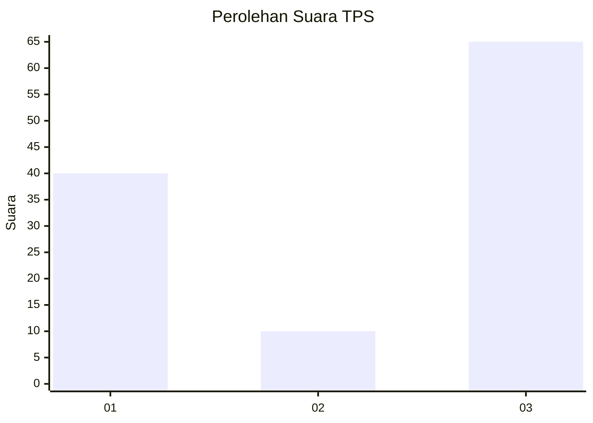
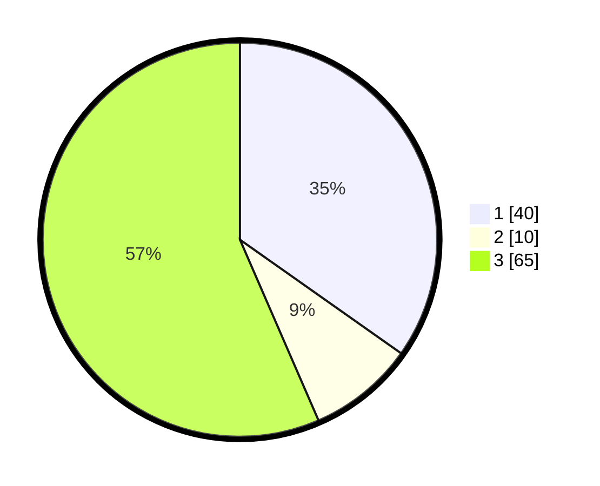

# Hasil

## Grafik

## Tabel

| No. | Nama Paslon    | Suara | Suara (raw) | Persentase |
|:--- |:-------------- | -----:| -----------:| ----------:|
| 1   | ANIES MUHAIMIN | 40    | [40][p-1]   | 34,78      |
| 2   | PRABOWO GIBRAN | 10    | [10][p-2]   | 8,70       |
| 3   | GANJAR MAHFUD  | 65    | [65][p-3]   | 56,52      |

[p-1]: https://github.com/gigit-pemilu/pemilu-2024-33-jawa-tengah/blob/main/pilpres/hitung-suara/sub/33-jawa-tengah/sub/21-demak/sub/11-demak/sub/1015-kalicilik/sub/002-tps/sub/paslon-1.txt
[p-2]: https://github.com/gigit-pemilu/pemilu-2024-33-jawa-tengah/blob/main/pilpres/hitung-suara/sub/33-jawa-tengah/sub/21-demak/sub/11-demak/sub/1015-kalicilik/sub/002-tps/sub/paslon-2.txt
[p-3]: https://github.com/gigit-pemilu/pemilu-2024-33-jawa-tengah/blob/main/pilpres/hitung-suara/sub/33-jawa-tengah/sub/21-demak/sub/11-demak/sub/1015-kalicilik/sub/002-tps/sub/paslon-3.txt

## Foto C Plano

https://sirekap-obj-formc.kpu.go.id/d82c/pemilu/ppwp/33/21/11/10/15/3321111015002-20240216-131726--5345877e-7066-4a68-94bc-18867af8c01a.jpg

https://sirekap-obj-formc.kpu.go.id/d82c/pemilu/ppwp/33/21/11/10/15/3321111015002-20240215-170915--43594e9e-dfd1-406f-976f-045c9c270a41.jpg

## Metadata

| Key        | Value               |
| ---------- | ------------------- |
| Time Stamp | 2024-02-21 21:00:04 |

