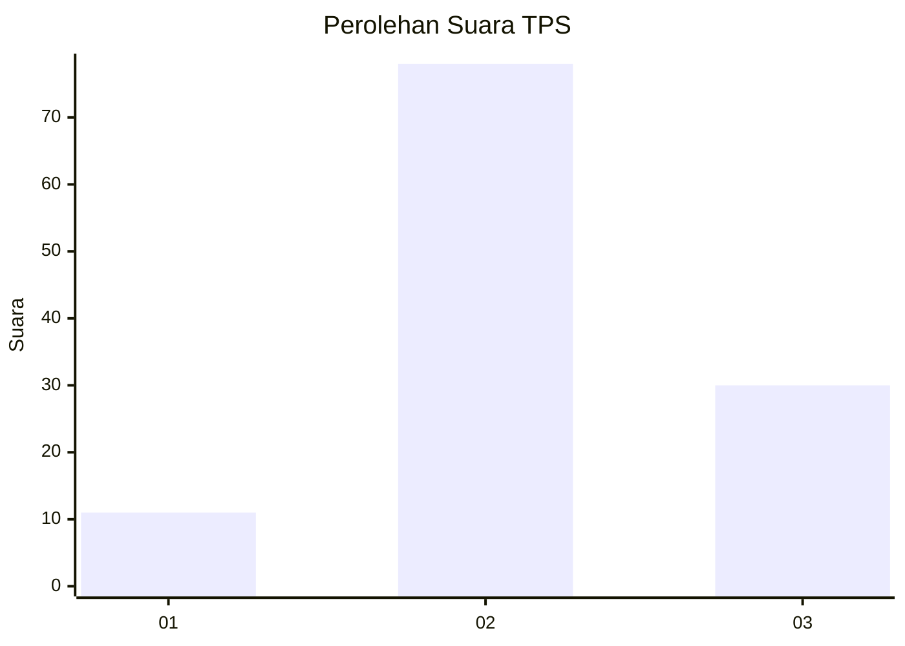
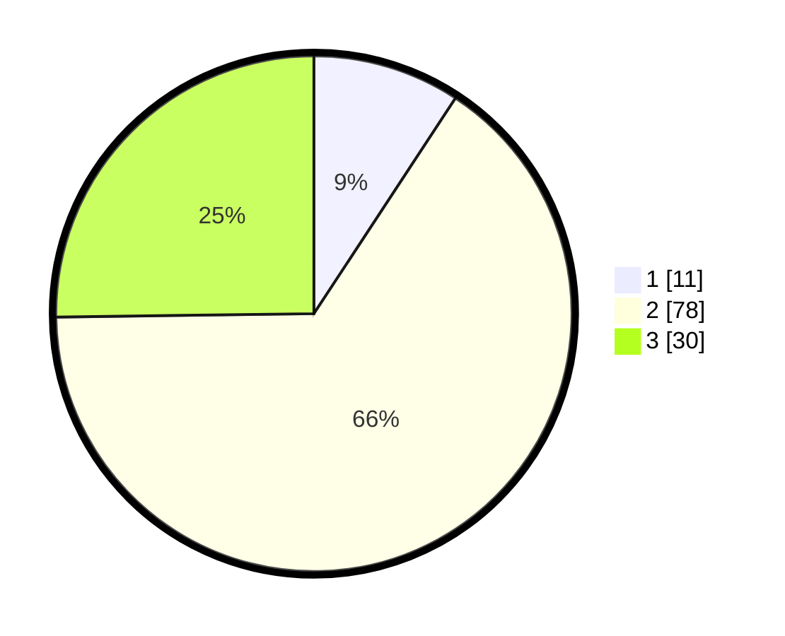

# Hasil

## Grafik

## Tabel

| No. | Nama Paslon    | Suara | Suara (raw) | Persentase |
|:--- |:-------------- | -----:| -----------:| ----------:|
| 1   | ANIES MUHAIMIN | 11    | [11][p-1]   | 9,24       |
| 2   | PRABOWO GIBRAN | 78    | [78][p-2]   | 65,55      |
| 3   | GANJAR MAHFUD  | 30    | [30][p-3]   | 25,21      |

[p-1]: https://github.com/gigit-pemilu/pemilu-2024-33-jawa-tengah/blob/main/pilpres/hitung-suara/sub/33-jawa-tengah/sub/21-demak/sub/11-demak/sub/2007-raji/sub/013-tps/sub/paslon-1.txt
[p-2]: https://github.com/gigit-pemilu/pemilu-2024-33-jawa-tengah/blob/main/pilpres/hitung-suara/sub/33-jawa-tengah/sub/21-demak/sub/11-demak/sub/2007-raji/sub/013-tps/sub/paslon-2.txt
[p-3]: https://github.com/gigit-pemilu/pemilu-2024-33-jawa-tengah/blob/main/pilpres/hitung-suara/sub/33-jawa-tengah/sub/21-demak/sub/11-demak/sub/2007-raji/sub/013-tps/sub/paslon-3.txt

## Foto C Plano

https://sirekap-obj-formc.kpu.go.id/a7f1/pemilu/ppwp/33/21/11/20/07/3321112007013-20240217-153949--635e1af7-8c8a-477a-aeac-a785881f202c.jpg

https://sirekap-obj-formc.kpu.go.id/a7f1/pemilu/ppwp/33/21/11/20/07/3321112007013-20240217-131219--d8eed07a-ad23-4f7d-80b8-b109e61a0711.jpg

https://sirekap-obj-formc.kpu.go.id/a7f1/pemilu/ppwp/33/21/11/20/07/3321112007013-20240217-132040--9d47ec8f-aae4-4013-a351-3b6cb52d7b6d.jpg

## Metadata

| Key        | Value               |
| ---------- | ------------------- |
| Time Stamp | 2024-02-25 12:00:00 |

