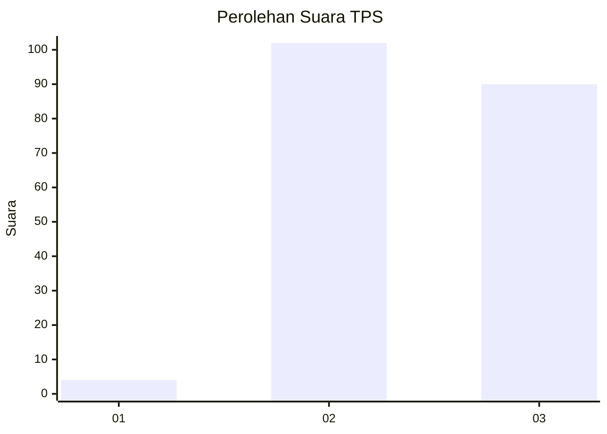
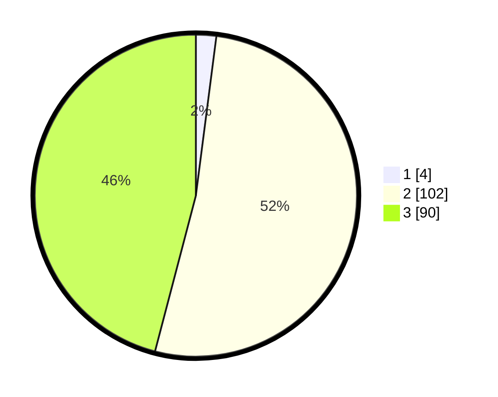

# Hasil

## Grafik

## Tabel

| No. | Nama Paslon    | Suara | Suara (raw) | Persentase |
|:--- |:-------------- | -----:| -----------:| ----------:|
| 1   | ANIES MUHAIMIN | 4     | [4][p-1]    | 2,04       |
| 2   | PRABOWO GIBRAN | 102   | [102][p-2]  | 52,04      |
| 3   | GANJAR MAHFUD  | 90    | [90][p-3]   | 45,92      |

[p-1]: https://github.com/gigit-pemilu/pemilu-2024/blob/main/pilpres/hitung-suara/sub/33-jawa-tengah/sub/21-demak/sub/12-bonang/sub/2001-jatimulyo/sub/001-tps/sub/paslon-1.txt
[p-2]: https://github.com/gigit-pemilu/pemilu-2024/blob/main/pilpres/hitung-suara/sub/33-jawa-tengah/sub/21-demak/sub/12-bonang/sub/2001-jatimulyo/sub/001-tps/sub/paslon-2.txt
[p-3]: https://github.com/gigit-pemilu/pemilu-2024/blob/main/pilpres/hitung-suara/sub/33-jawa-tengah/sub/21-demak/sub/12-bonang/sub/2001-jatimulyo/sub/001-tps/sub/paslon-3.txt

## Foto C Plano

https://sirekap-obj-formc.kpu.go.id/dc43/pemilu/ppwp/33/21/12/20/01/3321122001001-20240214-235514--7c06de64-84b1-40dd-9584-9aa2f3530a5a.jpg

https://sirekap-obj-formc.kpu.go.id/dc43/pemilu/ppwp/33/21/12/20/01/3321122001001-20240214-235534--8ee6972b-8ab8-43d7-8c09-ce81632eb1b9.jpg

https://sirekap-obj-formc.kpu.go.id/dc43/pemilu/ppwp/33/21/12/20/01/3321122001001-20240214-235552--4824c791-8b7d-4a3d-83da-9aa82356dc97.jpg

## Metadata

| Key        | Value               |
| ---------- | ------------------- |
| Time Stamp | 2024-02-15 21:30:27 |

